# eight

# 用人工神经网络预测股票价格

继续上一章的股票价格预测项目，本章将深入介绍和解释神经网络模型。我们将从构建最简单的神经网络开始，并通过向它添加更多的层来深入研究。我们将涵盖神经网络构建模块和其他重要概念，包括激活函数、前馈和反向传播。我们还将使用 scikit-learn 和 TensorFlow 从头开始实现神经网络。我们将关注如何有效地利用神经网络进行学习，而不会过度拟合，利用辍学和早期停止技术。最后，我们将训练一个神经网络来预测股票价格，看看它是否能击败我们在上一章中用三种回归算法实现的结果。

我们将在本章中讨论以下主题:

*   揭开神经网络的神秘面纱
*   从浅层神经网络到深层学习
*   从头开始实现神经网络
*   用 scikit-learn 实现神经网络
*   用张量流实现神经网络
*   激活功能
*   拒绝传统社会的人
*   提前停止
*   用神经网络预测股票价格
*   微调神经网络

# 揭开神经网络的神秘面纱

这里大概来了媒体最常提到的模型，**人工神经网络**(**ann**)；更多的时候我们只是称它们为**神经网络**。有趣的是，神经网络已经(错误地)被大众认为等同于机器学习或人工智能。

人工神经网络只是机器学习众多算法中的一种。而机器学习是人工智能的一个分支。这是我们实现通用人工智能的方法之一。

无论如何，它是最重要的机器学习模型之一，并随着**深度学习** ( **DL** )的革命而快速进化。让我们首先了解神经网络是如何工作的。

## 从单层神经网络开始

我先讲一下一个网络中不同的层，然后是激活功能，最后是训练一个反向传播的网络。

### 神经网络中的层

一个简单的神经网络由三个层组成:**输入层**、**隐藏层**和**输出层**，如下图所示:

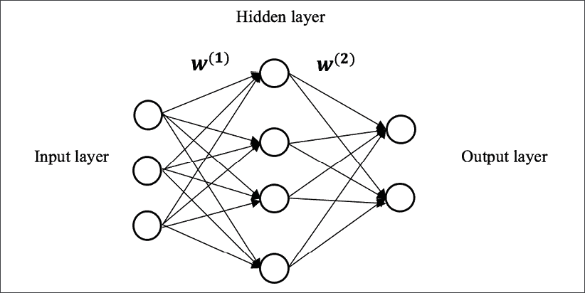

图 8.1:一个简单的浅层神经网络

一个**层**是一个概念集合**节点**(也称为**单位**)，它模拟生物大脑中的神经元。输入图层表示输入要素， *x* ，每个节点为预测要素， *x* 。输出层代表目标变量。

在二进制分类中，输出层只包含一个节点，其值为正类的概率。在多类分类中，输出层由 *n* 个节点组成，其中 *n* 是可能的类的数量，每个节点的值是预测该类的概率。回归中，输出层只包含一个节点，其值为预测结果。

隐藏层可以被认为是从前一层提取的潜在信息的组合。可以有多个隐藏层。用具有两个或更多隐藏层的神经网络进行学习被称为 **DL** 。在本章中，我们将首先关注一个隐藏层。

两个相邻的层通过概念边缘(有点像生物大脑中的突触)连接在一起，概念边缘将信号从一层中的一个神经元传输到下一层中的另一个神经元。**边**由模型的权重 *W* 参数化。例如，上图中的 *W* <sup class="" style="font-style: italic;">(1)</sup> 连接输入层和隐藏层， *W* <sup class="" style="font-style: italic;">(2)</sup> 连接隐藏层和输出层。

在标准神经网络中，数据仅通过隐藏层从输入层传送到输出层。因此，这种网络被称为**前馈**神经网络。基本上，逻辑回归是一个没有隐藏层的前馈神经网络，其中输出层直接与输入层相连。在输入层和输出层之间有一个或多个隐藏层的神经网络应该能够更多地了解输入数据和目标之间的潜在关系。

## 激活功能

假设输入 *x* 为 *n* 维，隐藏层由 *H* 隐藏单元组成。连接输入和隐藏层的权重矩阵 *W* <sup class="" style="font-style: italic;">(1)</sup> 的大小为 *n* 乘 *H* ，其中每一列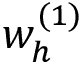代表将输入与第 *h* 个隐藏单元相关联的系数。隐藏层的输出(也称为**激活**)可以数学表达如下:


这里， *f(z)* 是激活函数。顾名思义，激活功能检查每个神经元的激活程度，模拟我们大脑的工作方式。典型的激活函数包括逻辑函数(在神经网络中更常被称为 **sigmoid** 函数)和**tanh**函数，其被认为是逻辑函数的重新缩放版本，以及作为 **ReLU** (整流线性单元**的简称**，其经常在 DL 中使用:


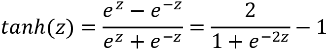


我们将这三个激活函数绘制如下:

*   输出值在(0，1)范围内的**逻辑** ( **西格玛**)功能:


图 8.2:逻辑功能

*   输出值在(-1，1)范围内的 **tanh** 功能图:

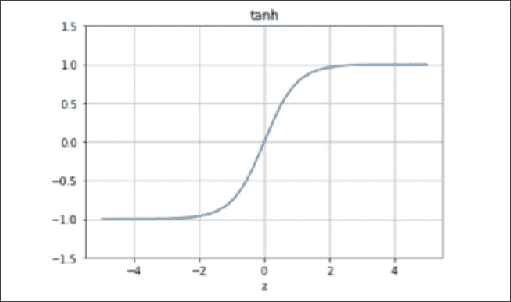

图 8.3:tanh 函数

*   **ReLU** 功能绘图，其中输出值在(0，+inf)范围内:

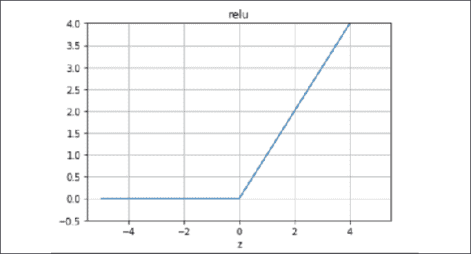

图 8.4:ReLu 函数

对于输出层，假设有一个输出单元(回归或二进制分类)和权重矩阵， *W* <sup class="" style="font-style: italic;">(2)</sup> ，将隐藏层连接到输出层的大小为 *H* 乘 *1* 。在回归中，输出可以用数学方式表示如下(为了一致性，这里我将其表示为 *a* <sup class="" style="font-style: italic;">(3)</sup> 而不是 *y* ):

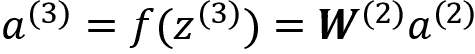

## 反向传播

那么，如何才能获得模型的最优权重， *W = {W(1)，W(2)}* ？类似于逻辑回归，我们可以使用梯度下降学习所有权重，目标是最小化**均方误差** ( **MSE** )成本， *J(W)* 。不同的是，梯度*δW*是通过到**反向传播**来计算的。每次向前通过网络后，都会执行向后通过来调整模型的参数。

顾名思义 *back* 这个词，梯度的计算是向后进行的:首先计算最后一层的梯度，最后计算第一层的梯度。至于*传播*，这意味着在计算上一层的梯度时，会重复使用上一层梯度的部分计算。错误信息逐层传播，而不是单独计算。

在单层网络中，反向传播的详细步骤如下:

1.  我们通过网络从输入到输出，计算输出值，隐藏层和输出层的 *a* <sup class="" style="font-style: italic;">(2)</sup> ， *a* <sup class="" style="font-style: italic;">(3)</sup> 。这是前馈步骤。
2.  对于最后一层，我们计算成本函数相对于输出层输入的导数:

    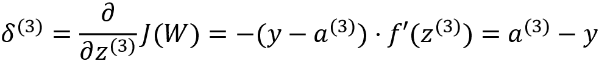

3.  对于隐藏层，我们计算成本函数相对于隐藏层输入的导数:

    

4.  我们通过应用**链规则** :

    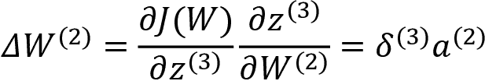

    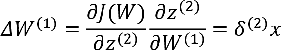

    来计算渐变
5.  We update the weights with the computed gradients and learning rate, 

    

    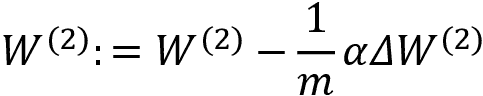

    这里， *m* 是样本数。

    我们通过用最新的权重重复更新所有的权重，直到成本函数收敛或者模型经过足够的迭代。

乍一看，这可能不容易消化，所以在下一节之后，我们将从头开始实现它，这将有助于您更好地理解神经网络。

## 向神经网络添加更多层:DL

在实际应用中，一个神经网络通常带有多个隐藏层。这就是 DL 得名的原因——使用具有“堆叠”隐藏层的神经网络进行学习。下面是一个 DL 模型的例子:

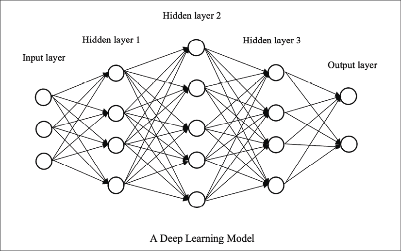

图 8.5:深度神经网络

在多个隐藏层的堆叠中，一个隐藏层的输入就是其前一层的输出，从*图 8.5* 可以看到。从每个隐藏层提取特征(信号)。不同层的特征代表不同层次的模式。超越浅层神经网络(通常只有一个隐藏层)，具有正确网络架构和参数的 DL 模型(通常有两个或更多隐藏层)可以更好地从数据中学习复杂的非线性关系。

让我们看看 DL 的一些典型应用，这样你会更有动力开始即将到来的 DL 项目。

计算机视觉被广泛认为是 DL 有巨大突破的领域。你将在*第 12 章*、*用卷积神经网络*对服装图像进行分类中了解到更多信息。目前，这里列出了计算机视觉的一些常见应用:

*   图像识别，如人脸识别和手写数字识别。手写数字识别，连同共同的评价数据集 MNIST([http://yann.lecun.com/exdb/mnist/](http://yann.lecun.com/exdb/mnist/)，已经成为“你好，世界！”DL 中的项目。
*   基于图像的搜索引擎在其图像分类和图像相似性编码组件中大量使用了 DL 技术。
*   机器视觉是自动驾驶汽车的一个关键部分，它感知摄像机的视角来做出实时决策。
*   黑色和白色照片的色彩还原以及巧妙地融合了两种不同风格图像的艺术转移。谷歌艺术&文化([https://artsandculture.google.com/](https://artsandculture.google.com/)中的人工杰作令人印象深刻。

**自然语言处理** ( **NLP** )是的另一个领域，在这里你可以看到 DL 在其现代解决方案中的主导用途。您将在*第 13 章*、*中了解更多关于使用递归神经网络进行序列预测的信息*。但是现在让我们快速看一些例子:

*   机器翻译，其中 DL 已经显著提高了准确性和流畅性，例如基于句子的**谷歌神经机器翻译** ( **GNMT** )系统。
*   文本生成，通过深度神经网络学习句子和段落中单词之间的复杂关系来再现文本。如果你在他们的作品上训练一个模特，你可以成为一个虚拟的罗琳或者一个虚拟的莎士比亚。
*   图像字幕，也称为图像到文本，利用深层神经网络来检测和识别图像中的对象，并以一个可理解的句子“描述”这些对象。它结合了最近在计算机视觉和自然语言处理方面的突破。例子可以在[http://cs . Stanford . edu/people/Karpathy/deepimagesend/generation demo/](http://cs.stanford.edu/people/karpathy/deepimagesent/generationdemo/)找到(由斯坦福大学的 Andrej Karpathy 开发)。
*   在其他常见的自然语言处理任务中，如情感分析和信息检索和提取，DL 模型取得了最先进的性能。

类似于浅层网络，我们使用梯度下降学习深层神经网络中的所有权重，目标是最小化均方误差成本， *J(W)* 。梯度*δW*通过反向传播计算。不同的是，我们反向传播了不止一个隐藏层。在下一节中，我们将实现神经网络，从浅层网络开始，然后进入深层网络。

# 构建神经网络

本实用部分将从从头开始实现一个浅层网络，然后使用 scikit-learn 实现一个两层的深层网络。然后，我们将使用 TensorFlow 和 Keras 实现一个深度网络。

## 从头开始实现神经网络

在本例中，我们将使用 sigmoid 作为激活函数。

我们首先定义`sigmoid`函数及其导数函数:

```py
>>> def sigmoid(z):
...     return 1.0 / (1 + np.exp(-z))
>>> def sigmoid_derivative(z):
...     return sigmoid(z) * (1.0 - sigmoid(z)) 
```

如果你有兴趣验证，你可以自己推导导数。

然后，我们定义训练函数，该函数接受训练数据集、隐藏层中的单元数量(我们将仅使用一个隐藏层作为示例)以及迭代次数:

```py
>>> def train(X, y, n_hidden, learning_rate, n_iter):
...     m, n_input = X.shape
...     W1 = np.random.randn(n_input, n_hidden)
...     b1 = np.zeros((1, n_hidden))
...     W2 = np.random.randn(n_hidden, 1)
...     b2 = np.zeros((1, 1))
...     for i in range(1, n_iter+1):
...         Z2 = np.matmul(X, W1) + b1
...         A2 = sigmoid(Z2)
...         Z3 = np.matmul(A2, W2) + b2
...         A3 = Z3
...         dZ3 = A3 - y
...         dW2 = np.matmul(A2.T, dZ3)
...         db2 = np.sum(dZ3, axis=0, keepdims=True)
...         dZ2 = np.matmul(dZ3, W2.T) * sigmoid_derivative(Z2)
...         dW1 = np.matmul(X.T, dZ2)
...         db1 = np.sum(dZ2, axis=0)
...         W2 = W2 - learning_rate * dW2 / m
...         b2 = b2 - learning_rate * db2 / m
...         W1 = W1 - learning_rate * dW1 / m
...         b1 = b1 - learning_rate * db1 / m
...         if i % 100 == 0:
...             cost = np.mean((y - A3) ** 2)
...             print('Iteration %i, training loss: %f' % 
                                                  (i, cost))
...     model = {'W1': W1, 'b1': b1, 'W2': W2, 'b2': b2}
...     return model 
```

注意除了权重， *W* ，我们还采用了偏差， *b* 。在训练之前，我们首先随机初始化权重和偏差。在每次迭代中，我们向网络的所有层提供最新的权重和偏差，然后使用反向传播算法计算梯度，最后用结果梯度更新权重和偏差。对于训练性能检查，我们打印出每 100 次迭代的损失和均方误差。

为了测试模型，我们将使用波士顿房价作为玩具数据集。提醒一下，每当使用梯度下降时，通常都建议进行数据归一化。因此，我们将通过移除平均值并缩放到单位方差来标准化输入数据:

```py
>>> boston = datasets.load_boston()
>>> num_test = 10 # the last 10 samples as testing set
>>> from sklearn import preprocessing
>>> scaler = preprocessing.StandardScaler()
>>> X_train = boston.data[:-num_test, :]
>>> X_train = scaler.fit_transform(X_train)
>>> y_train = boston.target[:-num_test].reshape(-1, 1)
>>> X_test = boston.data[-num_test:, :]
>>> X_test = scaler.transform(X_test)
>>> y_test = boston.target[-num_test:] 
```

有了缩放的数据集，我们现在可以训练一个具有`20`隐藏单元、`0.1`学习率和`2000`迭代的单层神经网络:

```py
>>> n_hidden = 20
>>> learning_rate = 0.1
>>> n_iter = 2000
>>> model = train(X_train, y_train, n_hidden, learning_rate, n_iter)
Iteration 100, training loss: 13.500649
Iteration 200, training loss: 9.721267
Iteration 300, training loss: 8.309366
Iteration 400, training loss: 7.417523
Iteration 500, training loss: 6.720618
Iteration 600, training loss: 6.172355
Iteration 700, training loss: 5.748484
Iteration 800, training loss: 5.397459
Iteration 900, training loss: 5.069072
Iteration 1000, training loss: 4.787303
Iteration 1100, training loss: 4.544623
Iteration 1200, training loss: 4.330923
Iteration 1300, training loss: 4.141120
Iteration 1400, training loss: 3.970357
Iteration 1500, training loss: 3.814482
Iteration 1600, training loss: 3.673037
Iteration 1700, training loss: 3.547397
Iteration 1800, training loss: 3.437391
Iteration 1900, training loss: 3.341110
Iteration 2000, training loss: 3.255750 
```

然后，我们定义一个预测函数，它将采用一个模型并产生回归结果:

```py
>>> def predict(x, model):
...     W1 = model['W1']
...     b1 = model['b1']
...     W2 = model['W2']
...     b2 = model['b2']
...     A2 = sigmoid(np.matmul(x, W1) + b1)
...     A3 = np.matmul(A2, W2) + b2
...     return A3 
```

最后，我们将训练好的模型应用于测试集:

```py
>>> predictions = predict(X_test, model) 
```

打印出预测及其基本事实，并进行比较:

```py
>>> print(predictions)
[[16.28103034]
 [19.98591039]
 [22.17811179]
 [19.37515137]
 [20.5675095 ]
 [24.90457042]
 [22.92777643]
 [26.03651277]
 [25.35493394]
 [23.38112184]]
>>> print(y_test)
[19.7 18.3 21.2 17.5 16.8 22.4 20.6 23.9 22\. 11.9] 
```

从零开始成功构建神经网络模型后，我们将继续进行`scikit-learn`的实现。

## 用 scikit-learn 实现神经网络

我们将利用`MLPRegressor`类( **MLP** 代表**多层感知器**，神经网络的昵称:

```py
>>> from sklearn.neural_network import MLPRegressor
>>> nn_scikit = MLPRegressor(hidden_layer_sizes=(16, 8), 
...                          activation='relu', solver='adam',
...                          learning_rate_init=0.001, 
...                          random_state=42, max_iter=2000) 
```

`hidden_layer_sizes`超参数代表隐藏神经元的数量。在本例中，网络包含两个隐藏层，分别具有`16`和`8`节点。使用 ReLU 激活。

我们在训练集上拟合神经网络模型，并根据测试数据进行预测:

```py
>>> nn_scikit.fit(X_train, y_train)
>>> predictions = nn_scikit.predict(X_test)
>>> print(predictions)
[16.79582331 18.55538023 21.07961496 19.21362606 18.50955771 23.5608387 22.27916529 27.11909153 24.70251262 22.05522035] 
```

我们计算预测的均方误差:

```py
>>> print(np.mean((y_test - predictions) ** 2))
13.933482332708781 
```

我们用 scikit-learn 实现了一个神经网络。让我们在下一节中使用 TensorFlow 来实现这一点。

## 用张量流实现神经网络

在行业，神经网络往往是用 TensorFlow 实现的。其他流行的 DL(多层神经网络)框架包括 py torch([https://pytorch.org/](https://pytorch.org/)，我们将在*第 14 章*、*使用强化学习在复杂环境中做出决策*和Keras([https://keras.io/](https://keras.io/))，它们已经包含在 TensorFlow 2.x 中。

1.  首先，我们导入必要的模块并设置一个随机种子，推荐用于可再现建模:

    ```py
    >>> import tensorflow as tf
    >>> from tensorflow import keras
    >>> tf.random.set_seed(42) 
    ```

2.  接下来，我们通过将图层实例列表传递给构造器来创建 Keras Sequential 模型，包括两个完全连接的隐藏图层，分别具有`20`节点和`8`节点。再次使用 ReLU 激活:

    ```py
    >>> model = keras.Sequential([
    ...     keras.layers.Dense(units=20, activation='relu'),
    ...     keras.layers.Dense(units=8, activation='relu'),
    ...     keras.layers.Dense(units=1)
    ... ]) 
    ```

3.  And we compile the model by using Adam as the optimizer with a learning rate of `0.02` and MSE as the learning goal:

    ```py
    >>> model.compile(loss='mean_squared_error',
    ...               optimizer=tf.keras.optimizers.Adam(0.02)) 
    ```

    亚当优化器是随机梯度下降算法的替代品。它根据训练数据自适应地更新梯度。关于亚当的更多信息，请查看 https://arxiv.org/abs/1412.6980 的报纸。

4.  After defining the model, we now train it against the training set:

    ```py
    >>> model.fit(X_train, y_train, epochs=300)
    Train on 496 samples
    Epoch 1/300
    496/496 [==============================] - 1s 2ms/sample - loss: 459.1884
    Epoch 2/300
    496/496 [==============================] - 0s 76us/sample - loss: 102.3990
    Epoch 3/300
    496/496 [==============================] - 0s 62us/sample - loss: 35.7367
    ……
    ……
    Epoch 298/300
    496/496 [==============================] - 0s 60us/sample - loss: 2.8095
    Epoch 299/300
    496/496 [==============================] - 0s 60us/sample - loss: 3.0976
    Epoch 300/300
    496/496 [==============================] - 0s 56us/sample - loss: 3.3194 
    ```

    我们用`300`迭代拟合模型。在每次迭代中，都会显示训练损失。

5.  最后，我们使用训练好的模型来预测测试用例，并打印出预测及其均方误差:

    ```py
    >>> predictions = model.predict(X_test)[:, 0]
    >>> print(predictions)
    [18.078342 17.279167 19.802671 17.54534  16.193192 24.769335 22.12822 30.43017  26.262056 20.982824]
    >>> print(np.mean((y_test - predictions) ** 2))
    15.72498178190508 
    ```

如您所见，我们在 TensorFlow Keras API 中为神经网络模型添加了一层又一层。我们从第一个隐藏层(有 20 个节点)开始，然后是第二个隐藏层(有 8 个节点)，最后是输出层(有一个单元，目标变量)。这与建造乐高非常相似。接下来，我们将看看如何选择正确的激活功能。

# 选择正确的激活功能

到目前为止，我们已经在实现中使用了 ReLU 和 sigmoid 激活函数。你可能想知道如何为你的神经网络选择正确的激活函数。下面给出了何时选择特定激活功能的详细答案:

*   **线性** : *f(z) = z* 。你可以解释为没有激活功能。我们通常在回归网络的输出层使用它，因为我们不需要对输出进行任何转换。
*   **Sigmoid** (逻辑)将图层的输出转换为 0 到 1 之间的范围。你可以把它解释为输出预测的概率。因此，我们通常在**二进制分类**网络的输出层使用它。除此之外我们有时会在隐藏层使用。然而，需要注意的是，sigmoid 函数是单调的，但它的导数不是。因此，神经网络可能陷入次优解。
*   **Softmax** 。正如在*第 5 章*、*中提到的用逻辑回归*预测在线广告点击率，softmax 是一个用于多类分类的广义逻辑函数。因此，我们在**多类分类**网络的输出层中使用它。
*   **Tanh** 是更好的乙状结肠功能的版本，具有更强的梯度。正如你在图中看到的，tanh 函数的导数比 sigmoid 函数的导数更陡。它的范围是-1 到 1。在隐藏层中使用 tanh 函数是很常见的。
*   **ReLU** 大概是现在最常用的激活功能。它是前馈网络中隐藏层的“默认”层。它的范围是从 0 到无穷大，函数本身及其导数都是单调的。ReLU 函数的一个缺点是不能适当地映射输入的负部分，其中所有负输入都被转换为零。为了解决 ReLU 中的“濒死负”问题，发明了**漏 ReLu**在负部分引入一个小斜率。当 *z < 0* 、 *f(z) = az* 时，其中 *a* 通常为小值，如 0.01。

概括来说，ReLU 通常处于隐藏层激活状态。如果 ReLU 不太好用，你可以试试 Leaky ReLU。Sigmoid 和 tanh 可用于隐藏层，但不建议用于具有许多层的深层网络。对于输出层，回归网络采用线性激活(或不激活)；sigmoid 用于二进制分类网络，softmax 用于多分类情况。

选择正确的激活很重要，避免神经网络中的过拟合也很重要。让我们在下一节中看看如何做到这一点。

# 防止神经网络中的过拟合

一个神经网络是强大的，因为它可以从具有正确架构(正确数量的隐藏层和隐藏节点)的数据中导出分层特征。它提供了很大的灵活性，可以适应复杂的数据集。然而，如果网络没有对学习过程给予足够的控制，这种优势将成为弱点。具体来说，如果一个网络只擅长拟合训练集，但不能推广到看不见的数据，就可能导致过度拟合。因此，防止过拟合对于神经网络模型的成功至关重要。

主要有三种方法对我们的神经网络施加限制:L1/L2 正则化、辍学和提前停止。我们在*第 5 章*、*用逻辑回归*预测在线广告点击率练习了第一种方法，本节将讨论另外两种方法。

## 拒绝传统社会的人

**drop**是指在神经网络的学习阶段忽略某一组隐藏节点。这些隐藏节点是随机选择的，给定一个特定的概率。在训练迭代期间的正向传递中，随机选择的节点暂时不用于计算损失；在反向过程中，随机选择的节点不会被临时更新。

在下图中，我们选择网络中的三个节点在训练期间忽略:

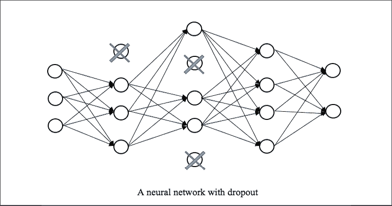

图 8.6:要忽略的三个节点

回想一下，一个常规层的节点完全连接到前一层和后一层的节点。如果一个大的网络发展并记住单个节点对之间的相互依赖，就会导致过度匹配。Dropout 通过在每次迭代中暂时停用某些节点来打破这种相互依赖。因此，它有效地减少了过度拟合，同时不会中断学习。

在每次迭代中被随机选择的节点的比例也称为辍学率。在实践中，我们通常设定辍学率不超过 50%。在 TensorFlow 中，我们使用`tf.keras.layers.Dropout`模块为图层添加脱落。一个例子如下:

```py
>>> model = keras.Sequential([
...    keras.layers.Dense(units=32, activation='relu'),
...    tf.keras.layers.Dropout(0.5)
...    keras.layers.Dense(units=1) 
```

在前面的示例中，从 16 节点层随机选取的 50%的节点在训练期间的迭代中被忽略。

请记住，辍学只发生在培训阶段。在预测阶段，所有节点再次完全连接。

## 提前停止

顾名思义，如果模型性能在某个迭代次数内没有改善，那么用**提前停止**来训练网络将会结束。模型性能是在不同于训练集的验证集上测量的，以便评估它的推广程度。在训练过程中，如果性能在几次(比如说 50 次)迭代后下降，这意味着模型过度拟合，不能很好地推广。因此，在这种情况下尽早停止学习有助于防止过度适应。

在 TensorFlow 中，我们使用`tf.keras.callbacks.EarlyStopping`模块来合并提前停止。我将在本章后面演示如何使用它。

既然您已经了解了神经网络及其实现，让我们利用它们来解决我们的股价预测问题。

# 用神经网络预测股票价格

我们将在本节中使用 TensorFlow 构建股票预测器。我们先从特征生成和数据准备开始，然后是网络搭建和训练。之后，我们将对网络进行微调，并加入提前止损来提升股票预测值。

## 训练一个简单的神经网络

我们准备数据并通过以下步骤训练一个简单的神经工作:

1.  我们加载股票数据，生成特征，并标记我们在*第 7 章*、*中开发的`generate_features`函数，使用回归算法* :

    ```py
    >>> data_raw = pd.read_csv('19880101_20191231.csv', index_col='Date')
    >>> data = generate_features(data_raw) 
    ```

2.  我们使用 1988 年至 2018 年的数据构建训练集，使用 2019 年的数据构建测试集:

    ```py
    >>> start_train = '1988-01-01'
    >>> end_train = '2018-12-31'
    >>> start_test = '2019-01-01'
    >>> end_test = '2019-12-31'
    >>> data_train = data.loc[start_train:end_train]
    >>> X_train = data_train.drop('close', axis=1).values
    >>> y_train = data_train['close'].values
    >>> data_test = data.loc[start_test:end_test]
    >>> X_test = data_test.drop('close', axis=1).values
    >>> y_test = data_test['close'].values 
    ```

3.  We need to normalize features into the same or a comparable scale. We do so by removing the mean and rescaling to unit variance:

    ```py
    >>> from sklearn.preprocessing import StandardScaler
    >>> scaler = StandardScaler() 
    ```

    我们用训练集示教的缩放器重新缩放两个集:

    ```py
    >>> X_scaled_train = scaler.fit_transform(X_train)
    >>> X_scaled_test = scaler.transform(X_test) 
    ```

4.  We now build a neural network model using the Keras Sequential API:

    ```py
    >>> from tensorflow.keras import Sequential
    >>> from tensorflow.keras.layers import Dense
    >>> model = Sequential([
    ...     Dense(units=32, activation='relu'),
    ...     Dense(units=1)
    ... ]) 
    ```

    我们开始的网络有一个隐藏层`32`节点，后面跟一个 ReLU 函数。

5.  我们使用 Adam 作为优化器，以学习率`0.1`和 MSE 作为学习目标来编译模型:

    ```py
    >>> model.compile(loss='mean_squared_error',
    ...               optimizer=tf.keras.optimizers.Adam(0.1)) 
    ```

6.  定义模型后，我们现在根据训练集

    ```py
    >>> model.fit(X_scaled_train, y_train, epochs=100, verbose=True)
    Train on 7558 samples
    Epoch 1/100
    7558/7558 [==============================] - 1s 175us/sample - loss: 31078305.1905
    Epoch 2/100
    7558/7558 [==============================] - 0s 58us/sample - loss: 2062612.2298
    Epoch 3/100
    7558/7558 [==============================] - 0s 56us/sample - loss: 474157.7456
    ……
    ……
    Epoch 98/100
    7558/7558 [==============================] - 0s 56us/sample - loss: 21777.9346
    Epoch 99/100
    7558/7558 [==============================] - 0s 55us/sample - loss: 19343.1628
    Epoch 100/100
    7558/7558 [==============================] - 0s 52us/sample - loss: 20780.1686 
    ```

    对其进行训练
7.  最后，我们使用训练好的模型来预测测试数据并显示度量:

    ```py
    >>> from sklearn.metrics import mean_squared_error, mean_absolute_error, r2_score
    >>> print(f'MSE: {mean_squared_error(y_test,predictions):.3f}')
    MSE: 43212.312
    >>> print(f'MAE: {mean_absolute_error(y_test, predictions):.3f}')
    MAE: 160.936
    >>> print(f'R^2: {r2_score(y_test, predictions):.3f}')
    R^2: 0.962 
    ```

我们用一个简单的神经网络模型实现`0.962 R` `2`。

## 微调神经网络

我们能做得更好吗？当然，我们还没有微调超参数。我们通过以下步骤在 TensorFlow 中执行模型微调:

1.  我们依赖于 TensorFlow 中的`hparams`模块，所以先导入:

    ```py
    >>> from tensorboard.plugins.hparams import api as hp 
    ```

2.  We want to tweak the number of hidden nodes in the hidden layer (again, we are using one hidden layer for this example), the number of training iterations, and the learning rate. We pick the following values of hyperparameters to experiment on:

    ```py
    >>> HP_HIDDEN = hp.HParam('hidden_size', hp.Discrete([64, 32, 16]))
    >>> HP_EPOCHS = hp.HParam('epochs', hp.Discrete([300, 1000]))
    >>> HP_LEARNING_RATE = hp.HParam('learning_rate', hp.RealInterval(0.01, 0.4)) 
    ```

    这里，我们对隐藏节点(离散值)的数量进行了三个选项的实验:`16`、`32`和`64`；我们对迭代次数(离散值)使用两个选项，`300`和`1000`；并且我们使用`0.01`到`4`的范围作为学习率(连续值)。

3.  After initializing the hyperparameters to optimize, we now create a function to train and validate the model that will take the hyperparameters as arguments, and output the performance:

    ```py
    >>> def train_test_model(hparams, logdir):
    ...     model = Sequential([
    ...         Dense(units=hparams[HP_HIDDEN], activation='relu'),
    ...         Dense(units=1)
    ...     ])
    ...     model.compile(loss='mean_squared_error',
    ...                   optimizer=tf.keras.optimizers.Adam(
                                    hparams[HP_LEARNING_RATE]),
    ...                   metrics=['mean_squared_error'])
    ...     model.fit(X_scaled_train, y_train, 
                      validation_data=(X_scaled_test, y_test), 
                      epochs=hparams[HP_EPOCHS], verbose=False,
    ...               callbacks=[
    ...                   tf.keras.callbacks.TensorBoard(logdir), 
    ...                   hp.KerasCallback(logdir, hparams), 
    ...                   tf.keras.callbacks.EarlyStopping(
    ...                       monitor='val_loss', min_delta=0, 
                              patience=200, verbose=0, mode='auto',
    ...                   )
    ...               ],
    ...               )
    ...     _, mse = model.evaluate(X_scaled_test, y_test)
    ...     pred = model.predict(X_scaled_test)
    ...     r2 = r2_score(y_test, pred)
    ...     return mse, r2 
    ```

    这里，我们基于给定的超参数(包括隐藏节点的数量、学习速率和训练迭代的数量)来构建、编译和拟合神经网络模型。这里和我们以前做的没什么不同。但是在训练模型的时候，我们也运行了几个回调函数，包括使用`tf.keras.callbacks.TensorBoard(logdir)`更新 TensorBoard，使用`hp.KerasCallback(logdir, hparams)`记录超参数和度量，使用`tf.keras.callbacks.EarlyStopping(...)`提前停止。

    TensorBoard 回调函数很简单。它在训练和验证期间为模型图和度量提供可视化。

    超参数记录回调记录超参数和度量。

    早期停止回调监视验证集的性能，在我们的例子中，验证集是测试集。如果 MSE 在 200 个纪元后没有降低，它将停止训练过程。

    在这个函数的最后，我们在测试集上输出预测的 MSE 和 *R* <sup class="" style="font-style: italic;">2</sup> 。

4.  接下来，我们开发一个函数来启动一个训练过程，该过程包含要评估的超参数的组合，并使用`train_test_model`函数返回的 MSE 和*R*T5【2】T6

    ```py
    >>> def run(hparams, logdir):
    ...     with tf.summary.create_file_writer(logdir).as_default():
    ...         hp.hparams_config(
    ...             hparams=[HP_HIDDEN, HP_EPOCHS, HP_LEARNING_RATE],
    ...             metrics=[hp.Metric('mean_squared_error', 
                                        display_name='mse'),
    ...                      hp.Metric('r2', display_name='r2')],
    ...         )
    ...         mse, r2 = train_test_model(hparams, logdir)
    ...         tf.summary.scalar('mean_squared_error', mse, step=1)
    ...         tf.summary.scalar('r2', r2, step=1) 
    ```

    的度量来编写一个摘要
5.  We now train the model for each different combination of the hyperparameters in a gridsearch manner:

    ```py
    >>> for hidden in HP_HIDDEN.domain.values:
    ...     for epochs in HP_EPOCHS.domain.values:
    ...         for learning_rate in 
                  tf.linspace(HP_LEARNING_RATE.domain.min_value, 
                              HP_LEARNING_RATE.domain.max_value, 5):
    ...             hparams = {
    ...                 HP_HIDDEN: hidden,
    ...                 HP_EPOCHS: epochs,
    ...                 HP_LEARNING_RATE: 
                             float("%.2f"%float(learning_rate)),
    ...             }
    ...             run_name = "run-%d" % session_num
    ...             print('--- Starting trial: %s' % run_name)
    ...             print({h.name: hparams[h] for h in hparams})
    ...             run(hparams, 'logs/hparam_tuning/' + run_name)
    ...             session_num += 1 
    ```

    对于每个实验，从预定义的值池中选取一个离散值(隐藏节点和迭代的数量)，从间隔(从`0.01`到`0.4`的五个均匀间隔的值中选取一个连续值(学习速率)。运行这些实验需要几分钟的时间。您将看到以下输出:

    ```py
    --- Starting trial: run-0
    {'hidden_size': 16, 'epochs': 300, 'learning_rate': 0.01}
    2020-04-29 08:06:43.149021: I tensorflow/core/profiler/lib/profiler_session.cc:184] Profiler session started.
    ……
    =================================================] - 0s 42us/sample - loss: 62625.1632 - mean_squared_error: 55865.6680
    ……
    ……
    ……
    --- Starting trial: run-29
    {'hidden_size': 64, 'epochs': 1000, 'learning_rate': 0.4}
    2020-04-29 08:28:03.036671: I tensorflow/core/profiler/lib/profiler_session.cc:184] Profiler session started.
    ……
    =================================================] - 0s 54us/sample - loss: 51182.3352 - mean_squared_error: 59099.1250 
    ```

6.  You will notice that a new folder, logs, is created after the experiments start. It contains the training and validation performance for each experiment. After 30 experiments finish, it's time to launch TensorBoard. We use the following command:

    ```py
     tensorboard --logdir ls/hparam_tuning
    Serving TensorBoard on localhost; to expose to the network, use a proxy or pass --bind_all
    TensorBoard 2.0.0 at http://localhost:6006/ (Press CTRL+C to quit) 
    ```

    一旦上线，你会在`http://localhost:6006/`看到漂亮的仪表盘。请在此处查看预期结果的截图:

    

    图 8.7:tensor board 截图

    点击 **HPARAMS** 选项卡到查看超参数日志。您可以在表格中看到所有的超参数组合和相应的度量(MSE 和 *R* <sup class="" style="font-style: italic;">2</sup> )，如下所示:

    

    图 8.8:用于超参数调整的 TensorBoard 截图

    ( **hidden_size=16** 、**epoch = 1000**、 **learning_rate=0.21** )的组合是表现最好的组合，用它我们实现了 **0.97122** 的 *R* <sup class="" style="font-style: italic;">2</sup> 。

7.  最后，我们使用最优模型进行预测:

    ```py
    >>> model = Sequential([
    ...     Dense(units=16, activation='relu'),
    ...     Dense(units=1)
    ... ])
    >>> model.compile(loss='mean_squared_error',
    ...               optimizer=tf.keras.optimizers.Adam(0.21))
    >>> model.fit(X_scaled_train, y_train, epochs=1000, verbose=False)
    >>> predictions = model.predict(X_scaled_test)[:, 0] 
    ```

8.  将预测和地面事实绘制如下:

    ```py
    >>> import matplotlib.pyplot as plt
    >>> plt.plot(data_test.index, y_test, c='k')
    >>> plt.plot(data_test.index, predictions, c='b')
    >>> plt.plot(data_test.index, predictions, c='r')
    >>> plt.plot(data_test.index, predictions, c='g')
    >>> plt.xticks(range(0, 252, 10), rotation=60)
    >>> plt.xlabel('Date')
    >>> plt.ylabel('Close price')
    >>> plt.legend(['Truth', 'Neural network prediction'])
    >>> plt.show() 
    ```

最终结果参见以下截图:

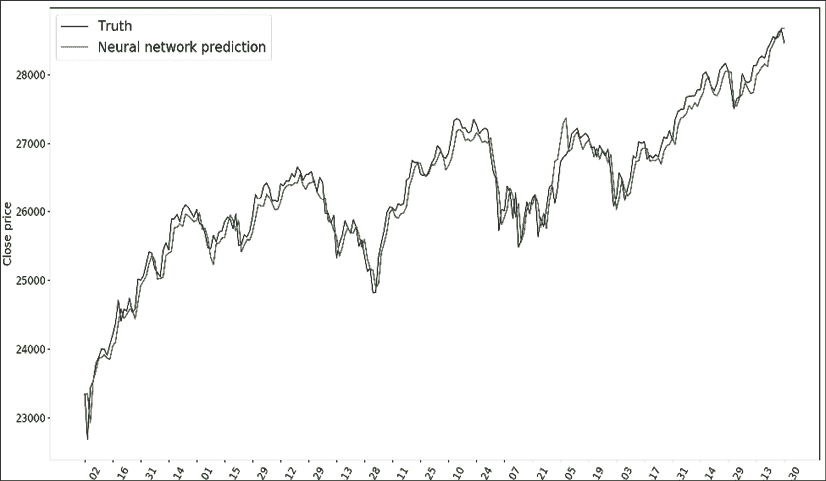

图 8.9:股票价格的预测和基本事实

微调的神经网络在预测股价方面做得很好。

在这一部分中，我们利用 TensorFlow 中的`hparams`模块进一步改进了神经网络股票预测器。随意使用更多隐藏层，重新运行模型微调，看看是否能得到更好的效果。

# 摘要

在本章中，我们再次研究了股票预测项目，但这次是用神经网络。我们从详细解释神经网络开始，包括基本组件(层、激活、前馈和反向传播)，然后过渡到 DL。我们使用 scikit-learn 和 TensorFlow 从头开始实现。你还学到了避免过度训练的方法，比如辍学和提前停止。最后，我们应用本章所述内容来解决我们的股价预测问题。

在下一章中，我们将探索自然语言处理技术和无监督学习。

# 锻炼

1.  如前所述，你能在神经网络股票预测器中使用更多的隐藏层并重新运行模型微调吗？你能得到一个更好的结果吗，也许使用辍学和提前停止？