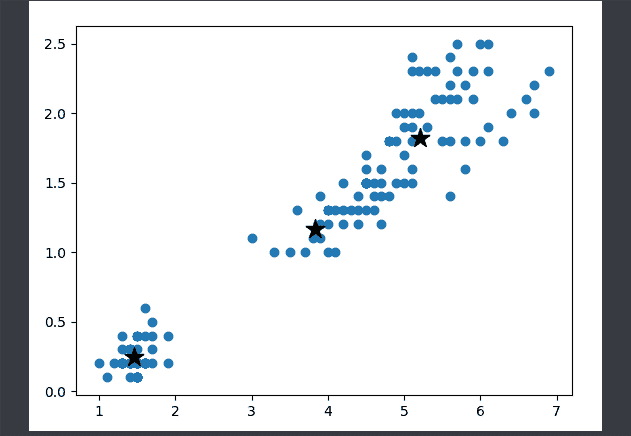
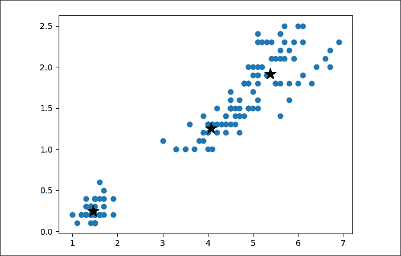
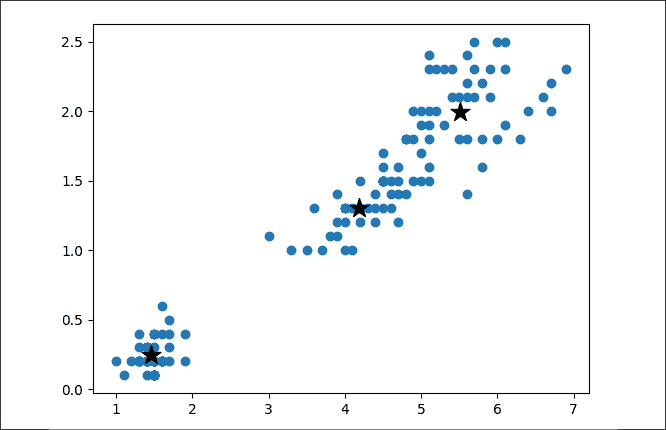
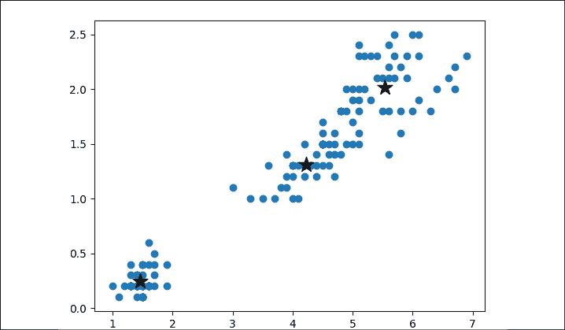
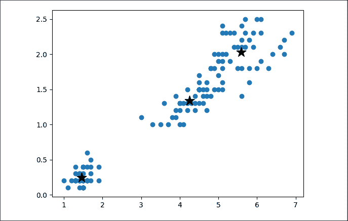
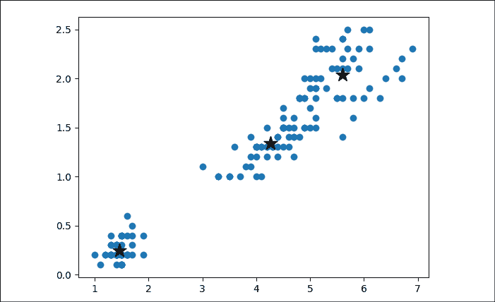
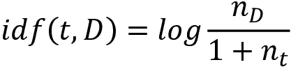
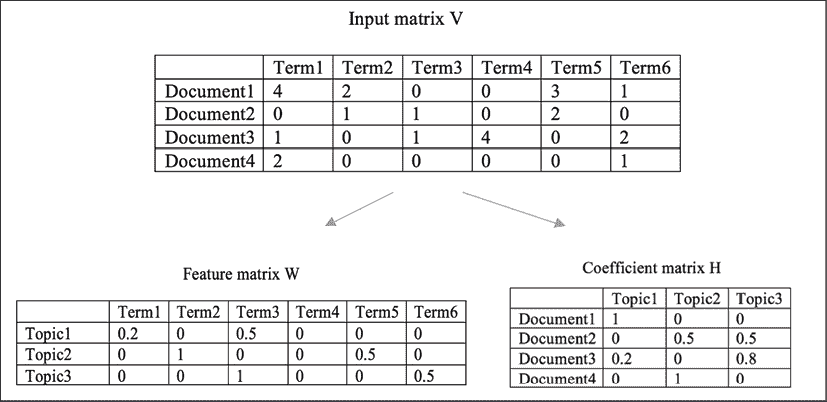
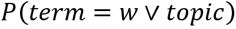
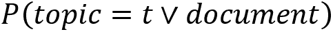

# 十、利用聚类和主题建模发现新闻组数据集中的底层主题

在前一章中，我们使用 t-SNE 进行了文本可视化。T-SNE 或任何降维算法都是一种无监督学习。展望未来，在这一章中，我们将继续我们的无监督学习之旅，特别关注聚类和主题建模。我们将从无监督学习如何在没有指导的情况下学习，以及它如何善于发现数据下面隐藏的信息开始。

接下来，我们将讨论聚类作为无监督学习的一个重要分支，它从数据中识别不同的观察组。例如，聚类对于市场细分是有用的，在市场细分中，出于营销目的，具有相似行为的消费者被分组到一个细分中。我们将对 20 个新闻组文本数据集进行聚类，看看会产生哪些聚类。

我们将采取的另一种无监督学习路线是主题建模，这是提取隐藏在数据集中的主题的过程。你会被我们能从 20 个新闻组数据集中挖掘出多少有趣的主题而逗乐。

我们将涵盖以下主题:

*   什么是无监督学习？
*   无监督学习的类型
*   什么是 k-means 聚类，它是如何工作的？
*   从头开始实现 k-均值聚类
*   用 scikit-learn 实现 k-means
*   优化 k-均值聚类模型
*   术语频率-反向文档频率
*   用 k-均值聚类新闻组数据
*   什么是话题建模？
*   主题建模的非负矩阵分解
*   主题建模的潜在狄利克雷分配
*   新闻组数据的主题建模

# 没有指导的学习——无监督学习

在前一章中，我们应用了 t-SNE 来可视化新闻组文本数据，将其简化为二维。总的来说，T-SNE 或降维是一种无监督学习**。非监督学习识别输入数据中的固有结构或共性，而不是让教师教育要产生什么特定的输出，例如类或成员(分类)和连续值(回归)。由于在无监督学习中没有*“老师”*的指导，所以对于什么是对或错的结果没有明确的答案。无监督学习可以自由地发现输入数据下隐藏的信息。**

 **理解无监督学习的一个简单方法是考虑为考试复习许多练习题。在监督学习中，你会得到这些练习问题的答案。你基本上弄清楚了问题和答案之间的关系，并学会了如何将问题映射到答案。希望你最终能通过给出正确的答案在实际考试中取得好成绩。然而，在无监督学习中，你没有得到那些练习问题的答案。在这种情况下，您可以执行以下操作:

*   将类似的练习题分组，以便以后可以同时学习相关的问题
*   找到重复性很高的问题，这样你就不会在这些问题上浪费时间
*   发现罕见的问题，这样你就可以更好地准备它们
*   通过删除样板文件来提取每个问题的关键部分，这样您就可以切入正题

你会注意到所有这些任务的结果都是无限的。只要它们能够描述数据的共性和结构，它们就是正确的。

练习题是机器学习中的**特征**，也常被称为**属性**、**观察**或**预测变量**。问题的答案是机器学习中的标签，又称为目标或**目标变量**。提供答案的练习题为**标注数据**，没有答案的练习题为**未标注数据**。无监督学习处理未标记的数据，并在没有指导的情况下对该信息进行操作。

无监督学习可以包括以下类型:

*   **聚类**:这是指根据共性对数据进行分组，常用于探索性数据分析。如前所述，将类似的练习题分组是聚类的一个例子。聚类技术被广泛用于客户细分或为营销活动对类似的在线行为进行分组。
*   **关联**:这探索了两个或更多特征的特定值的共现。离群点检测(也称为异常检测)是一种典型的情况，在这种情况下，罕见的观察被识别。使用离群点检测技术可以发现前面例子中的罕见问题。
*   **投影**:这将原始特征空间映射到保留或提取一组主变量的降维空间。提取练习题的关键部分是一个示例投影，或者具体来说是一个降维。

无监督学习被广泛应用于自然语言处理领域，主要是因为难以获得标记文本数据。与数字数据(如房价、股票数据和在线点击流)不同，标注文本有时可能是主观的、手动的和繁琐的。当涉及到挖掘文本数据时，不需要标签的无监督学习算法变得有效。

在*第 9 章*、*使用文本分析技术*挖掘 20 个新闻组数据集时，您体验到了使用 t-SNE 来降低文本数据的维度。现在，让我们用聚类算法和主题建模技术来探索文本挖掘。我们将从聚集新闻组数据开始。

# 用 k-均值聚类新闻组数据

新闻组数据自带标签，标签为新闻组的类别，以及多个密切相关甚至重叠的类别，例如五个电脑组:`comp.graphics`、`comp.os.ms-windows.misc`、`comp.sys.ibm.pc.hardware`、`comp.sys.mac.hardware`、`comp.windows.x`，以及两个宗教相关的:`alt.atheism`和`talk.religion.misc`。

现在让我们假设我们不知道那些标签或者它们不存在。相关主题的样本会聚集在一起吗？我们现在将求助于 k-means 聚类算法。

## k-means 聚类是如何工作的？

k-means 算法的目标是基于特征相似性将数据划分为 k 个组。k 是 k-均值聚类模型的预定义属性。k 个聚类中的每一个都由质心(聚类的中心)指定，并且每个数据样本都属于质心最近的聚类。在训练期间，该算法基于所提供的数据迭代地更新 k 个质心。具体来说，它包括以下步骤:

1.  **指定 k** :算法需要知道生成多少个聚类作为最终结果。
2.  **初始化质心**:算法从数据集中随机选取 k 个样本作为质心开始。
3.  **Assigning clusters**: Now that we have k centroids, samples that share the same closest centroid constitute one cluster. K clusters are created as a result. Note that closeness is usually measured by the **Euclidean distance**. Other metrics can also be used, such as the **Manhattan distance** and **Chebyshev distance**, which are listed in the following table:

    

    图 10.1:距离度量

4.  **更新质心**:对于每个聚类，我们需要重新计算它的中心点，这是聚类中所有样本的平均值。k 个质心被更新为相应簇的平均值。这就是为什么该算法被称为 **k-means。**
5.  **重复第 3 步和第 4 步**:我们不断重复分配簇和更新质心，直到模型收敛，此时没有或只有足够小的质心更新可以完成，或者已经完成了足够多的迭代。

经过训练的 k 均值聚类模型的输出包括以下内容:

*   每个训练样本的聚类标识，范围从 1 到 k
*   k 个质心，可用于聚类新样本——新样本将属于最近质心的聚类

k-means 聚类算法非常容易理解，它的实现也很简单，您将在下面发现这一点。

## 从头开始实现 k-means

我们将以 scikit-learn 的`iris`数据集为例。让我们首先加载数据并可视化它。为了简单起见，我们在这里只使用了最初四个特性中的两个:

```py
>>> from sklearn import datasets
>>> iris = datasets.load_iris()
>>> X = iris.data[:, 2:4]
>>> y = iris.target 
```

由于数据集包含三个虹膜类，我们用三种不同的颜色绘制它，如下所示:

```py
>>> import numpy as np
>>> from matplotlib import pyplot as plt
>>> plt.scatter(X[:,0], X[:,1], c=y)
>>> plt.show() 
```

这将为原始数据图提供以下输出:


图 10.2:原始虹膜数据集图

假设我们对标签 *y* 一无所知，我们尝试将数据分成三组，因为在前面的图中似乎有三个组(或者你可以说两个，我们稍后会回来)。让我们执行*步骤 1* 、*指定 k* 、*步骤 2* 、*初始化质心*，随机选择三个样本作为初始`centroids`:

```py
>>> k = 3
>>> random_index = np.random.choice(range(len(X)), k)
>>> centroids = X[random_index] 
```

我们可视化数据(不再有标签)以及初始随机质心:

```py
>>> def visualize_centroids(X, centroids):
...     plt.scatter(X[:, 0], X[:, 1])
...     plt.scatter(centroids[:, 0], centroids[:, 1], marker='*',
                                             s=200, c='#050505')
...     plt.show()
>>> visualize_centroids(X, centroids) 
```

参考下面的数据截图，以及初始随机质心:


图 10.3:具有随机质心的数据点

现在我们执行*步骤 3* ，这需要根据最近的质心分配簇。首先，我们需要定义一个计算距离的函数，该函数由欧几里德距离来度量，如下所示:

```py
>>> def dist(a, b):
...     return np.linalg.norm(a - b, axis=1) 
```

然后，我们开发一个函数，将样本分配给最近质心的聚类:

```py
>>> def assign_cluster(x, centroids):
...     distances = dist(x, centroids)
...     cluster = np.argmin(distances)
...     return cluster 
```

分配聚类后，我们执行*步骤 4* ，该步骤涉及将质心更新为单个`clusters`中所有样本的平均值:

```py
>>> def update_centroids(X, centroids, clusters):
...     for i in range(k):
...         cluster_i = np.where(clusters == i)
...         centroids[i] = np.mean(X[cluster_i], axis=0) 
```

最后，我们有*第 5 步*，包括重复*第 3 步*和*第 4 步*，直到模型收敛，并发生以下任一情况:

*   质心移动小于预先指定的阈值
*   已经进行了足够的迭代

我们将第一个条件的容差和最大迭代次数设置如下:

```py
>>> tol = 0.0001
>>> max_iter = 100 
```

初始化聚类的起始值，以及所有样本的起始聚类，如下所示:

```py
>>> iter = 0
>>> centroids_diff = 100000
>>> clusters = np.zeros(len(X)) 
```

准备好所有组件后，我们可以在执行*第 3 步*和*第 4 步*之前，在模型迭代第一次检查收敛的地方对模型迭代进行训练，然后可视化最新的质心:

```py
>>> from copy import deepcopy
>>> while iter < max_iter and centroids_diff > tol:
...     for i in range(len(X)):
...         clusters[i] = assign_cluster(X[i], centroids)
...     centroids_prev = deepcopy(centroids)
...     update_centroids(X, centroids, clusters)
...     iter += 1
...     centroids_diff = np.linalg.norm(centroids -
                                       centroids_prev)
...     print('Iteration:', str(iter))
...     print('Centroids:\n', centroids)
...     print('Centroids move: {:5.4f}'.format(centroids_diff))
...     visualize_centroids(X, centroids) 
```

让我们看一下从前面的命令生成的以下输出:

*   **Iteration 1**: Take a look at the following output of iteration 1:

    ```py
    Iteration: 1
    Centroids:
    [[5.01827957 1.72258065]
    [3.41428571 1.05714286]
    [1.464      0.244 ]]
    Centroids move: 0.8274 
    ```

    迭代 1 后的质心图如下:

    

图 10.4:第一轮后的 k 均值聚类结果

*   **Iteration 2**: Take a look at the following output of iteration 2:

    ```py
    Iteration: 2
    Centroids:
    [[5.20897436 1.81923077]
    [3.83181818 1.16818182]
    [1.464      0.244 ]]
    Centroids move: 0.4820 
    ```

    迭代 2 后的质心图如下:

    

图 10.5:第二轮后的 k 均值聚类结果

*   **Iteration 3**: Take a look at the following output of iteration 3:

    ```py
    Iteration: 3
    Centroids:
    [[5.3796875  1.9125 ]
    [4.06388889 1.25555556]
    [1.464      0.244 ]]
    Centroids move: 0.3152 
    ```

    迭代 3 后的质心图如下:

    

图 10.6:第三轮后的 k 均值聚类结果

*   **Iteration 4**: Take a look at the following output of iteration 4:

    ```py
    Iteration: 4
    Centroids:
    [[5.51481481 1.99444444]
    [4.19130435 1.30217391]
    [1.464      0.244 ]]
    Centroids move: 0.2083 
    ```

    迭代 4 后的质心图如下:

    

图 10.7:第四轮后的 k 均值聚类结果

*   **Iteration 5**: Take a look at the following output of iteration 5:

    ```py
    Iteration: 5
    Centroids:
    [[5.53846154 2.01346154]
    [4.22083333 1.31041667]
    [1.464      0.244 ]]
    Centroids move: 0.0431 
    ```

    迭代 5 后的质心图如下:

    

图 10.8:第五轮后的 k 均值聚类结果

*   **Iteration 6**: Take a look at the following output of iteration 6:

    ```py
    Iteration: 6
    Centroids:
    [[5.58367347 2.02653061]
    [4.25490196 1.33921569]
    [1.464 0.244 ]]
    Centroids move: 0.0648 
    ```

    迭代 6 后的质心图如下:

    

图 10.9:第六轮后的 k 均值聚类结果

*   **Iteration 7**: Take a look at the following output of iteration 7:

    ```py
    Iteration: 7
    Centroids:
    [[5.59583333 2.0375 ]
    [4.26923077 1.34230769]
    [1.464 0.244 ]]
    Centroids move: 0.0220 
    ```

    迭代 7 后的质心图如下:

    

图 10.10:第七轮后的 k 均值聚类结果

*   **Iteration 8**: Take a look at the following output of iteration 8:

    ```py
    Iteration: 8
    Centroids:
    [[5.59583333 2.0375 ]
    [4.26923077 1.34230769]
    [1.464 0.244 ]]
    Centroids move: 0.0000 
    ```

    迭代 8 后的质心图如下:

    

图 10.11:第八轮后的 k 均值聚类结果

模型在八次迭代后收敛。生成的质心看起来很有希望，我们还可以绘制集群:

```py
>>> plt.scatter(X[:, 0], X[:, 1], c=clusters)
>>> plt.scatter(centroids[:, 0], centroids[:, 1], marker='*',
                                           s=200, c='#050505')
>>> plt.show() 
```

有关最终结果，请参考以下屏幕截图:


图 10.12:数据样本以及学习到的聚类质心

可以看到，周围样本同一个质心形成一个聚类。经过八次迭代(在您的情况下，您可能会看到稍微多一点或少一点的迭代)，模型收敛，质心不再更新。

## 用 scikit-learn 实现 k-means

开发了我们自己的 k-means 聚类模型后，我们现在将讨论如何通过执行以下步骤使用 scikit-learn 获得更快的解决方案:

1.  First, import the `KMeans` class and initialize a model with three clusters, as follows:

    ```py
    >>> from sklearn.cluster import KMeans
    >>> kmeans_sk = KMeans(n_clusters=3, random_state=42) 
    ```

    `KMeans`类接受以下重要参数:

    <colgroup><col> <col> <col> <col></colgroup> 
    | 构造函数参数 | 缺省值 | 示例值 | 描述 |
    | `n_clusters` | `8` | `3`、 `5`、 `10` | k 个集群 |
    | `max_iter` | `300` | `10`、 `100`、 `500` | 最大迭代次数 |
    | `tol` | `1e-4` | `1e-5`、 `1e-8` | 声明收敛的容差 |
    | `random_state` | `None` | `0, 42` | 用于程序再现性的随机种子 |

    表 10.1:知识管理工具类的参数

2.  然后我们在数据上拟合模型:

    ```py
    >>> kmeans_sk.fit(X) 
    ```

3.  之后我们就可以得到聚类结果，包括数据样本的聚类和单个聚类的质心:

    ```py
    >>> clusters_sk = kmeans_sk.labels_
    >>> centroids_sk = kmeans_sk.cluster_centers_ 
    ```

4.  类似地，我们沿着质心绘制集群:

    ```py
    >>> plt.scatter(X[:, 0], X[:, 1], c=clusters_sk)
    >>> plt.scatter(centroids_sk[:, 0], centroids_sk[:, 1],
                                   marker='*', s=200, c='#050505')
    >>> plt.show() 
    ```

这将导致以下输出:


图 10.13:数据样本以及使用 scikit-learn 学习的聚类质心

我们使用从头开始实现的模型获得了与前一个类似的结果。

## 选择 k 的值

让我们回到我们先前关于什么是`k`的正确值的讨论。在前面的例子中，设置为`3`更直观，因为我们知道总共有三个类。然而，在大多数情况下，我们不知道有多少组是足够的或有效的，同时，算法需要一个特定的值`k`来开始。那么，如何选择为`k`取值呢？有一种著名的方法叫做**肘法**。

在肘关节法中，选择不同的 k 值，训练相应的模型；对于每个训练好的模型，计算质心的**平方误差之和**或 **SSE** (也称为**簇内距离之和**)并对 k 作图。注意，对于一个簇，平方误差(或簇内距离)计算为从簇中的单个样本到质心的平方距离之和。在上证综指边际跌幅开始大幅下降的地方，选择最优 k。这意味着进一步的集群化不会带来任何实质性的收益。

让我们将肘关节方法应用于上一节中介绍的示例(通过示例学习是本书的全部内容)。我们对`iris`数据进行不同 k 值下的 k 均值聚类:

```py
>>> iris = datasets.load_iris()
>>> X = iris.data
>>> y = iris.target
>>> k_list = list(range(1, 7))
>>> sse_list = [0] * len(k_list) 
```

我们使用整个特征空间，`k`的范围从`1`到`6`。然后，我们分别训练单个模型并记录产生的上交所:

```py
>>> for k_ind, k in enumerate(k_list):
...     kmeans = KMeans(n_clusters=k, random_state=42)
...     kmeans.fit(X)
...     clusters = kmeans.labels_
...     centroids = kmeans.cluster_centers_
...     sse = 0
...     for i in range(k):
...         cluster_i = np.where(clusters == i)
...         sse += np.linalg.norm(X[cluster_i] - centroids[i])
...     print('k={}, SSE={}'.format(k, sse))
...     sse_list[k_ind] = sse
k=1, SSE=26.103076447039722
k=2, SSE=16.469773740281195
k=3, SSE=15.089477089696558
k=4, SSE=15.0307321707491
k=5, SSE=14.858930749063735
k=6, SSE=14.883090350867239 
```

最后，我们绘制了上证综指与各种`k`区间的关系图，如下所示:

```py
>>> plt.plot(k_list, sse_list)
>>> plt.show() 
```

这将导致以下输出:


图 10.14:k-均值弯头:SSE 与 k

显然，拐点是`k=3`，因为上证综指的下跌在`3`之后急剧放缓。因此，`k=3` 在这种情况下是一个最优解，这与有三类花的事实是一致的。

## 用 k-均值聚类新闻组数据

你现在应该很熟悉 k-means 聚类了。接下来，让我们看看我们能够使用这个算法从新闻组数据集中挖掘什么。我们将使用来自四个类别的所有数据作为示例:`'alt.atheism'`、`'talk.religion.misc'`、`'comp.graphics'`和`'sci.space'`。

我们首先从这些新闻组加载数据，并对其进行预处理，就像我们在*第 9 章*、*中使用文本分析技术*挖掘 20 个新闻组数据集一样:

```py
>>> from sklearn.datasets import fetch_20newsgroups
>>> categories = [
...     'alt.atheism',
...     'talk.religion.misc',
...     'comp.graphics',
...     'sci.space',
... ]
>>> groups = fetch_20newsgroups(subset='all',
                                     categories=categories)
>>> labels = groups.target
>>> label_names = groups.target_names
>>> def is_letter_only(word):
...     for char in word:
...         if not char.isalpha():
...             return False
...     return True
>>> from nltk.corpus import names
>>> all_names = set(names.words())
>>> from nltk.stem import WordNetLemmatizer
>>> lemmatizer = WordNetLemmatizer()
>>> data_cleaned = []
>>> for doc in groups.data:
...     doc = doc.lower()
...     doc_cleaned = ' '.join(lemmatizer.lemmatize(word) for
                    word in doc.split() if word.isalpha()  
                    and word not in all_names)
...     data_cleaned.append(doc_cleaned) 
```

然后，我们使用 scikit-learn 的`CountVectorizer`将已清理的文本数据转换为计数向量:

```py
>>> from sklearn.feature_extraction.text import CountVectorizer
>>> count_vector = CountVectorizer(stop_words="english",
                        max_features=None, max_df=0.5, min_df=2)
>>> data = count_vector.fit_transform(data_cleaned) 
```

请注意，我们在这里使用的矢量器并不限制特征(单词标记)的数量，而是限制最小和最大文档频率，它们分别是数据集的 2%和 50%。**一个单词的文档频率**是通过数据集中包含该单词的文档(样本)的比例来衡量的。

准备好输入数据后，我们现在将尝试将它们分成如下四组:

```py
>>> from sklearn.cluster import KMeans
>>> k = 4
>>> kmeans = KMeans(n_clusters=k, random_state=42)
>>> kmeans.fit(data) 
```

让我们快速检查一下结果集群的大小:

```py
>>> clusters = kmeans.labels_
>>> from collections import Counter
>>> print(Counter(clusters))
Counter({3: 3360, 0: 17, 1: 7, 2: 3}) 
```

集群看起来并不完全正确，大多数样本(`3360`样本)都拥挤在一个大集群(集群 3)中。可能出了什么问题？事实证明，我们基于计数的特征并不具有足够的代表性。文本数据更好的数字表示是**术语频率-逆文档频率** ( **tf-idf** )。它不是简单地使用令牌计数，或者所谓的**术语频率** ( **tf** )，而是为每个术语频率分配一个与文档频率成反比的加权因子。在实践中，文件 *D* 中术语 *t* 的 **idf** 因子计算如下:



此处， *n* <sub class="" style="font-style: italic;">D</sub> 为文件总数， *n* <sub class="" style="font-style: italic;">t</sub> 为包含术语 *t* 的文件数，加 *1* 以避免被零除。

结合`idf`因素，`tf-idf`表示减少了常用术语的权重(如*获得*和*制造*)，并强调了很少出现但传达了重要意义的术语。

要使用 tf-idf 表示，我们只需要将 scikit 中的`CountVectorizer`替换为`TfidfVectorizer`-了解如下:

```py
>>> from sklearn.feature_extraction.text import TfidfVectorizer
>>> tfidf_vector = TfidfVectorizer(stop_words='english',
                        max_features=None, max_df=0.5, min_df=2) 
```

现在，使用`tf-idf`矢量器和 k-means 聚类算法在结果特征空间上重做特征提取:

```py
>>> data = tfidf_vector.fit_transform(data_cleaned)
>>> kmeans.fit(data)
>>> clusters = kmeans.labels_
print(Counter(clusters))
Counter({1: 1560, 2: 686, 3: 646, 0: 495}) 
```

聚类结果变得更加合理。

我们还通过检查集群包含的内容以及代表每个集群的前 10 个术语(tf-idf 最高的 10 个术语)来进一步了解集群:

```py
>>> cluster_label = {i: labels[np.where(clusters == i)] for i in
                                                        range(k)}
>>> terms = tfidf_vector.get_feature_names()
>>> centroids = kmeans.cluster_centers_
>>> for cluster, index_list in cluster_label.items():
...     counter = Counter(cluster_label[cluster])
...     print('cluster_{}: {} samples'.format(cluster, len(index_list)))
...     for label_index, count in sorted(counter.items(),
                               key=lambda x: x[1], reverse=True):
...         print('{}: {} samples'.format(label_names[label_index], count))
...     print('Top 10 terms:')
...     for ind in centroids[cluster].argsort()[-10:]:
...         print(' %s' % terms[ind], end="")
...     print()
cluster_0: 495 samples
sci.space: 494 samples
comp.graphics: 1 samples
Top 10 terms:
toronto moon zoology nasa hst mission wa launch shuttle space
cluster_1: 1560 samples
sci.space: 459 samples
alt.atheism: 430 samples
talk.religion.misc: 352 samples
comp.graphics: 319 samples
Top 10 terms:
people new think know like ha just university article wa
cluster_2: 686 samples
comp.graphics: 651 samples
sci.space: 32 samples
alt.atheism: 2 samples
talk.religion.misc: 1 samples
Top 10 terms:
know thanks need format looking university program file graphic image
cluster_3: 646 samples
alt.atheism: 367 samples
talk.religion.misc: 275 samples
sci.space: 2 samples
comp.graphics: 2 samples
Top 10 terms:
moral article morality think jesus people say christian wa god 
```

从我们在前面的结果中观察到:

*   `cluster_0`显然是关于空间的，包括几乎所有`sci.space`样本和相关术语，如`moon`、 `nasa`、 `launch`、 `shuttle`、`space`
*   `cluster_1`更多的是一个一般性的话题
*   `cluster_2`更多的是关于计算机图形学及相关术语，如`format`、 `program`、 `file`、 `graphic`、`image`
*   `cluster_3`是一个有趣的一个，成功的将无神论和宗教这两个重叠的话题集合在一起，关键术语包括`moral`、 `morality`、 `jesus`、 `christian`和`god`

随意尝试`k`的不同值，或者用肘关节法找到最优值(这其实是本章的一个练习)。

通过聚类找到每个文本组的关键术语非常有趣。主题建模是另一种方法，但方式更直接。它不是简单地搜索预先生成的单个聚类中的关键术语。它所做的是直接从文档中提取关键术语的集合。您将在下一节看到这是如何工作的。

# 在新闻组中发现基础主题

一个**主题模型**是一种类型的统计模型，用于发现链接到该主题的单词的概率分布。主题建模中的主题并不完全符合字典定义，而是对应于一个模糊的统计概念，这是一个出现在文档集合中的抽象。

当我们阅读文档时，我们期望出现在标题或正文中的某些单词能够捕捉文档的语义上下文。一篇关于 Python 编程的文章会有*类*和*函数*这样的词，而一篇关于蛇的故事会有*蛋*和*怕*这样的词。文档通常有多个主题；例如，这个食谱是关于三件事:主题建模、非负矩阵分解和潜在的狄利克雷分配，我们将很快讨论。因此，我们可以通过为主题分配不同的权重来为主题定义一个加法模型。

**主题建模**广泛应用于挖掘给定文本数据中隐藏的语义结构。有两种流行的主题建模算法——非负矩阵分解和潜在狄利克雷分配。在接下来的两节中，我们将详细介绍这两个方面。

## 使用 NMF 进行主题建模

**非负矩阵分解** ( **NMF** )严重依赖线性代数。它将输入矩阵 **V** 分解为两个较小矩阵 W 和 **H** 的乘积，使得这三个矩阵没有负值。在自然语言处理的上下文中，这三个矩阵具有以下含义:

*   输入矩阵 **V** 为术语计数或 tf-idf 矩阵，大小为 *n* * *m* ，其中 *n* 为文件或样本数， *m* 为术语数。
*   第一个分解输出矩阵 **W** 是尺寸 *t* * *m* 的特征矩阵，其中 *t* 是指定的主题数。 **W** 的每一行代表一个主题，该行中的每个元素代表一个术语在主题中的排名。
*   第二个分解输出矩阵 **H** 是尺寸 *n* * *t* 的系数矩阵。 **H** 的每一行代表一个文档，该行中的每个元素代表文档中一个主题的权重。

如何推导**W****H**的计算不在本书范围内。但是，您可以参考下图来更好地了解 NMF 是如何工作的:



图 10.15:由输入矩阵 V 导出的矩阵 W 和矩阵 H 的例子

如果你对阅读更多关于 NMF 的文章感兴趣，请查看 Inderjit S. Dhillon 和 Suvrit Sra 在《T4》NIPS 2005 上发表的原始论文*带 Bregman 散度的广义非负矩阵逼近*。

现在让我们将 NMF 应用于我们的新闻组数据。Scikit-learn 有一个很好的分解模块，其中包括 NMF:

```py
>>> from sklearn.decomposition import NMF
>>> t = 20
>>> nmf = NMF(n_components=t, random_state=42) 
```

我们指定 20 个主题(`n_components`)作为示例。下表列出了模型的重要参数:

<colgroup><col> <col> <col> <col></colgroup> 
| 构造函数参数 | 缺省值 | 示例值 | 描述 |
| `n_components` | `None` | `5`、`10`、`20` | 组件的数量——在主题建模的上下文中，这对应于主题的数量。如果`None`，则成为输入特征数。 |
| `max_iter` | `200` | `100`、`200` | 最大迭代次数 |
| `tol` | `1e-4` | `1e-5`、`1e-8` | 声明收敛的容差 |

表 10.2:NMF 级参数

我们使用术语矩阵作为 NMF 模型的输入，但是您也可以使用 tf-idf 模型来代替。在这里，我们将重复使用`count_vector`，如前所述:

```py
>>> data = count_vector.fit_transform(data_cleaned) 
```

现在，将 NMF 模型`nmf`放在术语矩阵`data`上:

```py
>>> nmf.fit(data) 
```

经过模型训练后，我们可以得到最终的主题特征排名 **W** :

```py
>>> nmf.components_
[[0.00000000e+00 0.00000000e+00 0.00000000e+00 ... 0.00000000e+00
 0.00000000e+00 1.81952400e-04]
[0.00000000e+00 0.00000000e+00 0.00000000e+00 ... 0.00000000e+00
 7.35497518e-04 3.65665719e-03]
[0.00000000e+00 0.00000000e+00 0.00000000e+00 ... 0.00000000e+00
 0.00000000e+00 0.00000000e+00]
...
[0.00000000e+00 0.00000000e+00 0.00000000e+00 ... 2.69725134e-02
 0.00000000e+00 0.00000000e+00]
[0.00000000e+00 0.00000000e+00 0.00000000e+00 ... 0.00000000e+00
 0.00000000e+00 4.26844886e-05]
[0.00000000e+00 0.00000000e+00 0.00000000e+00 ... 0.00000000e+00
 0.00000000e+00 0.00000000e+00]] 
```

对于每个话题，我们根据排名显示前 10 个术语:

```py
>>> terms = count_vector.get_feature_names()
>>> for topic_idx, topic in enumerate(nmf.components_):
...         print("Topic {}:" .format(topic_idx))
...         print(" ".join([terms[i] for i in topic.argsort()[-10:]]))
Topic 0:
available quality program free color version gif file image jpeg
Topic 1:
ha article make know doe say like just people think
Topic 2:
include available analysis user software ha processing data tool image
Topic 3:
atmosphere kilometer surface ha earth wa planet moon spacecraft solar
Topic 4:
communication technology venture service market ha commercial space satellite launch
Topic 5:
verse wa jesus father mormon shall unto mcconkie lord god
Topic 6:
format message server object image mail file ray send graphic
Topic 7:
christian people doe atheism believe religion belief religious god atheist
Topic 8:
file graphic grass program ha package ftp available image data
Topic 9:
speed material unified star larson book universe theory physicist physical
Topic 10:
planetary station program group astronaut center mission shuttle nasa space
Topic 11:
infrared high astronomical center acronym observatory satellite national telescope space
Topic 12:
used occurs true form ha ad premise conclusion argument fallacy
Topic 13:
gospel people day psalm prophecy christian ha matthew wa jesus
Topic 14:
doe word hanging say greek matthew mr act wa juda
Topic 15:
siggraph graphic file information format isbn data image ftp available
Topic 16:
venera mar lunar surface space venus soviet mission wa probe
Topic 17:
april book like year time people new did article wa
Topic 18:
site retrieve ftp software data information client database gopher search
Topic 19:
use look xv color make program correction bit gamma image 
```

有多个有趣的话题，比如计算机图形学相关的话题，比如`0`、`2`、`6`、 `8`，空间相关的话题，比如`3`、`4`、`9`，宗教相关的话题，比如`5`、`7`、`13`。还有两个题目，`1`和`12`，很难解读，完全没问题，因为题目建模是一种自由形式的学习。

## 使用 LDA 的主题建模

我们来探索另一个热门话题建模算法，**潜狄利克雷分配** ( **LDA** )。LDA 是一个生成性概率图形模型，它通过具有一定概率的主题混合来解释每个输入文档。再次，**话题建模中的**话题是指有一定联系的词的集合。换句话说，LDA 基本上处理两个概率值，和。这在一开始可能很难理解。所以，让我们从底部开始，LDA 模型的最终结果。

让我们看看下面的一组文档:

```py
Document 1: This restaurant is famous for fish and chips.
Document 2: I had fish and rice for lunch.
Document 3: My sister bought me a cute kitten.
Document 4: Some research shows eating too much rice is bad.
Document 5: I always forget to feed fish to my cat. 
```

现在，假设我们想要两个主题。源自这些文档的主题可能如下所示:

```py
Topic 1: 30% fish, 20% chip, 30% rice, 10% lunch, 10% restaurant (which we can interpret Topic 1 to be food related)
Topic 2: 40% cute, 40% cat, 10% fish, 10% feed (which we can interpret Topic 1 to be about pet) 
```

因此，我们发现每个文档是如何由这两个主题表示的:

```py
Documents 1: 85% Topic 1, 15% Topic 2
Documents 2: 88% Topic 1, 12% Topic 2
Documents 3: 100% Topic 2
Documents 4: 100% Topic 1
Documents 5: 33% Topic 1, 67% Topic 2 
```

看到一个的虚拟例子后，我们回到的学习过程:

1.  指定题目数量， *T* 。现在我们有话题 1，2，…和 *T* 。
2.  对于每个文档，为文档中的每个术语随机分配一个主题。
3.  对于每个文档，计算，这是文档中分配给主题 *t* 的术语的比例。
4.  对于每个主题，计算，这是分配给该主题的所有术语中术语 *w* 的比例。
5.  对于每个术语 *w* ，根据最新的概率和重新分配其主题。
6.  在每次迭代的最新主题分布下重复*步骤 3* 至 *5* 。如果模型收敛或达到最大迭代次数，则训练停止。

LDA 是以生成的方式训练的，它试图从文档中抽象出一组隐藏的主题，这些主题可能会生成特定的单词集合。

考虑到这一切，让我们看看 LDA 的行动。LDA 模型也包含在 scikit-learn 中:

```py
>>> from sklearn.decomposition import LatentDirichletAllocation
>>> t = 20
>>> lda = LatentDirichletAllocation(n_components=t,
                      learning_method='batch',random_state=42) 
```

再次，我们指定 20 个主题(`n_components`)。该模型的关键参数如下表所示:

<colgroup><col> <col> <col> <col></colgroup> 
| 构造函数参数 | 缺省值 | 示例值 | 描述 |
| `n_components` | `10` | `5`、`10`、`20` | 组件数量–在主题建模的上下文中，这对应于主题的数量。 |
| `learning_method` | `"batch"` | `"online"`、`"batch"` | 在批处理模式下，每次更新都使用所有训练数据。在联机模式下，每次更新都会使用一小批训练数据。一般来说，如果数据量大，联机模式会更快。 |
| `max_iter` | `10` | `10`、`20` | 最大迭代次数。 |
| `randome_state` | `None` | `0`、`42` | 随机数生成器使用的种子。 |

表 10.3:潜在标准位置类的参数

对于 LDA 的输入数据，请记住 LDA 只考虑术语，因为它是一个概率图形模型。这与 NMF 不同，后者可以使用术语计数矩阵和 tf-idf 矩阵，只要它们是非负数据。同样，我们使用之前定义的术语矩阵作为 LDA 模型的输入:

```py
>>> data = count_vector.fit_transform(data_cleaned) 
```

现在，在术语矩阵`data`上拟合线性判别分析模型:

```py
>>> lda.fit(data) 
```

在训练模型后，我们可以获得最终的主题术语排名:

```py
>>> lda.components_
[[0.05     2.05    2.05    ...   0.05      0.05    0.05 ]
 [0.05     0.05    0.05    ...   0.05      0.05    0.05 ]
 [0.05     0.05    0.05    ...   4.0336285 0.05    0.05 ]
 ...
 [0.05     0.05    0.05    ...   0.05      0.05    0.05 ]
 [0.05     0.05    0.05    ...   0.05      0.05    0.05 ]
 [0.05     0.05    0.05    ...   0.05      0.05    3.05 ]] 
```

同样，对于每个话题，我们根据的排名显示前 10 个术语，如下所示:

```py
>>> terms = count_vector.get_feature_names()
>>> for topic_idx, topic in enumerate(lda.components_):
...         print("Topic {}:" .format(topic_idx))
...         print(" ".join([terms[i] for i in
                                   topic.argsort()[-10:]]))
Topic 0:
atheist doe ha believe say jesus people christian wa god
Topic 1:
moment just adobe want know ha wa hacker article radius
Topic 2:
center point ha wa available research computer data graphic hst
Topic 3:
objective argument just thing doe people wa think say article
Topic 4:
time like brian ha good life want know just wa
Topic 5:
computer graphic think know need university just article wa like
Topic 6:
free program color doe use version gif jpeg file image
Topic 7:
gamma ray did know university ha just like article wa
Topic 8:
tool ha processing using data software color program bit image
Topic 9:
apr men know ha think woman just university article wa
Topic 10:
jpl propulsion mission april mar jet command data spacecraft wa
Topic 11:
russian like ha university redesign point option article space station
Topic 12:
ha van book star material physicist universe physical theory wa
Topic 13:
bank doe book law wa article rushdie muslim islam islamic
Topic 14:
think gopher routine point polygon book university article know wa
Topic 15:
ha rocket new lunar mission satellite shuttle nasa launch space
Topic 16:
want right article ha make like just think people wa
Topic 17:
just light space henry wa like zoology sky article toronto
Topic 18:
comet venus solar moon orbit planet earth probe ha wa
Topic 19:
site format image mail program available ftp send file graphic 
```

我们刚刚挖掘了多个有趣的话题，比如计算机图形学相关的话题，比如`2`、`5`、`6`、`8`和`19`，太空相关的话题，比如`10`、`11`、`12`和`15`，以及宗教相关的话题，比如`0`和`13`。还有涉及噪音的话题，比如`9`、`16`，可能需要一定的想象力去解读。同样，这一点也不奇怪，因为前面提到的 LDA 或一般的主题建模是一种自由形式的学习。

# 摘要

本章中的项目是关于寻找新闻组数据下隐藏的相似性，无论是语义组、主题还是词云。我们从无监督学习的作用和无监督学习算法的典型类型开始。然后我们介绍了无监督学习聚类，并详细研究了一种流行的聚类算法 k-means。

我们还谈到 tf-idf 是一种更有效的文本数据特征提取工具。之后，我们对新闻组数据进行了 k-means 聚类，得到了四个有意义的聚类。在检查了每个结果聚类中的关键术语之后，我们直接使用主题建模技术在原始文档中提取代表性术语。讨论并实现了两种强大的主题建模方法，NMF 和 LDA。最后，我们从这两种方法中获得了一些有趣的主题。

迄今为止，我们已经涵盖了无监督学习的所有主要类别，包括降维、聚类和主题建模，这在某种程度上也是降维。

在下一章中，我们将回顾到目前为止您在本书中学到的内容，并提供真实世界机器学习的最佳实践。本章旨在确保您的学习万无一失，并让您为整个机器学习工作流程和生产化做好准备。在我们进入最后三章更复杂的主题之前，这将是一般机器学习技术的总结。

# 练习

1.  使用不同的 k 值对新闻组数据执行 k 均值聚类，或者使用肘关节方法找到最佳的一个。看看你是否得到更好的分组结果。
2.  在 NMF 或伦敦发展署尝试不同数量的主题，看看哪一个最终产生更有意义的主题。这应该是一个有趣的练习。
3.  你能用 NMF 或 LDA 对全部 20 组新闻组数据进行实验吗？由此产生的话题是充满噪音还是宝石？**