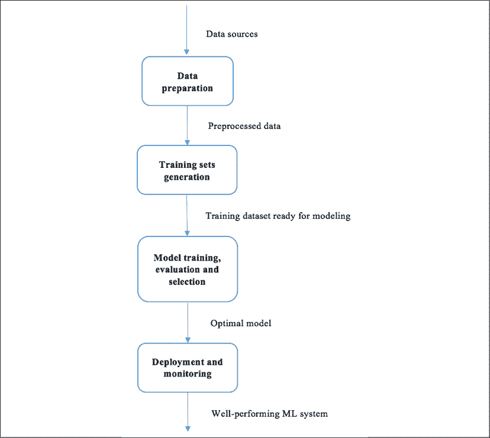
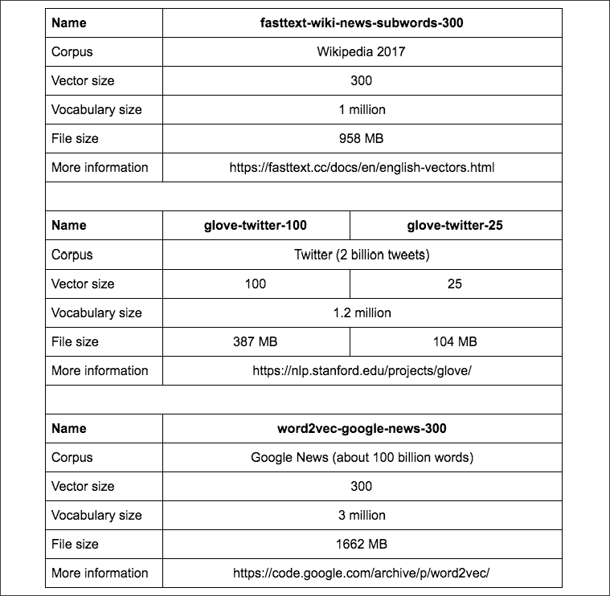

# 十一、机器学习最佳实践

在参与了多个涵盖重要机器学习概念、技术和广泛使用的算法的项目后，您对机器学习生态系统有了一个大致的了解，并在使用机器学习算法和 Python 解决实际问题方面有了扎实的经验。然而，一旦我们开始在现实世界中从头开始做项目，就会出现问题。本章旨在让我们为它做好准备，并在整个机器学习解决方案工作流程中遵循 21 个最佳实践。

我们将在本章中讨论以下主题:

*   机器学习解决方案工作流
*   数据准备阶段的任务
*   训练集生成阶段的任务
*   算法训练、评估和选择阶段的任务
*   系统部署和监控阶段的任务
*   数据准备阶段的最佳实践
*   培训集生成阶段的最佳实践
*   单词嵌入
*   模型培训、评估和选择阶段的最佳实践
*   系统部署和监控阶段的最佳实践

# 机器学习解决方案工作流

一般来说，解决机器学习问题所涉及的主要任务可以概括为以下四个方面:

*   数据准备
*   训练集生成
*   模型培训、评估和选择
*   部署和监测

从数据源开始，到最终的机器学习系统结束，机器学习解决方案基本上遵循这里显示的范例:



图 11.1:机器学习解决方案的生命周期

在下面的部分，我们将学习这四个阶段的典型任务、常见挑战和最佳实践。

# 数据准备阶段的最佳实践

没有数据就无法构建机器学习系统。所以**数据采集**应该是我们的第一重点。

## 最佳实践 1–完全理解项目目标

在开始收集数据之前，我们应该确保完全理解项目的目标和业务问题，因为这将指导我们研究哪些数据源，以及哪里还需要足够的领域知识和专业技能。例如，在前一章*第 7 章*、*用回归算法*预测股价，我们的目标是预测 DJIA 指数的未来价格，所以我们首先收集其过去表现的数据，而不是不相关的欧洲股票的过去表现。在*第四章*、*用基于树的算法预测在线广告点击率*中，业务问题是优化以点击率衡量的广告定位效率，因此我们收集了哪些人在什么页面点击或没有点击什么广告的点击流数据，而不是仅仅使用一个 web 域中显示了多少广告。

## 最佳实践 2–收集所有相关字段

有了一个既定的目标，我们就可以缩小潜在的数据源来进行调查。现在问题变成了:是需要收集数据源中所有可用字段的数据，还是属性的子集就足够了？如果我们事先知道哪些属性是关键指标或关键预测因素，那就再好不过了。然而，实际上很难确保由领域专家手工挑选的属性将产生最佳预测结果。因此，对于每个数据源，建议收集与项目相关的所有字段，尤其是在重新收集数据非常耗时甚至不可能的情况下。

例如，在股价预测示例中，我们收集了所有字段的数据，包括**开盘**、**高**、**低**和**成交量**，尽管我们最初不确定**高**和**低**预测会有多大用处。然而，检索股票数据既快捷又容易。在另一个例子中，如果我们想通过抓取在线文章进行主题分类来自己收集数据，我们应该存储尽可能多的信息。否则，如果任何一条信息没有被收集，但后来发现是有价值的，如文章中的超链接，该文章可能已经从网页上删除；如果它仍然存在，重新抓取这些页面的成本会很高。

在收集了我们认为有用的数据集之后，我们需要通过检查其**一致性**和**完整性**来保证数据质量。一致性指的是数据的分布如何随着时间而变化。完整性意味着有多少数据存在于字段和样本中。在下面的两个实践中详细解释了它们。

## 最佳实践 3–保持字段值的一致性

在已经存在的数据集中，或者在我们从零开始收集的数据集中，我们经常会看到代表相同含义的不同值。比如我们在乡村领域看到*美国*、*美国*、*美国 A* ，在性别领域看到*男性*和 *M* 。有必要统一或规范一个领域的价值观。比如在性别字段中只保留 *M* 、 *F* 、*性别多样*三个选项，替换其他可选值。否则，会在后期搞乱算法，因为不同的特征值即使意义相同，也会被区别对待。跟踪哪些值映射到字段的默认值也是一种很好的做法。

此外，同一字段中值的格式也应该一致。例如，在*年龄*字段中，可能存在真实的年龄值，如 *21* 和 *35* ，以及不正确的年龄值，如 *1990* 和*1978*；在*评级*字段中，既可以找到基数，也可以找到英文数字，如 *1* 、 *2* 、 *3* 、*1*、*2*、*3*。应该进行转换和重新格式化，以确保数据的一致性。

## 最佳实践 4–处理丢失的数据

由于各种原因，现实世界中的数据集很少是完全干净的，并且经常包含丢失或损坏的值。它们通常显示为空白、 *Null* 、 *-1，999999* 、*未知*或任何其他占位符。数据缺失的样本不仅提供不完整的预测信息，还会混淆机器学习模型，因为它无法分辨 *-1* 或*未知*是否有意义。重要的是查明和处理缺失的数据，以避免在后期阶段危及模型的性能。

以下是我们可以用来解决缺失数据问题的三个基本策略:

*   丢弃包含任何缺失值的样本。
*   丢弃任何样本中包含缺失值的字段。
*   根据属性的已知部分推断缺失值。这个过程叫做**缺失数据插补**。典型的插补方法包括用所有样本的平均值或中值，或分类数据最常见的值，替换缺失值。

前两种策略实施起来很简单；然而，它们是以数据丢失为代价的，尤其是当原始数据集不够大时。第三个策略并没有放弃任何数据，而是试图填补空白。

让我们看看在一个示例中如何应用每种策略，其中我们有一个由六个样本组成的数据集(年龄、收入):(30、100)、(20、50)、(35、*未知*)、(25、80)、(30、70)和(40、60):

*   如果我们使用第一种策略处理这个数据集，它将变成(30，100)，(20，50)，(25，80)，(30，70)和(40，60)。
*   如果我们采用第二种策略，数据集将变成(30)、(20)、(35)、(25)、(30)和(40)，其中只保留第一个字段。
*   如果我们决定完成未知值而不是跳过它，样本(35，*未知*)可以转换为(35，72)，其余值的平均值在第二个字段，或者(35，70)，中间值在第二个字段。

在 scikit-learn 中，`SimpleImputer`类([https://sci kit-learn . org/stable/modules/generated/sklearn .归位. simple 归位. html](https://scikit-learn.org/stable/modules/generated/sklearn.impute.SimpleImputer.html) )提供了一个写得很好的归位转换器。我们在此将其用于以下小示例:

```py
>>> import numpy as np
>>> from sklearn.impute import SimpleImputer 
```

用`numpy`中的`np.nan`表示未知值，具体如下:

```py
>>> data_origin = [[30, 100],
...                [20, 50],
...                [35, np.nan],
...                [25, 80],
...                [30, 70],
...                [40, 60]] 
```

用平均值初始化插补转换器，并从原始数据中获得平均值:

```py
>>> imp_mean = SimpleImputer(missing_values=np.nan, strategy='mean')
>>> imp_mean.fit(data_origin) 
```

按如下方式填写缺失值:

```py
>>> data_mean_imp = imp_mean.transform(data_origin)
>>> print(data_mean_imp)
[[ 30\. 100.]
 [ 20\. 50.]
 [ 35\. 72.]
 [ 25\. 80.]
 [ 30\. 70.]
 [ 40\. 60.]] 
```

同样，用中值初始化插补变压器，如下所述:

```py
>>> imp_median = SimpleImputer(missing_values=np.nan, strategy='median')
>>> imp_median.fit(data_origin)
>>> data_median_imp = imp_median.transform(data_origin)
>>> print(data_median_imp)
[[ 30\. 100.]
 [ 20\. 50.]
 [ 35\. 70.]
 [ 25\. 80.]
 [ 30\. 70.]
 [ 40\. 60.]] 
```

当新样本进来时，可以使用训练好的转换器估算缺失值(在任何属性中)，例如，平均值，如下所示:

```py
>>> new = [[20, np.nan],
...        [30, np.nan],
...        [np.nan, 70],
...        [np.nan, np.nan]]
>>> new_mean_imp = imp_mean.transform(new)
>>> print(new_mean_imp)
[[ 20\. 72.]
 [ 30\. 72.]
 [ 30\. 70.]
 [ 30\. 72.]] 
```

请注意，年龄字段中的`30`是原始数据集中这六个年龄值的平均值。

既然我们已经了解了插补是如何工作的，以及它的实现，让我们通过下面的例子来探讨插补缺失值和丢弃缺失数据的策略是如何影响预测结果的:

1.  首先，我们加载糖尿病数据集，如下所示:

    ```py
    >>> from sklearn import datasets
    >>> dataset = datasets.load_diabetes()
    >>> X_full, y = dataset.data, dataset.target 
    ```

2.  通过添加 25%的缺失值来模拟损坏的数据集:

    ```py
    >>> m, n = X_full.shape
    >>> m_missing = int(m * 0.25)
    >>> print(m, m_missing)
    442 110 
    ```

3.  随机选择的`m_missing`样本，如下:

    ```py
    >>> np.random.seed(42)
    >>> missing_samples = np.array([True] * m_missing + 
                                   [False] * (m - m_missing))
    >>> np.random.shuffle(missing_samples) 
    ```

4.  对于每个缺失的样本，从`n`特征中随机选择 1 个:

    ```py
    >>> missing_features = np.random.randint(low=0, high=n, 
                                             size=m_missing) 
    ```

5.  用`nan`表示缺失值，如下图:

    ```py
    >>> X_missing = X_full.copy()
    >>> X_missing[np.where(missing_samples)[0], missing_features] 
                                                          = np.nan 
    ```

6.  然后，我们通过丢弃包含缺失值的样本来处理这个损坏的数据集:

    ```py
    >>> X_rm_missing = X_missing[~missing_samples, :]
    >>> y_rm_missing = y[~missing_samples] 
    ```

7.  通过使用回归森林模型以交叉验证的方式估计平均回归得分 *R* 2 来衡量使用此策略的效果。去除缺失样本后，估计数据集上的 *R* 2，如下所示:

    ```py
    >>> from sklearn.ensemble import RandomForestRegressor
    >>> from sklearn.model_selection import cross_val_score
    >>> regressor = RandomForestRegressor(random_state=42, 
                                      max_depth=10, n_estimators=100)
    >>> score_rm_missing = cross_val_score(regressor,X_rm_missing,
                                              y_rm_missing).mean()
    >>> print(f'Score with the data set with missing samples removed: {score_rm_missing:.2f}')
    Score with the data set with missing samples removed: 0.38 
    ```

8.  现在，我们通过用平均值输入缺失值来以不同的方式处理损坏的数据集，如下所示:

    ```py
    >>> imp_mean = SimpleImputer(missing_values=np.nan, strategy='mean')
    >>> X_mean_imp = imp_mean.fit_transform(X_missing) 
    ```

9.  同样，通过估算平均 *R* 2 来测量使用该策略的效果，如下所示:

    ```py
    >>> regressor = RandomForestRegressor(random_state=42, 
                                          max_depth=10, 
                                          n_estimators=100)
    >>> score_mean_imp = cross_val_score(regressor, X_mean_imp, 
                                                       y).mean()
    >>> print(f'Score with the data set with missing values replaced by mean: {score_mean_imp:.2f}')
    Score with the data set with missing values replaced by mean: 0.41 
    ```

10.  在这种情况下，插补策略比丢弃更有效。那么，估算的数据集离原始完整数据集有多远？我们可以通过估计原始数据集上的平均回归得分来再次检查它，如下所示:

    ```py
    >>> regressor = RandomForestRegressor(random_state=42, 
                                          max_depth=10, 
                                          n_estimators=500)
    >>> score_full = cross_val_score(regressor, X_full, y).mean()
    >>> print(f'Score with the full data set: {score_full:.2f}')
    Score with the full data set: 0.42 
    ```

事实证明，在估算的数据集中几乎没有信息被泄露。

然而，不能保证插补策略总是更有效，有时丢弃缺失值的样本会更有效。因此，像我们之前所做的那样，通过交叉验证来比较不同策略的性能是一个很好的实践。

## 最佳实践 5–存储大规模数据

随着数据规模的不断增长，我们经常无法简单地将数据放入单个本地机器中，需要将其存储在云或分布式文件系统中。由于这主要是一本关于 Python 机器学习的书，我们将只涉及一些您可以研究的基本领域。存储大数据的两个主要策略是**纵向扩展**和**横向扩展**:

*   如果数据超过当前系统容量，纵向扩展方法会增加存储容量，例如添加更多磁盘。这在快速访问平台中非常有用。
*   在横向扩展方法中，存储容量随着存储群集中的更多节点而递增。ApacheHadoop([https://hadoop.apache.org/](https://hadoop.apache.org/))用于存储和处理横向扩展集群中的大数据，数据分布在数百甚至数千个节点上。还有基于云的分布式文件服务，比如亚马逊 Web Services 中的 S3([https://aws.amazon.com/s3/](https://aws.amazon.com/s3/))，谷歌云中的谷歌云存储([https://cloud.google.com/storage/](https://cloud.google.com/storage/))，微软 Azure 中的存储([https://azure.microsoft.com/en-us/services/storage/](https://azure.microsoft.com/en-us/services/storage/))。它们是可大规模扩展的，专为安全耐用的存储而设计。

有了准备充分的数据，就可以安全地进入训练集生成阶段。让我们看看下一部分。

# 培训集生成阶段的最佳实践

本阶段的典型任务可归纳为两大类:**数据预处理**和**特征工程**。

首先，数据预处理通常涉及分类特征编码、特征缩放、特征选择和降维。

## 最佳实践 6–用数值识别分类特征

一般来说，分类特征很容易发现，因为它们传达了定性信息，如风险水平、职业和兴趣。然而，如果该特性采用谨慎且可计数的(有限的)数值，例如，1 到 12 代表一年中的月份，1 和 0 表示真和假，这就变得棘手了。识别这种特征是分类的还是数字的关键是它是否提供了数学或排序的含义；如果是，则是数字特征，例如产品评级从 1 到 5；否则，它是绝对的，例如月或星期几。

## 最佳实践 7–决定是否编码分类特征

如果一个特征被认为是绝对的，我们需要决定是否应该编码它。这取决于我们将在后期阶段使用什么预测算法。朴素贝叶斯和基于树的算法可以直接处理分类特征，而其他算法通常不能，在这种情况下，编码是必不可少的。

由于特征生成阶段的输出是模型训练阶段的输入，因此在特征生成阶段采取的*步骤应该与预测算法*兼容。因此，我们应该将特征生成和预测模型训练这两个阶段视为一个整体，而不是两个孤立的部分。接下来的两个实用技巧也强化了这一点。

## 最佳实践 8–决定是否选择功能，如果是，如何选择

您已经在*第 5 章*、*中看到了如何使用基于 L1 的正则化逻辑回归和随机森林来进行特征选择。功能选择的好处包括以下几点:*

*   由于消除了冗余或不相关的特征，减少了预测模型的训练时间
*   出于前面相同的原因，减少过度拟合
*   可能会提高性能，因为预测模型将从具有更重要特征的数据中学习

请注意，我们使用了单词*可能是*，因为没有绝对的把握特征选择会提高预测精度。因此，通过交叉验证来比较进行特征选择和不进行特征选择的性能是一种很好的做法。例如，通过执行以下步骤，我们可以通过以交叉验证的方式用`SVC`模型估计平均分类精度来测量特征选择的效果:

1.  首先，我们从 scikit-learn 加载手写数字数据集，如下所示:

    ```py
    >>> from sklearn.datasets import load_digits
    >>> dataset = load_digits()
    >>> X, y = dataset.data, dataset.target
    >>> print(X.shape)
    (1797, 64) 
    ```

2.  接下来，估计原始数据集的精度，它是 64 维的，详细如下:

    ```py
    >>> from sklearn.svm import SVC
    >>> from sklearn.model_selection import cross_val_score
    >>> classifier = SVC(gamma=0.005, random_state=42)
    >>> score = cross_val_score(classifier, X, y).mean()
    >>> print(f'Score with the original data set: {score:.2f}')
    Score with the original data set: 0.90 
    ```

3.  然后基于随机森林进行特征选择，根据特征的重要性得分进行分类:

    ```py
    >>> from sklearn.ensemble import RandomForestClassifier
    >>> random_forest = RandomForestClassifier(n_estimators=100, criterion='gini', n_jobs=-1, random_state=42)
    >>> random_forest.fit(X, y)
    >>> feature_sorted = 
                   np.argsort(random_forest.feature_importances_) 
    ```

4.  现在选择不同数量的顶部要素来构建新的数据集，并估计每个数据集上的精度，如下所示:

    ```py
    >>> K = [10, 15, 25, 35, 45]
    >>> for k in K:
    ...     top_K_features = feature_sorted[-k:]
    ...     X_k_selected = X[:, top_K_features]
    ...     # Estimate accuracy on the data set with k 
              selected features
    ...     classifier = SVC(gamma=0.005)
    ...     score_k_features = cross_val_score(classifier, 
                                  X_k_selected, y).mean()
    ...     print(f'Score with the dataset of top {k} features: 
                  {score_k_features:.2f}')
    ...
    Score with the dataset of top 10 features: 0.86
    Score with the dataset of top 15 features: 0.92
    Score with the dataset of top 25 features: 0.95
    Score with the dataset of top 35 features: 0.93
    Score with the dataset of top 45 features: 0.90 
    ```

如果我们使用随机森林选择的前 25 个特征，SVM 分类性能可以从 0.9 增加到 0.95。

## 最佳实践 9–决定是否降维，如果降维，如何降维

特征选择和维度是不同的，前者从原始数据空间选择特征，而后者从原始空间的投影空间选择特征。降维具有以下类似于特征选择的优点，如下所示:

*   减少预测模型的训练时间，因为冗余或相关的特征被合并到新的特征中
*   出于同样的原因，减少过度拟合
*   可能会提高性能，因为预测模型将从冗余或相关特征较少的数据中学习

同样，不能保证降维会产生更好的预测结果。为了检验其效果，建议在模型训练阶段集成降维。重用前面的手写数字示例，我们可以测量基于**主成分分析** ( **主成分分析**)的降维的效果，其中我们保留不同数量的顶级成分来构建新的数据集，并估计每个数据集上的精度:

```py
>>> from sklearn.decomposition import PCA
>>> # Keep different number of top components
>>> N = [10, 15, 25, 35, 45]
>>> for n in N:
...     pca = PCA(n_components=n)
...     X_n_kept = pca.fit_transform(X)
...     # Estimate accuracy on the data set with top n components
...     classifier = SVC(gamma=0.005)
...     score_n_components = 
                   cross_val_score(classifier, X_n_kept, y).mean()
...     print(f'Score with the dataset of top {n} components:  
                                    {score_n_components:.2f}')
Score with the dataset of top 10 components: 0.94
Score with the dataset of top 15 components: 0.95
Score with the dataset of top 25 components: 0.93
Score with the dataset of top 35 components: 0.91
Score with the dataset of top 45 components: 0.90 
```

如果我们使用主成分分析生成的前 15 个特征，SVM 分类性能可以从 0.9 提高到 0.95。

## 最佳实践 10–决定是否重新缩放功能

如*第 7 章*、*用回归算法*预测股票价格、*第 8 章*、*用人工神经网络*预测股票价格、基于 SGD 的线性回归、SVR 和神经网络模型要求通过去除均值和缩放到单位方差来标准化特征。那么，什么时候需要功能扩展，什么时候不需要呢？

一般来说，朴素贝叶斯和基于树的算法对不同尺度的特征不敏感，因为它们独立地看待每个特征。

在大多数情况下，在学习中涉及任何形式的样本距离(或空间分离)的算法需要缩放/标准化的输入，例如 SVC、SVR、k 均值聚类和 **k 近邻** ( **KNN** )算法。对于任何使用 SGD 进行优化的算法，例如具有梯度下降的线性或逻辑回归以及神经网络，特征缩放也是必须的。

到目前为止，我们已经介绍了关于数据预处理的技巧，接下来我们将讨论作为训练集生成的另一个主要方面的特征工程的最佳实践。我们将从两个角度这样做。

## 最佳实践 11–利用领域专业知识执行功能工程

如果我们有幸拥有足够的领域知识，我们可以将其应用于创建特定领域的特征；我们利用我们的业务经验和见解来识别数据中的内容，并制定与预测目标相关的新数据。例如在*第 7 章*、*用回归算法预测股价*中，我们基于投资者在做出投资决策时通常会考虑的因素，设计并构建了用于预测股价的特征集。

虽然需要特定的领域知识，但有时我们仍然可以在这一类别中应用一些通用技巧。例如，在与客户分析相关的领域，如营销和广告，一天中的时间、一周中的日期和月份通常是重要的信号。给定一个数据点，日期列中的值为 *2020/09/01* ，时间列中的值为 *14:34:21* ，我们可以创建包括*下午*、*星期二*和*九月*在内的新功能。在零售业中，覆盖一段时间的信息通常会进行汇总，以提供更好的见解。例如，顾客在过去三个月中光顾商店的次数，或者前一年每周平均购买的产品数量，可以作为顾客行为预测的良好预测指标。

## 最佳实践 12–在没有领域专业知识的情况下执行功能工程

不幸的是，如果我们只有很少的领域知识，我们如何生成特征？别慌。有几种通用的方法可以遵循，例如二值化、离散化、交互和多项式变换。

## 二值化

这是将数字特征转换为具有预设阈值的二进制特征的过程。例如，在垃圾邮件检测中，对于特征(或术语)*奖品*，我们可以生成一个新的特征`whether_term_prize_occurs`:任何大于 1 的术语频率值都变成 1；否则为 0。特征*每周的访问次数*可以通过判断值是否大于等于 3 来产生一个新的特征`is_frequent_visitor`。我们使用 scikit-learn 实现这样的二值化，如下所示:

```py
>>> from sklearn.preprocessing import Binarizer
>>> X = [[4], [1], [3], [0]]
>>> binarizer = Binarizer(threshold=2.9)
>>> X_new = binarizer.fit_transform(X)
>>> print(X_new)
[[1]
 [0]
 [1]
 [0]] 
```

## [数]离散化

这是将数值特征转换为可能值有限的分类特征的过程。二值化可以看作是离散化的一种特例。例如，我们可以生成一个*年龄组*特征:“ *18-24* ”代表 18-24 岁，“ *25-34* ”代表 25-34 岁，“ *34-54* ”和“ *55+* ”。

## 互动

这个包括两个数值特征的和、乘或任意运算，以及两个分类特征的联合条件检查。例如*每周访问次数*和*每周购买产品数量*可以用来生成*每次访问购买产品数量*特征；*兴趣与职业*，如*运动*、*工程师*，可以形成*职业与兴趣*，如*工程师对运动感兴趣*。

## 多项式变换

这是生成多项式和交互特征的过程。对于两个特征， *a* 和 *b* ，生成的两次多项式特征为*a*<sup class="" style="font-style: italic;">2</sup>*ab*，以及 *b* <sup class="" style="font-style: italic;">2</sup> 。在 scikit-learn 中，我们可以使用`PolynomialFeatures`类([https://sci kit-learn . org/stable/modules/generated/sklearn . premixing . polynomicalfeatures . html](https://scikit-learn.org/stable/modules/generated/sklearn.preprocessing.PolynomialFeatures.html))进行多项式变换，如下所示:

```py
>>> from sklearn.preprocessing import PolynomialFeatures
>>> X = [[2, 4],
...      [1, 3],
...      [3, 2],
...      [0, 3]]
>>> poly = PolynomialFeatures(degree=2)
>>> X_new = poly.fit_transform(X)
>>> print(X_new)
[[ 1\. 2\. 4\. 4\. 8\. 16.]
 [ 1\. 1\. 3\. 1\. 3\. 9.]
 [ 1\. 3\. 2\. 9\. 6\. 4.]
 [ 1\. 0\. 3\. 0\. 0\. 9.]] 
```

注意，产生的新特征包括 *1* (偏差、截距) *a* 、 *b* 、 *a* <sup class="" style="font-style: italic;">2</sup> 、 *ab* 和 *b* <sup class="" style="font-style: italic;">2</sup> 。

## 最佳实践 13–记录每个功能是如何生成的

我们已经用领域知识覆盖了特征工程的规则，总的来说，还有一点值得注意:记录每个特征是如何生成的。这听起来很琐碎，但我们经常忘记一个特征是如何获得或创建的。我们通常需要在模型训练阶段的一些失败的试验之后回到这个阶段，并尝试创建更多的特征，希望提高性能。我们必须清楚特性是如何生成的，以便删除那些不太有效的特性，并添加更有潜力的新特性。

## 最佳实践 14–从文本数据中提取特征

我们将从从文本、tf 和 tf-idf 中提取特征的传统方法开始。然后我们将继续使用现代方法:单词嵌入。最后，我们将研究使用预训练模型的单词嵌入。

## Tf 和 tf-idf

我们在*第 9 章*、*中使用文本分析技术*挖掘 20 个新闻组数据集，在*第 10 章*、*中使用聚类和主题建模*发现新闻组数据集中的底层主题，其中我们基于**术语频率** ( **tf** )和**术语频率-反向文档频率**(**TF-IDF**从文本中提取特征这两种方法都将每一个文档的单词(术语)视为一个单词集合，或者一个**单词包** ( **BoW** )，不考虑单词的顺序，但保持多样性。tf 方法简单地使用标记的计数，而 tf-idf 通过为每个 tf 分配一个与文档频率成反比的加权因子来扩展 tf。加入 idf 因子后，tf-idf 减少了经常出现的常用术语(如 *get* 、 *make* )的权重，强调了很少出现但传达重要意义的术语。因此，通常从 tf-idf 中提取的特征比从 tf 中提取的特征更具代表性。****

您可能还记得，文档由一个非常稀疏的向量表示，其中只有当前项具有非零值。向量的维数通常很高，这是由词汇的大小和唯一术语的数量决定的。此外，这种一键编码方法将每个术语视为一个独立的项目，而不考虑单词之间的关系(在语言学中称为“上下文”)。

## 单词嵌入

相反，另一种方法，称为**单词嵌入**，能够捕捉单词的含义及其上下文。在这种方法中，一个单词由一个浮点数向量表示。它的维度比词汇量小得多，通常只有几百个。例如字**机**可以表示为【1.4，2.1，10.3，0.2，6.81】。那么，我们如何将一个单词嵌入到向量中呢？一种解决方案是 word2vec，它训练一个浅层神经网络来预测一个单词周围的其他单词(称为**连续单词包** ( **CBOW** ))，或者预测一个单词周围的其他单词(称为 **skip-gram** )。训练好的神经网络的系数是对应单词的嵌入向量。

给定句子*我喜欢通过示例阅读 Python 机器学习*在一个语料库中，5 作为单词窗口的大小，我们可以为 CBOW 神经网络设置以下训练集:

<colgroup><col> <col></colgroup> 
| 神经网络输入 | 神经网络输出 |
| (我，爱，python，机器) | (阅读) |
| (爱、阅读、机器、学习) | (python) |
| (阅读、python、学习、by) | (机器) |
| (例如，python、机器) | (学习) |

表 11.1:CBOW 神经网络的输入和输出

当然，神经网络的输入和输出是一个热门的编码向量，其中对于当前单词的值是 1，或者对于不存在的单词的值是 0。我们可以从一个语料库中一句一句地构建数百万个训练样本。网络训练后，连接输入层和隐藏层的权重嵌入单个输入词。基于 skip-gram 的神经网络以类似的方式嵌入单词。但是它的输入和输出是 CBOW 的逆版本。给定相同的句子，*我喜欢通过示例阅读 Python 机器学习*，5 作为单词窗口的大小，我们可以为 skip-gram 神经网络设置以下训练集:

<colgroup><col> <col></colgroup> 
| 神经网络输入 | 神经网络输出 |
| (阅读) | ㈠ |
| (阅读) | (爱) |
| (阅读) | (python) |
| (阅读) | (机器) |
| (python) | (爱) |
| (python) | (阅读) |
| (python) | (机器) |
| (python) | (学习) |
| (机器) | (阅读) |
| (机器) | (python) |
| (机器) | (学习) |
| (机器) | (作者) |
| (学习) | (python) |
| (学习) | (机器) |
| (学习) | (作者) |
| (学习) | (示例) |

表 11.2:跳跃图神经网络的输入和输出

嵌入向量是实值，其中每个维度编码词汇中单词的一个意义方面。这有助于保留单词的语义信息，而不是像使用 tf 或 td-idf 的虚拟一热编码方法那样将其丢弃。一个有趣的现象是来自语义相似单词的向量在几何空间中彼此接近。例如，单词*聚类和分组*都指机器学习环境中的无监督聚类，因此它们的嵌入向量非常接近。

## 预训练模型的单词嵌入

训练一个单词嵌入神经网络可能很耗时，并且计算量很大。幸运的是，有几家大型科技公司已经在不同种类的语料库上训练了单词嵌入模型，并对它们进行了开源。我们可以简单地使用这些**预训练的**模型将单词映射到向量。一些流行的预训练单词嵌入模型如下:



图 11.2:流行的预训练单词嵌入模型的配置

一旦我们有了单个单词的嵌入向量，我们就可以通过平均文档中当前单词的所有向量来表示文档样本。文档样本的结果向量随后被下游预测任务消耗，例如分类、搜索引擎中的相似性排序和聚类。

现在我们来玩一下`gensim`，一个流行的 NLP 包，有强大的单词嵌入模块。如果您尚未在*第 9 章*、*中安装该软件包，您可以使用`pip`来使用文本分析技术挖掘 20 个新闻组数据集*。

首先，我们导入包并加载一个预先训练好的模型`glove-twitter-25`，如下所示:

```py
>>> import gensim.downloader as api
>>> model = api.load("glove-twitter-25")
[==================================================] 100.0% 
104.8/104.8MB downloaded 
```

如果您运行这一行代码，您将看到流程栏。`glove-twitter-25`型号是最小的型号之一，所以下载不会花很长时间。

我们可以得到一个单词的嵌入向量(例如`computer`，如下所示:

```py
>>> vector = model.wv['computer']
>>> print('Word computer is embedded into:\n', vector)
Word computer is embedded into:
[ 0.64005 -0.019514 0.70148 -0.66123 1.1723 -0.58859 0.25917
-0.81541 1.1708 1.1413 -0.15405 -0.11369 -3.8414 -0.87233
  0.47489 1.1541 0.97678 1.1107 -0.14572 -0.52013 -0.52234
 -0.92349 0.34651 0.061939 -0.57375 ] 
```

结果是如预期的 25 维浮点向量。

我们还可以使用`most_similar`方法获得与`computer`上下文关系最密切的前 10 个单词，如下所示:

```py
>>> similar_words = model.most_similar("computer")
>>> print('Top ten words most contextually relevant to computer:\n', 
           similar_words)
Top ten words most contextually relevant to computer:
 [('camera', 0.907833456993103), ('cell', 0.891890287399292), ('server', 0.8744666576385498), ('device', 0.869352400302887), ('wifi', 0.8631256818771362), ('screen', 0.8621907234191895), ('app', 0.8615544438362122), ('case', 0.8587921857833862), ('remote', 0.8583616018295288), ('file', 0.8575270771980286)] 
```

结果看起来很有希望。

最后，我们用一个简单的例子演示如何为文档生成表示向量，如下所示:

```py
>>> doc_sample = ['i', 'love', 'reading', 'python', 'machine', 
                 'learning', 'by', 'example']
>>> import numpy as np
>>> doc_vector = np.mean([model.wv[word] for word in doc_sample], 
                                                           axis=0)
>>> print('The document sample is embedded into:\n', doc_vector)
The document sample is embedded into:
 [-0.17100249 0.1388764 0.10616798 0.200275 0.1159925 -0.1515975
  1.1621187 -0.4241785 0.2912 -0.28199488 -0.31453252 0.43692702
 -3.95395 -0.35544625 0.073975 0.1408525 0.20736426 0.17444688
  0.10602863 -0.04121475 -0.34942 -0.2736689 -0.47526264 -0.11842456
 -0.16284864] 
```

得到的向量是八个输入单词的嵌入向量的平均值。

在传统的 NLP 应用中，如文本分类和主题建模，tf 或 td-idf 仍然是特征提取的优秀解决方案。在更复杂的领域，如文本摘要、机器翻译、命名实体解析、问答和信息检索，单词嵌入被广泛使用，并且提取出比这两种传统方法好得多的特征。

现在您已经回顾了数据和特征生成的最佳实践，接下来让我们看看模型训练。

# 模型培训、评估和选择阶段的最佳实践

给定一个有监督的机器学习问题，很多人问的第一个问题通常是*什么是最好的分类或回归算法来解决？*然而，没有一刀切的解决方案，也没有免费的午餐。在尝试多种算法并微调最佳算法之前，没有人知道哪种算法效果最好。在接下来的章节中，我们将探讨这方面的最佳实践。

## 最佳实践 15–选择正确的算法开始

由于一个算法有几个参数需要调整，耗尽所有算法并微调每一个算法会非常耗时且计算成本高。相反，我们应该列出一至三个算法，从使用下面的一般准则开始(注意，我们这里侧重于分类，但理论超越了回归，回归中通常有一个对应的算法)。

在列出潜在算法之前，我们需要明确几件事，如下所述:

*   训练数据集的大小
*   数据集的维度
*   数据是否是线性可分的
*   特征是否独立
*   偏差和方差的容限和权衡
*   是否需要在线学习

现在，让我们看看如何选择正确的算法开始，考虑到前面提到的观点。

### 奈伊夫拜厄斯

这是一个非常简单的算法。对于相对较小的训练数据集，如果特征是独立的，朴素贝叶斯通常会表现良好。对于大数据集，天真的贝叶斯仍然可以很好地工作，因为在这种情况下可以假设特征独立，而不管事实如何。由于计算简单，朴素贝叶斯的训练通常比任何其他算法都快。然而，这可能导致高偏差(但低方差)。

### 逻辑回归

这可能是最广泛使用的分类算法，也是机器学习从业者在给定分类问题时通常尝试的第一个算法。当数据是线性可分的或近似线性可分的时，它表现良好。即使它不是线性可分的，也有可能将线性不可分的特征转换成可分的特征，然后应用逻辑回归。

在下面的例子中，原始空间中的数据不是线性可分的，但是它在由两个特征的交互创建的变换空间中变得可分:


图 11.3:将特征从线性不可分转换为可分

此外，逻辑回归通过 SGD 优化对大型数据集具有极高的可扩展性，这使得它在解决大数据问题时非常有效。此外，它使在线学习变得可行。尽管逻辑回归是一种低偏差、高方差的算法，但我们通过添加 L1、L2 或两种正则化的混合来克服潜在的过度拟合。

### SVM

这是万能的足以适应数据的线性可分性。对于可分离的数据集，具有线性核的 SVM 的表现与逻辑回归相当。除此之外，如果配备了非线性核，如径向基函数，SVM 也适用于不可分离的数据集。对于高维数据集，逻辑回归的性能通常会受到影响，而 SVM 仍然表现良好。这方面的一个很好的例子是新闻分类，其特征维数在数万。总的来说，SVM 使用正确的内核和参数可以获得非常高的精度。然而，这可能是以高计算和高内存消耗为代价的。

### 随机森林

数据的线性可分性与算法无关，它直接与分类特征一起工作，无需编码，这提供了极大的易用性。此外，训练好的模型非常容易向非机器学习从业者解释和解释，这是大多数其他算法无法实现的。此外，随机森林增强了决策树算法，它可以通过集合一组独立的树来减少过度拟合。其性能与 SVM 相当，而与 SVM 和神经网络相比，微调随机森林模型的难度较小。

### 神经网络

这些都是极其强大的，尤其是随着深度学习的发展。然而，找到正确的拓扑(层、节点、激活函数等)并不容易，更不用说耗时的训练和调整模型了。因此，对于一般的机器学习问题，不建议将它们作为一种算法来开始。然而，对于计算机视觉和许多自然语言处理任务，神经网络仍然是首选模型。

## 最佳实践 16–减少过度拟合

在上次练习中讨论算法的优缺点时，我们谈到了避免过拟合的方法。我们在此正式总结如下:

*   **交叉验证**:这是我们在本书所有章节中建立起来的一个好习惯。
*   **正则化**:这增加了惩罚项，以减少在给定的训练集上完美拟合模型所导致的误差。
*   **简化，如果可能**:模型越复杂，过拟合的几率越高。复杂模型包括深度过大的树或森林、具有高多项式变换度的线性回归以及具有复杂核的 SVM。
*   **集成学习**:这涉及到将一组弱模型组合成一个更强的模型。

那么，我们如何判断一个模型是过度拟合，还是另一个极端，拟合不足呢？让我们看看下一部分。

## 最佳实践 17–诊断过度装配和装配不足

一条**学习曲线**通常是用来评估模型的偏差和方差。学习曲线是在给定数量的训练样本上比较交叉验证的训练和测试分数的图表。

对于非常适合训练样本的模型，训练样本的性能应该超出预期。理想情况下，随着训练样本数量的增加，模型在测试样本上的性能会提高；最终，测试样本的性能将接近训练样本的性能。

当测试样本上的性能收敛于比训练性能低得多的值时，可以得出过拟合的结论。在这种情况下，模型无法推广到尚未见过的实例。

对于一个甚至不太适合训练样本的模型，欠拟合很容易被发现:训练样本和测试样本的性能都低于学习曲线中的预期性能。

以下是理想情况下的学习曲线示例:


图 11.4:理想的学习曲线

下图显示了超负荷模型的学习曲线示例:


图 11.5:过度拟合学习曲线

欠负荷模型的学习曲线可能如下图所示:


图 11.6:拟合不足的学习曲线

要生成学习曲线，您可以利用 scikit-learn 中的`learning_curve`模块([https://sci kit-learn . org/stable/modules/generated/sklearn . model _ selection . learning _ curve . html # sklearn . model _ selection . learning _ curve](https://scikit-learn.org/stable/modules/generated/sklearn.model_selection.learning_curve.html#sklear))和[https://sci kit-learn . org/stable/auto _ examples/model _ selection/plot _ learning _ curve . html](https://scikit-learn.org/stable/auto_examples/model_selection/plot_learning_curve.html)中定义的`plot_learning_curve`功能。

## 最佳实践 18–在大规模数据集上建模

我们在第 6 章、*将预测扩展到万亿字节点击日志*中获得了使用大型数据集的经验。有一些技巧可以帮助您更有效地对大规模数据建模。

首先，从一个小的子集开始，例如，一个适合本地机器的子集。这有助于加快早期实验。显然，你不想在整个数据集上训练，只是为了找出 SVM 森林还是随机森林效果更好。相反，您可以随机采样数据点，并在选定的集合上快速运行几个模型。

第二个技巧是选择可扩展的算法，例如逻辑回归、线性 SVM 和基于 SGD 的优化。这是相当直观的。

一旦确定哪个模型最有效，就可以使用更多的数据点对其进行微调，并最终在整个数据集上进行训练。之后，别忘了保存训练好的模型。这是第三个提示。在大数据集上训练需要很长时间，如果可能的话，您希望避免重做。我们将在*最佳实践 19*–*保存、加载和重用模型*中详细探讨保存和加载模型，这是部署和监控阶段的一部分。

# 部署和监控阶段的最佳实践

在执行完前面三个阶段的所有流程后，我们现在有了一个完善的数据预处理管道和一个经过正确训练的预测模型。机器学习系统的最后一个阶段包括保存前几个阶段得到的模型，并将它们部署在新数据上，以及监控它们的性能并定期更新预测模型。

## 最佳实践 19–保存、加载和重用模型

部署机器学习时，新数据应经历与前几个阶段相同的数据预处理过程(缩放、特征工程、特征选择、降维等)。预处理后的数据被输入到训练好的模型中。我们不能每次新数据进来时都重新运行整个过程并重新训练模型。相反，我们应该在相应阶段完成后保存已建立的预处理模型和已训练的预测模型。在部署模式下，这些模型会提前加载，并用于根据新数据生成预测结果。

## 使用 pickle 保存和恢复模型

这个可以通过糖尿病的例子来说明，在这个例子中，我们对数据进行了标准化，采用了一个`SVR`模型，如下所示:

```py
>>> dataset = datasets.load_diabetes()
>>> X, y = dataset.data, dataset.target
>>> num_new = 30 # the last 30 samples as new data set
>>> X_train = X[:-num_new, :]
>>> y_train = y[:-num_new]
>>> X_new = X[-num_new:, :]
>>> y_new = y[-num_new:] 
```

使用缩放对训练数据进行预处理，如以下命令所示:

```py
>>> from sklearn.preprocessing import StandardScaler
>>> scaler = StandardScaler()
>>> scaler.fit(X_train) 
```

现在用`pickle`保存已建立的标准器`scaler`对象，如下所示:

```py
>>> import pickle
>>> pickle.dump(scaler, open("scaler.p", "wb" )) 
```

这将生成一个`scaler.p`文件。

继续在缩放的数据上训练一个`SVR`模型，如下所示:

```py
>>> X_scaled_train = scaler.transform(X_train)
>>> from sklearn.svm import SVR
>>> regressor = SVR(C=20)
>>> regressor.fit(X_scaled_train, y_train) 
```

用`pickle`保存训练好的`regressor`对象，如下:

```py
>>> pickle.dump(regressor, open("regressor.p", "wb")) 
```

这个生成一个`regressor.p`文件。

In the deployment stage, we first load the saved standardizer and the `regressor` object from the preceding two files, as follows:

```py
>>> my_scaler = pickle.load(open("scaler.p", "rb" ))
>>> my_regressor = pickle.load(open("regressor.p", "rb")) 
```

然后，我们使用标准化器对新数据进行预处理，并使用刚刚加载的`regressor`对象进行预测，如下所示:

```py
>>> X_scaled_new = my_scaler.transform(X_new)
>>> predictions = my_regressor.predict(X_scaled_new) 
```

## 在TensorFlow中保存和恢复模型

我还将演示如何在 TensorFlow 中保存和恢复模型，作为本节的额外课程。例如，我们将在癌症数据集上训练一个简单的逻辑回归模型，保存训练好的模型，并按照以下步骤重新加载:

1.  导入必要的 TensorFlow 模块，并从 scikit-learn 加载癌症数据集:

    ```py
    >>> import tensorflow as tf
    >>> from tensorflow import keras
    >>> from sklearn import datasets
    >>> cancer_data = datasets.load_breast_cancer()
    >>> X = cancer_data.data
    >>> Y = cancer_data.target 
    ```

2.  使用 Keras 顺序 API 和几个指定的参数建立一个简单的逻辑回归模型:

    ```py
    >>> learning_rate = 0.005
    >>> n_iter = 10
    >>> tf.random.set_seed(42)
    >>> model = keras.Sequential([
    ...     keras.layers.Dense(units=1, activation='sigmoid')
    ... ])
    >>> model.compile(loss='binary_crossentropy',
    ...         optimizer=tf.keras.optimizers.Adam(learning_rate)) 
    ```

3.  根据数据

    ```py
    >>> model.fit(X, Y, epochs=n_iter) 
    ```

    训练TensorFlow模型
4.  Display the model's architecture:

    ```py
    >>> model.summary()
    Model: "sequential"
    _________________________________________________________________
    Layer (type)                 Output Shape              Param #
    =================================================================
    dense (Dense)                multiple                  31
    =================================================================
    Total params: 31
    Trainable params: 31
    Non-trainable params: 0
    _________________________________________________________________ 
    ```

    我们将看看以后能否检索到相同的模型。

5.  Hopefully, the previous steps look familiar to you. If not, feel free to review our TensorFlow implementation. Now we save the model to a path:

    ```py
    >>> path = './model_tf'
    >>> model.save(path) 
    ```

    之后，你会看到一个名为`model_tf`的文件夹被创建。文件夹包含训练模型的架构、重量和训练配置。

6.  Finally, we load the model from the previous path and display the loaded model's path:

    ```py
    >>> new_model = tf.keras.models.load_model(path)
    >>> new_model.summary()
    Model: "sequential"
    _________________________________________________________________
    Layer (type)                 Output Shape              Param #
    =================================================================
    dense (Dense)                multiple                  31
    =================================================================
    Total params: 31
    Trainable params: 31
    Non-trainable params: 0
    ________________________________________________________________ 
    ```

    我们刚刚装回了完全一样的模型。

## 最佳实践 20–监控模型性能

机器学习系统现已启动运行。为了确保一切都在正确的轨道上，我们需要定期进行绩效检查。要做到这一点，除了实时做预测外，还要同时记录地面真相。

继续本章前面的糖尿病示例，我们进行如下性能检查:

```py
>>> from sklearn.metrics import r2_score
>>> print(f'Health check on the model, R^2: {r2_score(y_new, 
          predictions):.3f}')
Health check on the model, R^2: 0.613 
```

我们应该记录性能，并为任何衰退的性能设置警报。

## 最佳实践 21–定期更新模型

如果性能越来越差，数据模式很可能已经改变。我们可以通过更新模型来解决这个问题。根据在线学习是否可行，模型可以用新的数据集进行现代化(在线更新)，或者用最新的数据进行完全重新训练。

# 摘要

本章的目的是让你为现实世界的机器学习问题做好准备。我们从机器学习解决方案遵循的一般工作流程开始:数据准备、训练集生成、算法训练、评估和选择，最后是系统部署和监控。然后，我们深入研究了这四个阶段的典型任务、常见挑战和最佳实践。

熟能生巧。最重要的最佳实践是实践本身。从一个真实世界的项目开始，加深你的理解，应用你目前所学的知识。

在下一章中，我们将讨论使用卷积神经网络对服装图像进行分类。

# 练习

1.  你能使用单词嵌入来提取文本特征并开发一个多类分类器来分类新闻组数据吗？(请注意，与 tf-idf 相比，您可能无法通过单词嵌入获得更好的结果，但这是一种很好的做法。)
2.  你能在卡格尔([www.kaggle.com](http://www.kaggle.com))找到几个挑战，并在整本书中实践你所学到的东西吗？