# 统计与机器学习的并行性

乍一看，机器学习似乎离统计学很远。然而，如果我们深入研究它们，我们可以在两者之间找到相似之处。在这一章中，我们将深入探讨细节。已经对线性回归和套索/岭回归进行了比较，以便提供统计建模和机器学习之间的简单比较。这是两个世界的基本模型，从一开始就很好。

在本章中，我们将介绍以下内容:

*   了解统计参数和诊断
*   将统计诊断等同于机器学习模型中的补偿因素
*   脊线和套索回归
*   调整后的 R 平方与精度的比较

# 回归模型和机器学习模型的比较

线性回归和机器学习模型都试图以不同的方式解决同一个问题。在以下拟合最佳可能平面的双变量方程的简单示例中，回归模型试图通过最小化超平面和实际观测值之间的误差来拟合最佳可能超平面。然而，在机器学习中，同样的问题已经被转化为优化问题，其中误差以平方形式建模，以通过改变权重来最小化误差。

在统计建模中，样本是从总体中抽取的，模型将根据采样数据进行拟合。然而，在机器学习中，即使是像 30 个观察值这样的小数字也足以在每次迭代结束时更新权重；在少数情况下，例如在线学习，模型将会更新，甚至只需观察一次:


机器学习模型可以有效地并行化，并在多台机器上工作，其中模型权重在机器之间传播，等等。在使用 Spark 的大数据的情况下，实现了这些技术。

统计模型本质上是参数化的，这意味着模型将具有参数，对这些参数执行诊断以检查模型的有效性。而机器学习模型是非参数的，没有任何参数或曲线假设；这些模型基于所提供的数据自行学习，并得出复杂且错综复杂的函数，而不是预定义的函数拟合。

在统计建模中需要进行多重共线性检查。然而，在机器学习空间中，权重被自动调整以补偿多重共线性问题。如果我们考虑基于树的集成方法，如 bagging、随机森林、boosting 等，多重共线性甚至不存在，因为底层模型是决策树，它首先不存在多重共线性问题。

随着大数据和分布式并行计算的发展，更复杂的模型正在产生用过去的技术不可能产生的最先进的结果。

# 机器学习模型中的补偿因素

用一个由两个支架支撑的梁的例子来解释机器学习模型中的补偿因素，以便将统计诊断等同起来。如果其中一个支架不存在，横梁最终会因为失去平衡而掉下来。类似的类比也适用于比较统计建模和机器学习方法。

使用整体模型精度和单个参数显著性检验对训练数据的统计建模方法进行两点验证。由于无论是线性回归还是逻辑回归，由于模型本身的形状差异较小，因此在看不见的数据上，其效果变差的可能性很小。因此，在部署期间，这些模型不会导致太多偏离的结果。

然而，在机器学习空间中，模型具有高度的灵活性，可以从简单变得高度复杂。最重要的是，机器学习中不会对单个变量进行统计诊断。因此，确保稳健性以避免模型的过度拟合是很重要的，这将确保它在实现阶段的可用性，以确保对看不见的数据的正确使用。

如前所述，在机器学习中，数据将被分成三部分(训练数据-50%，验证数据-25%，测试数据-25%)，而不是统计方法中的两部分。机器学习模型应基于训练数据开发，其超参数应基于验证数据进行调整，以确保两点验证等价；这样，无需在单个变量级别执行诊断，就能确保模型的稳健性:

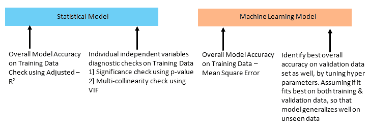

在深入研究这两种流之间的比较之前，我们将开始分别了解每种模型的基本原理。让我们从线性回归开始！这个模型听起来可能微不足道；然而，了解线性回归的工作原理将为更高级的统计和机器学习模型奠定基础。以下是线性回归的假设。

# 线性回归的假设

线性回归有以下假设，否则线性回归模型不成立:

*   因变量应该是自变量的线性组合
*   误差项没有自相关
*   误差应为零均值，且呈正态分布
*   没有多重共线性或多重共线性很少
*   错误术语应该是同源的

具体解释如下:

*   **因变量应为自变量**的线性组合: *Y* 应为 *X* 变量的线性组合。请注意，在下面的等式中， *X2* 已经升到了 *2* 的幂，等式仍然保持变量线性组合的假设:


如何诊断:查看残差与自变量的残差图。此外，尽量包含多项式项，并查看剩余值的任何减少，因为在简单的线性模型无法捕捉到信号的情况下，多项式项可能会从数据中捕捉到更多信号。

在前面的示例图中，最初，应用了线性回归，并且误差似乎有一个模式，而不是纯粹的白噪声；在这种情况下，它只是显示了非线性的存在。在增加多项式的幂之后，现在误差看起来就像白噪声。

*   **误差项无自相关**:误差项存在相关性会影响模型精度。

如何诊断:寻找杜宾-沃森试验。杜宾-沃森的 *d* 检验了残差不是线性自相关的零假设。而 *d* 可以位于 *0* 和 *4* 之间，如果 *d ≈ 2* 表示无自相关， *0 < d < 2* 表示正自相关， *2 < d < 4* 表示负自相关。

*   **误差应具有零均值且正态分布**:误差应具有零均值，以便模型创建无偏估计。绘制误差将显示误差的分布。然而，如果误差项不是正态分布的，这意味着置信区间将变得太宽或太窄，这导致基于最小二乘法估计系数的困难:


如何诊断:查看 Q-Q 图，还有像 Kolmogorov-Smirnov 测试这样的测试会有帮助。通过查看上面的 Q-Q 图，很明显，第一张图表显示误差是正态分布的，因为与对角线相比，残差似乎没有太大的偏差，而在右边的图表中，它清楚地显示误差不是正态分布的；在这些场景中，我们需要通过对数变换等重新评估变量，以使残差看起来像它们在左侧图表上一样。

*   **无多重共线性或很少多重共线性**:多重共线性是指自变量之间相互关联的情况，这种情况通过膨胀系数/估计值的大小来创建不稳定的模型。也很难确定哪个变量有助于预测响应变量。 *VIF* 通过计算相对于所有其他自变量的 R 平方值来计算每个自变量，并试图逐个排除哪个变量具有最高的 *VIF* 值:

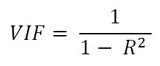

如何诊断:查看散点图，计算数据所有变量的相关系数。计算**方差膨胀因子** ( **VIF** )。如果 *VIF < = 4* 暗示没有多重共线性，那么在银行场景中，人们也用 *VIF < = 2* ！

*   **误差应该是同态的**:误差应该相对于自变量具有恒定的方差，这导致估计的置信区间不切实际地宽或窄，这降低了模型的性能。不保持同质性的一个原因是由于数据中存在异常值，这会将模型拟合拖向权重更高的异常值:


如何诊断:查看残差与因变量图；如果确实存在任何锥形或发散的模式，这表明误差没有恒定的方差，这影响了它的预测。

# 线性回归建模中应用的步骤

以下步骤应用于工业中的线性回归建模:

1.  缺失值和异常值处理
2.  自变量的相关性检验
3.  训练和测试随机分类
4.  根据列车数据拟合模型
5.  根据测试数据评估模型

# 第一性原理的简单线性回归示例

整个章节都展示了广受欢迎的葡萄酒质量数据集，该数据集可从位于[https://archive.ics.uci.edu/ml/datasets/Wine+Quality](https://archive.ics.uci.edu/ml/datasets/Wine+Quality)的 UCI 机器学习存储库中公开获得。

简单线性回归是预测因变量/响应变量 *Y* 的简单方法，给定独立变量/预测变量 *X* 。假设 *X* 和 *Y* 之间呈线性关系:

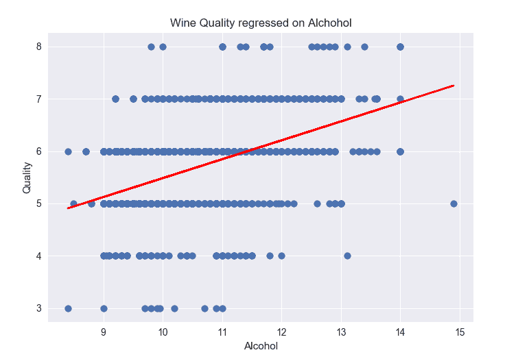

*β0* 和 *β1* 是两个未知常数，分别是截距和斜率参数。一旦我们确定了常数，我们就可以利用它们来预测因变量:

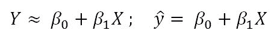

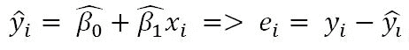


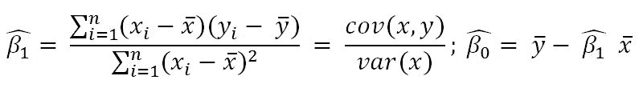

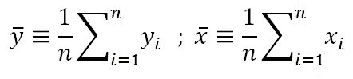

残差是从模型预测的第 *i* 个观测响应值和第 *i* 个响应值之间的差值。显示了平方和的残差。最小二乘法通过最小化误差来选择估计值。

为了从统计学上证明线性回归是显著的，我们必须进行假设检验。假设我们从零假设开始，即 *X* 和 *Y* 之间没有显著关系:


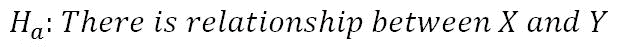

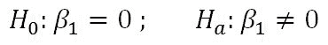

因为，如果 *β1 = 0* ，那么模型显示两个变量之间没有关联( *Y = β0 + ε* ，这些都是零假设假设；为了证明这个假设是对是错，我们需要确定 *β1* 距离 *0* 足够远(精确地说，与 *0* 的距离具有统计学意义)，这样我们就可以确信 *β1* 是非零的，并且两个变量之间具有显著的关系。现在，问题是，离零还有多远？它取决于 *β1* 的分布，这是它的平均值和标准误差(类似于标准差)。在某些情况下，如果标准误差较小，即使相对较小的值也可能提供强有力的证据证明 *β1 ≠ 0* ，因此 *X* 和 *Y* 之间存在关系。相比之下，如果 *SE(β1)* 大，那么 *β1* 的绝对值一定大，这样我们才能拒绝零假设。我们通常会进行以下测试，以检查 *β1* 偏离值 *0* 的标准偏差有多少:

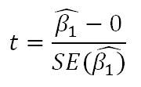

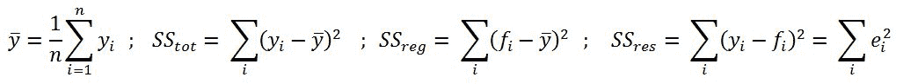


利用这个 *t* 值，假设 *β1 = 0* ，我们计算观察到任何等于 *|t|* 或更大值的概率；这个概率也被称为 p 值。如果 *p 值< 0.05* ，则表示 *β1* 明显远离 *0* ，因此我们可以拒绝零假设，同意存在强关系，而如果 *p 值> 0.05* ，则我们接受零假设，得出两个变量之间没有显著关系的结论。

一旦我们有了系数值，我们将尝试预测相关值，并检查 R 平方值；如果该值为 *> = 0.7* ，则表示该模型足够好，可以部署在看不见的数据上，反之如果不是这么好的值(*<【0.6】*)，则可以断定该模型不够好，不能部署。

# 使用葡萄酒质量数据的简单线性回归示例

在葡萄酒质量数据中，因变量( *Y* )为葡萄酒质量，我们选择的自变量( *X* )为酒精含量。我们在这里测试两者之间是否有任何显著的关系，以检查酒精百分比的变化是否是葡萄酒质量的决定因素:

```py
>>> import pandas as pd 
>>> from sklearn.model_selection import train_test_split     
>>> from sklearn.metrics import r2_score 

>>> wine_quality = pd.read_csv("winequality-red.csv",sep=';')   
>>> wine_quality.rename(columns=lambda x: x.replace(" ", "_"), inplace=True) 

```

在下一步中，使用 70%-30%的规则将数据分为训练数据和测试数据:

```py
>>> x_train,x_test,y_train,y_test = train_test_split (wine_quality ['alcohol'], wine_quality["quality"],train_size = 0.7,random_state=42) 

```

从数据框中分离出一个变量后，它就变成了熊猫系列，因此我们需要再次将其转换回熊猫数据框:

```py
>>> x_train = pd.DataFrame(x_train);x_test = pd.DataFrame(x_test) 
>>> y_train = pd.DataFrame(y_train);y_test = pd.DataFrame(y_test) 

```

以下函数用于计算数据帧各列的平均值。计算`alcohol`(独立)和`quality`(非独立)变量的平均值:

```py
>>> def mean(values): 
...      return round(sum(values)/float(len(values)),2) 
>>> alcohol_mean = mean(x_train['alcohol']) 
>>> quality_mean = mean(y_train['quality']) 

```

计算回归模型的系数确实需要方差和协方差:

```py
>>> alcohol_variance = round(sum((x_train['alcohol'] - alcohol_mean)**2),2) 
>>> quality_variance = round(sum((y_train['quality'] - quality_mean)**2),2) 

>>> covariance = round(sum((x_train['alcohol'] - alcohol_mean) * (y_train['quality'] - quality_mean )),2) 
>>> b1 = covariance/alcohol_variance 
>>> b0 = quality_mean - b1*alcohol_mean 
>>> print ("\n\nIntercept (B0):",round(b0,4),"Co-efficient (B1):",round(b1,4)) 

```

计算系数后，需要预测`quality`变量，这将使用 R 平方值测试拟合质量:

```py
>>> y_test["y_pred"] = pd.DataFrame(b0+b1*x_test['alcohol']) 
>>> R_sqrd = 1- ( sum((y_test['quality']-y_test['y_pred'])**2) / sum((y_test['quality'] - mean(y_test['quality']))**2 )) 
>>> print ("Test R-squared value",round(R_sqrd,4)) 

```

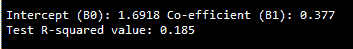

从测试的 R 平方值，我们可以得出结论:`quality`和`alcohol`变量在葡萄酒数据中没有很强的关系，因为 R 平方小于 *0.7* 。

下面的代码描述了使用第一性原理的简单回归拟合:

```py
wine_quality = read.csv("winequality-red.csv",header=TRUE,sep = ";",check.names = FALSE) 
names(wine_quality) <- gsub(" ", "_", names(wine_quality)) 

set.seed(123) 
numrow = nrow(wine_quality) 
trnind = sample(1:numrow,size = as.integer(0.7*numrow)) 
train_data = wine_quality[trnind,] 
test_data = wine_quality[-trnind,] 

x_train = train_data$alcohol;y_train = train_data$quality 
x_test = test_data$alcohol; y_test = test_data$quality 

x_mean = mean(x_train); y_mean = mean(y_train) 
x_var = sum((x_train - x_mean)**2) ; y_var = sum((y_train-y_mean)**2) 
covariance = sum((x_train-x_mean)*(y_train-y_mean)) 

b1 = covariance/x_var   
b0 = y_mean - b1*x_mean 

pred_y = b0+b1*x_test 

R2 <- 1 - (sum((y_test-pred_y )^2)/sum((y_test-mean(y_test))^2)) 
print(paste("Test Adjusted R-squared :",round(R2,4))) 

```

# 多线性回归示例-逐步建模方法

在本节中，我们实际展示了行业专家在使用样本葡萄酒数据进行线性回归建模时遵循的方法。`statmodels.api`包已用于多元线性回归演示目的，而不是 scikit-learn，因为前者提供变量诊断，而后者仅提供最终精度，等等:

```py
>>> import numpy as np 
>>> import pandas as pd 
>>> import statsmodels.api as sm 
>>> import matplotlib.pyplot as plt 
>>> import seaborn as sns 
>>> from sklearn.model_selection import train_test_split     
>>> from sklearn.metrics import r2_score 

>>> wine_quality = pd.read_csv("winequality-red.csv",sep=';')   
# Step for converting white space in columns to _ value for better handling  
>>> wine_quality.rename(columns=lambda x: x.replace(" ", "_"), inplace=True) 
>>> eda_colnms = [ 'volatile_acidity',  'chlorides', 'sulphates', 'alcohol','quality'] 
# Plots - pair plots 
>>> sns.set(style='whitegrid',context = 'notebook') 

```

样本五变量的配对图如下所示；但是，我们鼓励您尝试各种组合来直观地检查各种其他变量之间的各种关系:

```py
>>> sns.pairplot(wine_quality[eda_colnms],size = 2.5,x_vars= eda_colnms, y_vars= eda_colnms) 
>>> plt.show() 

```

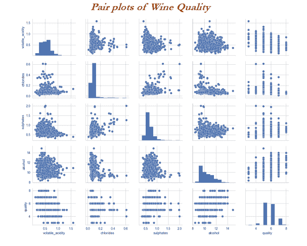

除了直观的图表外，还计算相关系数，以显示数字术语中的相关程度；这些图表用于在初始阶段删除变量，如果有很多变量的话:

```py
>>> # Correlation coefficients 
>>> corr_mat = np.corrcoef(wine_quality[eda_colnms].values.T) 
>>> sns.set(font_scale=1) 
>>> full_mat = sns.heatmap(corr_mat, cbar=True, annot=True, square=True, fmt='.2f',annot_kws={'size': 15}, yticklabels=eda_colnms, xticklabels=eda_colnms) 
>>> plt.show() 

```

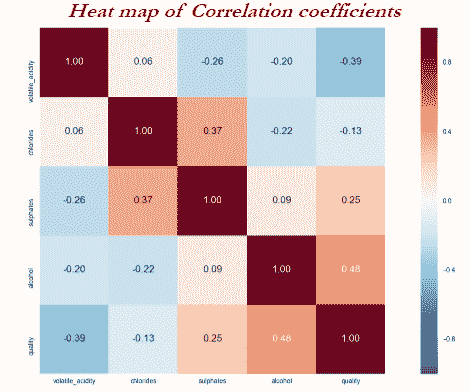

# 向后和向前选择

有各种方法来添加或移除变量，以确定最佳模型。

在逆向方法中，迭代从考虑所有变量开始，我们将一个接一个地移除变量，直到满足所有规定的统计量(如无显著性和多重共线性等)。最后检查整体统计，如 R 平方值为 *> 0.7* ，则认为是好模型，否则拒绝。在工业界，从业者主要倾向于研究落后的方法。

在向前的情况下，我们将从没有变量开始，并继续添加重要的变量，直到整个模型的拟合度提高。

在下面的方法中，我们使用了反向选择方法，从所有 11 个独立变量开始，并在每次迭代后从分析中逐个移除它们(无关紧要和多共线的变量):

```py
>>> colnms = ['fixed_acidity', 'volatile_acidity', 'citric_acid', 'residual_sugar', 'chlorides', 'free_sulfur_dioxide',  'total_sulfur_dioxide', 'density', 'pH', 'sulphates', 'alcohol'] 

>>> pdx = wine_quality[colnms] 
>>> pdy = wine_quality["quality"] 

```

通过随机执行数据分割来创建列车和测试数据。`random_state`(随机种子)用于可再现的结果:

```py
>>> x_train,x_test,y_train,y_test = train_test_split(pdx, pdy, train_size = 0.7, random_state = 42) 

```

在下面的代码中，添加`constant`意味着创建一个截取变量。如果我们不创建截距，系数将相应改变:

```py
>>> x_train_new = sm.add_constant(x_train) 
>>> x_test_new = sm.add_constant(x_test) 
>>> full_mod = sm.OLS(y_train,x_train_new) 

```

下面的代码创建了一个模型概要，包括 R 平方、调整后的 R 平方和自变量的 p 值:

```py
>>> full_res = full_mod.fit() 
>>> print ("\n \n",full_res.summary()) 

```

下面的代码根据第一性原理计算了所有单个变量的 VIF。这里我们计算每个变量的 R 平方值，并将其转换为 VIF 值:

```py
>>> print ("\nVariance Inflation Factor") 
>>> cnames = x_train.columns 
>>> for i in np.arange(0,len(cnames)): 
...      xvars = list(cnames) 
...      yvar = xvars.pop(i) 
...      mod = sm.OLS(x_train[yvar],sm.add_constant( x_train_new[xvars])) 
...      res = mod.fit() 
...      vif = 1/(1-res.rsquared) 
...      print (yvar,round(vif,3))   

```

前面的代码生成了下面的输出，我们可以从这里开始考虑调整多线性回归模型。

迭代 1:


调整模型时要关注的关键指标是 AIC、调整后的 R 平方、单个变量的 *P > |t|* 和 VIF 值(如下所示)。任何模型都可以被认为符合以下经验法则标准:

*   **AIC** :无绝对值显著。这是一个相对的衡量标准，越低越好。
*   **调整后的 R 平方**:是 *≥ 0.7* 。
*   **个体变量的 P 值(P > |t|)** :为 *≤ 0.05* 。
*   **个体变量的 VIF** :是 *≤ 5* (在银行业，有些地方也有人用 *≤ 2* )。


通过查看前面的结果，`residual_sugar`的 p 值最高`0.668`，`fixed_acidity`的 VIF 值最高`7.189`。在这种情况下，总是首先移除最不重要的变量，因为不重要是比多重共线性更严重的问题，尽管在到达最终模型时两者都应该被移除。

从列列表中删除`residual_sugar`变量后，运行前面的代码；我们从迭代 2 中得到以下结果:

*   **AIC** :仅仅从 2231 降到了 2229。
*   **调整后的 R 平方**:数值没有从 0.355 变化。
*   **单个变量的 P 值(P > |t|)** :密度仍然是最不重要的，值为 0.713。
*   **个人变量的 VIF**:`fixed_acidity`有 *VIF ≥ 5* 。但是`density`变量需要先删除，因为优先级被赋予了无意义。

迭代 2:


基于迭代 2，我们需要移除密度变量并重新运行练习，直到没有违反 p 值和 VIF 发生。为了节省空间，我们确实跳过了中间步骤；但是，我们鼓励您手动执行逐个移除变量的逐步过程。

在迭代 5 之后，模型不能进一步改进，因为它满足所有 p 值和 VIF 准则。结果显示在这里。

迭代 5:


在这个例子中，我们得到了迭代 5 后的最终结果:

*   **AIC** :从迭代 1 的`2231`减少到迭代 5 的`2225`。
*   **调整后的 R 平方**:数值改为`0.356`，略有提升，但不够值！
*   **个体变量的 P 值(P > |t|)** :没有一个变量是无关紧要的；所有值都小于 0.05。
*   **个体变量的 VIF** :所有变量小于 5。因此，我们不需要基于 VIF 值移除任何进一步的变量。

我们得到的答案是因变量和自变量之间不存在强关系。然而，我们仍然可以根据测试数据进行预测，并计算 R 平方来再次确认。

If a predictive model shows as strong relationship, the prediction step is a must-have utilize model in the deployment stage. Hence, we are predicting and evaluating the R-squared value here.

以下代码步骤利用该模型来预测测试数据:

```py
>>> # Prediction of data   
>>> y_pred = full_res.predict(x_test_new) 
>>> y_pred_df = pd.DataFrame(y_pred) 
>>> y_pred_df.columns = ['y_pred'] 

>>> pred_data = pd.DataFrame(y_pred_df['y_pred']) 
>>> y_test_new = pd.DataFrame(y_test) 
>>> y_test_new.reset_index(inplace=True) 
>>> pred_data['y_test'] = pd.DataFrame(y_test_new['quality'])

```

对于 R 平方计算，利用 scikit-learn 包`sklean.metrics`模块:

```py
>>> # R-square calculation 
>>> rsqd = r2_score(y_test_new['quality'].tolist(), y_pred_df['y_pred'].tolist()) 
>>> print ("\nTest R-squared value:",round(rsqd,4))

```


测试数据的调整后 R 平方值显示为 0.3519，而训练 R 平方值为 0.356。从最终的结果，我们可以得出结论，自变量和因变量(质量)之间的关系不能用线性回归方法建立。

葡萄酒数据线性回归的 R 码如下:

```py
library(usdm) 
# Linear Regression 
wine_quality = read.csv("winequality-red.csv",header=TRUE,sep = ";",check.names = FALSE) 
names(wine_quality) <- gsub(" ", "_", names(wine_quality)) 

set.seed(123) 
numrow = nrow(wine_quality) 
trnind = sample(1:numrow,size = as.integer(0.7*numrow)) 
train_data = wine_quality[trnind,] 
test_data = wine_quality[-trnind,] 
xvars = c("volatile_acidity","chlorides","free_sulfur_dioxide",  
           "total_sulfur_dioxide","pH","sulphates","alcohol") 
yvar = "quality" 
frmla = paste(yvar,"~",paste(xvars,collapse = "+")) 
lr_fit = lm(as.formula(frmla),data = train_data) 
print(summary(lr_fit)) 
#VIF calculation 
wine_v2 = train_data[,xvars] 
print(vif(wine_v2)) 
#Test prediction 
pred_y = predict(lr_fit,newdata = test_data) 
R2 <- 1 - (sum((test_data[,yvar]-pred_y )^2)/sum((test_data[,yvar]-mean(test_data[,yvar]))^2)) 
print(paste("Test Adjusted R-squared :",R2))

```

# 机器学习模型-脊线和套索回归

在线性回归中，只有平方的**残差和** ( **RSS** )被最小化，而在脊线和套索回归中，对系数值应用惩罚(也称为**收缩惩罚**，以使用调谐参数*【λ】*来正则化系数。

当 *λ=0* 时，惩罚没有影响，岭/套索产生与线性回归相同的结果，而*λ->∩*将系数归零:


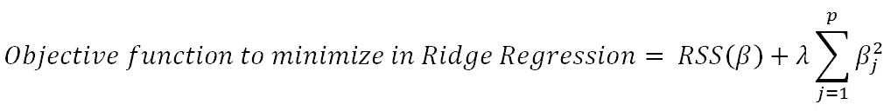


在我们深入研究脊和套索之前，有必要了解一些关于拉格朗日乘子的概念。可以用下面的格式显示前面的目标函数，其中目标只是受预算成本约束( *s* )的 RSS。对于 *λ* 的每个值，都有一个 *s* 这样的值，它将提供等效的等式，如带有惩罚因子的总体目标函数所示:

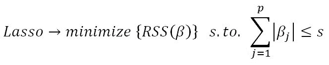


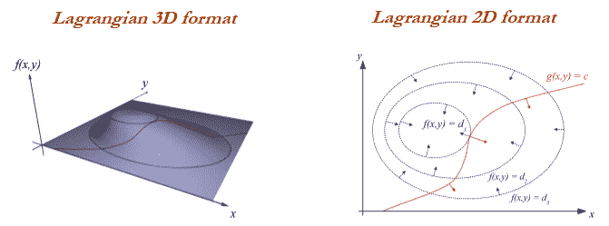

岭回归在最小二乘估计具有高方差的情况下工作良好。岭回归相对于需要 2P 模型的最佳子集选择具有计算优势。相比之下，对于λ的任何固定值，岭回归仅拟合单个模型，并且模型拟合过程可以非常快速地执行。

岭回归的一个缺点是，它将包括所有的预测因子，并根据它们的重要性缩小权重，但它没有将值精确地设置为零，以便从模型中消除不必要的预测因子；拉索回归克服了这个问题。给定预测器的数量非常大的情况，使用 ridge 可以提供准确性，但是它包括所有变量，这在模型的紧凑表示中是不期望的；这个问题在 lasso 中不存在，因为它会将不必要变量的权重设置为零。

从套索生成的模型非常像子集选择，因此它们比由岭回归生成的模型更容易解释。

# 岭回归机器学习示例

岭回归是一种机器学习模型，在这种模型中，我们不对自变量进行任何统计诊断，而只是利用模型来拟合测试数据并检查拟合的准确性。这里，我们使用了`scikit-learn`包:

```py
>>> from sklearn.linear_model import Ridge 

>>> wine_quality = pd.read_csv("winequality-red.csv",sep=';') 
>>> wine_quality.rename(columns=lambda x: x.replace(" ", "_"), inplace=True) 

>>> all_colnms = ['fixed_acidity', 'volatile_acidity', 'citric_acid', 'residual_sugar', 'chlorides', 'free_sulfur_dioxide', 'total_sulfur_dioxide', 'density', 'pH', 'sulphates', 'alcohol'] 

>>> pdx = wine_quality[all_colnms] 
>>> pdy = wine_quality["quality"] 

>>> x_train,x_test,y_train,y_test = train_test_split(pdx,pdy,train_size = 0.7,random_state=42)

```

从零开始的网格搜索的简单版本描述如下，其中`alphas`的各种值将在网格搜索中进行测试，以测试模型的适用性:

```py
>>> alphas = [1e-4,1e-3,1e-2,0.1,0.5,1.0,5.0,10.0]

```

R 平方的初始值被设置为`0`，以便跟踪其更新值，并在新值大于现有值时打印:

```py
>>> initrsq = 0 

>>> print ("\nRidge Regression: Best Parameters\n") 
>>> for alph in alphas: 
...      ridge_reg = Ridge(alpha=alph)  
...      ridge_reg.fit(x_train,y_train)   0 
...      tr_rsqrd = ridge_reg.score(x_train,y_train) 
...      ts_rsqrd = ridge_reg.score(x_test,y_test) 

```

以下代码始终跟踪测试 R 平方值，并在新值大于现有最佳值时打印:

```py
>>>     if ts_rsqrd > initrsq: 
...          print ("Lambda: ",alph,"Train R-Squared value:",round(tr_rsqrd,5),"Test R-squared value:",round(ts_rsqrd,5)) 
...          initrsq = ts_rsqrd 

```

这显示在下面的截图中:


另外，请注意，岭回归生成的测试 R 平方值与多元线性回归(`0.3519`)得到的值相似，但对变量的诊断没有压力，等等。因此，机器学习模型相对紧凑，可以用于自动学习，而无需人工干预来重新训练模型；这是将 ML 模型用于部署目的的最大优势之一。

葡萄酒质量数据的岭回归 R 代码如下:

```py
# Ridge regression 
library(glmnet) 

wine_quality = read.csv("winequality-red.csv",header=TRUE,sep = ";",check.names = FALSE) 
names(wine_quality) <- gsub(" ", "_", names(wine_quality)) 

set.seed(123) 
numrow = nrow(wine_quality) 
trnind = sample(1:numrow,size = as.integer(0.7*numrow)) 
train_data = wine_quality[trnind,]; test_data = wine_quality[-trnind,] 

xvars = c("fixed_acidity","volatile_acidity","citric_acid","residual_sugar","chlorides","free_sulfur_dioxide",            "total_sulfur_dioxide","density","pH","sulphates","alcohol") 
yvar = "quality" 

x_train = as.matrix(train_data[,xvars]);y_train = as.double (as.matrix (train_data[,yvar])) 
x_test = as.matrix(test_data[,xvars]) 

print(paste("Ridge Regression")) 
lambdas = c(1e-4,1e-3,1e-2,0.1,0.5,1.0,5.0,10.0) 
initrsq = 0 
for (lmbd in lambdas){ 
  ridge_fit = glmnet(x_train,y_train,alpha = 0,lambda = lmbd) 
  pred_y = predict(ridge_fit,x_test) 
  R2 <- 1 - (sum((test_data[,yvar]-pred_y )^2)/sum((test_data[,yvar]-mean(test_data[,yvar]))^2)) 

  if (R2 > initrsq){ 
    print(paste("Lambda:",lmbd,"Test Adjusted R-squared :",round(R2,4))) 
    initrsq = R2 
  } 
}

```

# 套索回归机器学习模型示例

套索回归是岭回归的近亲，在岭回归中，系数的绝对值被最小化，而不是值的平方。通过这样做，我们消除了一些无关紧要的变量，这些变量是非常紧凑的表示，类似于 OLS 方法。

除了对系数的模/绝对值进行惩罚外，以下实现类似于岭回归:

```py
>>> from sklearn.linear_model import Lasso 

>>> alphas = [1e-4,1e-3,1e-2,0.1,0.5,1.0,5.0,10.0] 
>>> initrsq = 0 
>>> print ("\nLasso Regression: Best Parameters\n") 

>>> for alph in alphas: 
...      lasso_reg = Lasso(alpha=alph)  
...      lasso_reg.fit(x_train,y_train)     
...      tr_rsqrd = lasso_reg.score(x_train,y_train) 
...      ts_rsqrd = lasso_reg.score(x_test,y_test) 

...      if ts_rsqrd > initrsq: 
...          print ("Lambda: ",alph,"Train R-Squared value:",round(tr_rsqrd,5),"Test R-squared value:",round(ts_rsqrd,5)) 
...          initrsq = ts_rsqrd

```

这显示在下面的截图中:

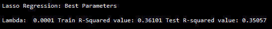

```py
>>> ridge_reg = Ridge(alpha=0.001)  
>>> ridge_reg.fit(x_train,y_train)   
>>> print ("\nRidge Regression coefficient values of Alpha = 0.001\n") 
>>> for i in range(11):  
...     print (all_colnms[i],": ",ridge_reg.coef_[i]) 

>>> lasso_reg = Lasso(alpha=0.001)  
>>> lasso_reg.fit(x_train,y_train) 
>>> print ("\nLasso Regression coefficient values of Alpha = 0.001\n") 
>>> for i in range(11): 
...      print (all_colnms[i],": ",lasso_reg.coef_[i])

```

以下结果显示了两种方法的系数值；套索回归中密度系数设置为`0`，而岭回归中密度值为`-5.5672`；此外，岭回归中的系数都不是零值:


葡萄酒质量数据上套索回归的 R 码如下:

```py
# Above Data processing steps are same as Ridge Regression, only below section of the code do change 

# Lasso Regression 
print(paste("Lasso Regression")) 
lambdas = c(1e-4,1e-3,1e-2,0.1,0.5,1.0,5.0,10.0) 
initrsq = 0 
for (lmbd in lambdas){ 
  lasso_fit = glmnet(x_train,y_train,alpha = 1,lambda = lmbd) 
  pred_y = predict(lasso_fit,x_test) 
  R2 <- 1 - (sum((test_data[,yvar]-pred_y )^2)/sum((test_data[,yvar]-mean(test_data[,yvar]))^2)) 

  if (R2 > initrsq){ 
    print(paste("Lambda:",lmbd,"Test Adjusted R-squared :",round(R2,4))) 
    initrsq = R2 
  } 
}

```

# 线性回归和岭/套索回归中的正则化参数

线性回归中调整后的 R 平方总是不利的，增加额外的不太重要的变量是线性回归中调整数据的一种类型，但它会调整到模型的唯一拟合。然而，在机器学习中，许多参数被调整以调节过拟合问题。在调整为正则化的套索/脊线回归惩罚参数( *λ* )的示例中，有无限个值可用于以无限种方式正则化模型:

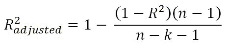

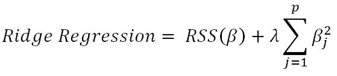

总的来说，预测模式的统计方法和机器学习方法有许多相似之处。

# 摘要

在本章中，您已经学习了统计模型与机器学习模型在回归问题上的比较。多元线性回归方法已经通过使用`statsmodel`包的逐步迭代过程进行了说明，去除了无关紧要的多共线变量。然而，在机器学习模型中，变量的移除不需要被移除并且权重被自动调整，但是具有可以被调整以微调模型拟合的参数，因为机器学习模型基于数据自己学习，而不是仅仅通过手动移除变量来建模。尽管我们在线性回归和套索/岭回归方法之间获得了几乎相同的精度结果，但是通过使用诸如随机森林的高度强大的机器学习模型，我们可以在模型精度上比传统的统计模型获得更好的提升。在下一章中，我们将详细介绍一个具有逻辑回归和高度强大的机器学习模型(如随机森林)的分类示例。