# 逻辑回归与随机森林

在本章中，我们将以德国信贷数据的分类为例，对逻辑回归和随机森林进行比较。逻辑回归是信贷和风险行业中非常普遍使用的技术，用于检查违约问题的概率。如今，信贷和风险部门与监管机构面临的主要挑战是机器学习模型的黑箱性质，这减缓了高级模型在这一领域的使用。然而，通过将逻辑回归与随机森林进行比较，一些转折是可能的；在这里，我们将讨论变量重要性图及其与逻辑回归 p 值的相似之处，我们也不应该忘记一个主要事实，即在公平的基础上，任何模型中的显著变量仍然是显著的，尽管任何两个模型之间总是存在一些变量显著性的变化。

# 最大似然估计

逻辑回归的原理是最大似然估计；在这里，我们将详细解释它的原理，这样我们就可以在接下来的章节中涵盖逻辑回归的更多基础知识。最大似然估计是在给定观测值的情况下估计模型参数的一种方法，通过找到最大化观测值可能性的参数值，这意味着找到最大化事件 *1* 和非事件 *0* 的概率 *p* 的参数，如您所知:

*概率(事件+非事件)= 1*

**例**:样本 *(0，1，0，0，1，0)* 取自二项式分布。最大似然估计是多少？

**解**:假设对于二项式分布 *P(X=1) =* 和 *P(X=0) = 1-* 其中为参数:


这里 *log* 为了数学上的方便，应用于方程的两边；此外，最大化可能性与最大化可能性对数是一样的:


通过将导数等于零来确定的最大值:


然而，我们需要做双重微分来确定由导数等于零得到的鞍点是最大值还是最小值。如果值最大；*对数(L( ))* 的双微分应为负值:


即使在双微分中没有替换值，我们也可以确定它是负值，因为分母值是平方的，并且它对两个项都有负号。尽管如此，我们正在进行替代，其价值是:


因此，已经证明在值 *= 1/3* 时，可能性最大。如果我们替换对数似然函数中的值，我们将获得:


计算 *-2*ln(L)* 背后的原因是复制在适当的逻辑回归中计算的度量。事实上:

*AIC = -2*ln(L) + 2*k*

因此，逻辑回归试图通过最大化单个参数的似然性来寻找参数。但一个小的区别是，在逻辑回归中，将使用伯努利分布，而不是二项式分布。准确地说，伯努利只是二项式的一个特例，因为主要结果只有两个类别，所有的轨迹都是从这两个类别中产生的。

# 逻辑回归-介绍和优势

逻辑回归应用最大似然估计，将因变量转换为关于自变量的 *logit* 变量(因变量出现或不出现的概率的自然对数)。这样，逻辑回归估计了某个事件发生的概率。在下面的等式中，*概率对数*作为解释变量的函数线性变化:

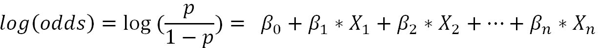

人们可以简单地问，为什么赔率、*对数(赔率)*而不是概率？事实上，这是面试官在分析面试中最喜欢的问题。

原因如下:


通过将概率转换为 *log(赔率)*，我们将范围从[0，1]扩展到[- ∞，+∞ ]。通过概率拟合模型，我们将遇到一个有限范围的问题，并且通过应用对数变换，我们掩盖了所涉及的非线性，并且我们可以仅用变量的线性组合进行拟合。

还有一个问题，如果有人用 0-1 问题而不是逻辑回归来拟合线性回归，会发生什么？

下图提供了简要说明:

*   误差项往往会在 *X* (自变量)的中间值处变大，在极值处变小，这违反了线性回归假设，即误差应为零均值，且应呈正态分布
*   在 *X* 的结束值处，生成大于 *1* 且小于 *0* 的无意义预测
*   **普通最小二乘** ( **OLS** )估计效率低，标准误差有偏差
*   *X* 中间值误差方差高，末端方差低

所有这些问题都可以通过逻辑回归来解决。

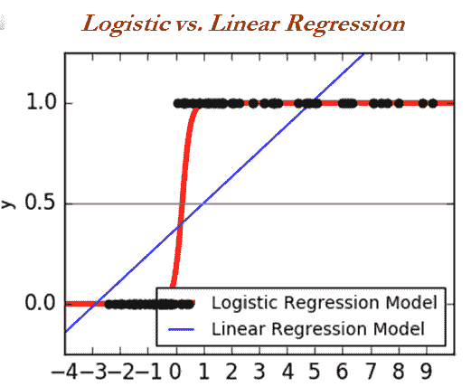

# 逻辑回归中涉及的术语

逻辑回归是许多面试官最喜欢用来测试分析师统计敏锐度的依据。有人说过，即使有人理解了逻辑回归中的 1000 个概念，面试官总会提出 1001 个问题。因此，从逻辑回归的基本原理中积累知识以建立一个坚实的基础是非常值得的:

*   **信息值(IV)** :这在将变量纳入模型之前对其进行初步筛选时非常有用。工业上主要使用 IV 来消除模型拟合前第一步中的主要变量，因为最终模型中存在的变量数量约为 10 个。因此，初始处理需要将变量从 400+左右减少。

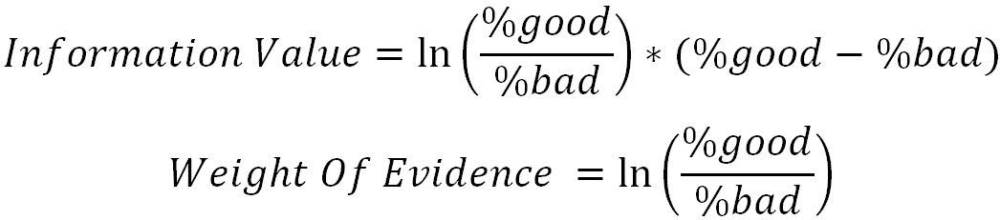

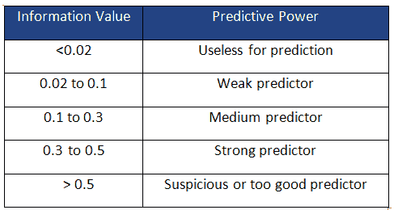

*   **例**:在下表中，连续变量(价格)已经根据价格范围和该区间中统计的事件和非事件的数量分解为十分位数(10 个区间)，并且已经计算了所有区间的信息值并加在一起。我们得到的总值为 *0.0356* ，这意味着它是对事件进行分类的弱预测因子。


*   **阿卡克信息标准(AIC)** :这衡量给定数据集的统计模型的相对质量。这是偏见和差异之间的权衡。在比较两个模型时，AIC 较少的模型比价值较高的模型更受青睐。

如果我们仔细观察下面的等式， *k* 参数(模型中包含的变量数量)正在惩罚模型的过拟合现象。这意味着我们可以通过在模型中加入更多不太重要的变量来人工证明模型的训练精度；通过这样做，我们可以在训练数据上获得更好的准确性，但是在测试数据上，准确性会降低。这种现象可能是逻辑回归中的某种正则化:

*AIC = -2*ln(L) + 2*k*

*L =最大似然值(为数学方便应用对数变换)*

*k =模型中的变量数量*

*   **接收器工作特性(ROC)曲线**:这是一个曲线图，说明了二进制分类器在判别阈值变化时的性能。该曲线是通过绘制不同阈值下的**真阳性率** ( **TPR** )与**假阳性率** ( **FPR** )来创建的。

了解 ROC 曲线效用的一个简单方法是，如果我们将阈值(threshold 是介于 *0* 和 *1* 之间的实值，用于将输出的预测概率转换为类，因为 logistic 回归预测的是概率)保持得很低，我们会将大部分预测观测值放在正类下，即使其中一些应该放在负类下。另一方面，将阈值保持在非常高的水平会惩罚积极类别，但消极类别会改善。理想情况下，阈值的设置应在两个类别之间权衡价值，并产生更高的整体准确性:

*Optimum threshold = Threshold where maximum (sensitivity + specificity) is possible*

在我们进入本质之前，我们将可视化混淆矩阵，以理解以下各种公式:

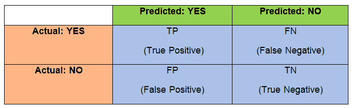

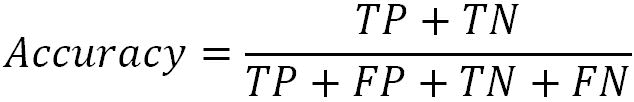


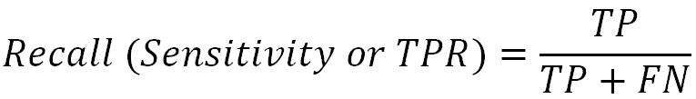


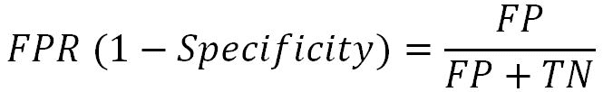


ROC 曲线如下所示:


*   **等级排序**:按照预测概率对观测值进行降序排序后，创建十分位数(10 个相等的区间，每个区间占总观测值的 10%)。通过将每个十分位数中的事件数量相加，我们将得到每个十分位数的聚合事件，并且这个数量应该按降序排列，否则将严重违反逻辑回归方法。

思考等级排序为什么重要的一种方式？当我们将分界点设置在前三至四十分之一时，这将非常有用，以发送营销活动，在这些活动中，细分市场有更高的机会响应活动。如果模型的等级顺序不成立，即使在选择了前三至四个十分位数之后，在分界点以下也会有很大一部分被遗漏，这是危险的。

*   **一致性/c-统计**:这是逻辑回归模型中二元结果拟合质量的度量。它是实际事件的预测事件概率高于非事件的对的比例。

*   **示例**:在下表中，实际值和预测值均以七行样本显示。实际是真实的范畴，无论默认与否；而预测是从逻辑回归模型预测的概率。计算一致性值。


为了计算一致性，我们需要将表拆分为两个(每个表的实际值为 *1* 和 *0* )，并应用两个表中每行的笛卡尔乘积来形成对:


在下表中，当 *1* 类别的预测概率高于 *0* 类别的预测概率时，已计算出完整的笛卡尔积并将该对分类为一致对。如果是反过来，那么这一对就被归类为不和谐的一对。在特殊情况下，如果两个概率相同，这些对将被归类为并列。


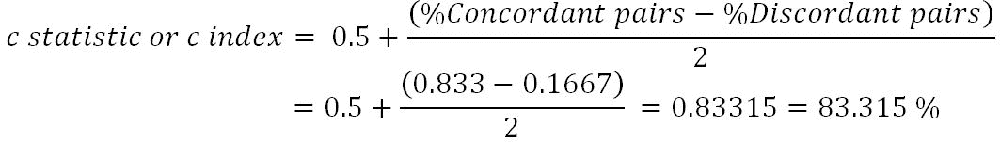
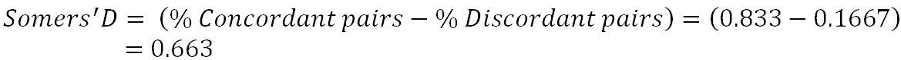

*   **C-statistics**:这是 0.83315%或 83.315%，任何大于 0.7%或 70%的值都被认为是实用的好模型。
*   **分歧**:违约账户平均得分与非违约账户平均得分的距离。距离越大，评分系统在区分好的和坏的观察方面就越有效。
*   **K-S 统计**:这是两个种群分布之间的最大距离。它有助于区分默认帐户和非默认帐户。
*   **人口稳定指数(PSI)** :这是用于检查当前人口中使用信用评分模型的漂移是否与相应发展时间的人口相同的指标:
    *   *PSI < = 0.1* :这表示当前人口的特征相对于发展人口没有变化
    *   *0.1 < PSI < = 0.25* :表示发生了一些变化，提醒注意，但仍可使用
    *   *PSI > 0.25* :这表明与开发时间相比，当前人口的分数分布发生了很大的变化

# 逻辑回归建模中的应用步骤

以下步骤应用于工业中的线性回归建模:

1.  排除标准和好与坏的定义确定
2.  初始数据准备和单变量分析
3.  派生/虚拟变量创建
4.  细分类和粗分类
5.  在训练数据上拟合逻辑模型
6.  根据测试数据评估模型

# 使用德国信贷数据的逻辑回归示例

开源的德国信贷数据已被 UCI 机器学习库用于逻辑回归建模:[https://archive . ics . UCI . edu/ml/datasets/Statlog+(德语+信贷+数据)](https://archive.ics.uci.edu/ml/datasets/Statlog+(German+Credit+Data))。

```py
>>> import os 
>>> os.chdir("D:\\Book writing\\Codes\\Chapter 3") 

>>> import numpy as np 
>>> import pandas as pd 

>>> from sklearn.model_selection import train_test_split     
>>> from sklearn.metrics import accuracy_score,classification_report 

>>> credit_data = pd.read_csv("credit_data.csv") 

```

下面的代码描述了数据的前五行:

```py
>>> print (credit_data.head()) 

```


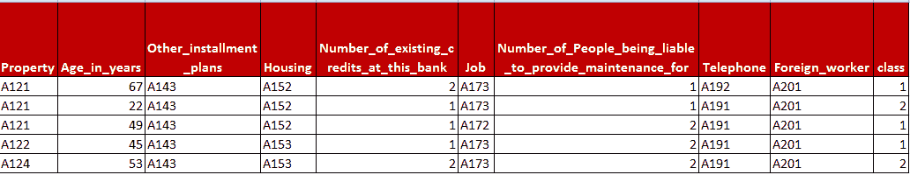

我们总共有 20 个解释变量，其中一个因变量叫做`class`。`class`变量`2`的值表示默认，`1`表示非默认。为了建模为 0-1 问题，我们在以下代码中通过`1`移除了该值:

```py
>>> credit_data['class'] = credit_data['class']-1 

```

为了知道每个变量对自变量的预测能力，这里我们做了一个信息值计算。在下面的代码中，分类变量和连续变量都被考虑在内。

如果数据类型是`object`，这意味着它是一个分类变量，任何其他变量，如`int64`等，将被视为连续的，并将相应地被分成 10 个相等的部分(也称为十分位数)。

```py
>>> def IV_calc(data,var): 
...    if data[var].dtypes == "object": 
...     dataf = data.groupby([var])['class'].agg(['count','sum']) 
...        dataf.columns = ["Total","bad"]     
...        dataf["good"] = dataf["Total"] - dataf["bad"] 
...        dataf["bad_per"] = dataf["bad"]/dataf["bad"].sum() 
...        dataf["good_per"] = dataf["good"]/dataf["good"].sum() 
...        dataf["I_V"] = (dataf["good_per"] - dataf["bad_per"]) * np.log(dataf["good_per"]/dataf["bad_per"]) 
...        return dataf 
...    else: 
...        data['bin_var'] = pd.qcut(data[var].rank(method='first'),10) 
...        dataf = data.groupby(['bin_var'])['class'].agg(['count','sum']) 
...        dataf.columns = ["Total","bad"]     
...        dataf["good"] = dataf["Total"] - dataf["bad"] 
...        dataf["bad_per"] = dataf["bad"]/dataf["bad"].sum() 
...        dataf["good_per"] = dataf["good"]/dataf["good"].sum() 
...        dataf["I_V"] = (dataf["good_per"] - dataf["bad_per"]) * np.log(dataf["good_per"]/dataf["bad_per"]) 
...        return dataf 

```

为了便于说明，已经计算了`Credit_history`(分类)和`Duration_in_month`(连续)的信息值。`Credit_history`得到的总体 IV 为`0.29`，说明预测力中等，`Duration_in_month`为`0.34`，为强预测力。

```py
>>> print ("\n\nCredit History - Information Value\n")
>>> print (IV_calc(credit_data,'Credit_history'))

```

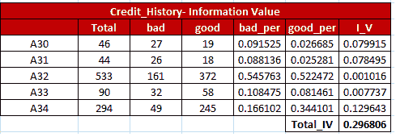

```py
>>> print ("\n\nCredit History - Duration in month\n")
>>> print (IV_calc(credit_data,'Duration_in_month'))

```

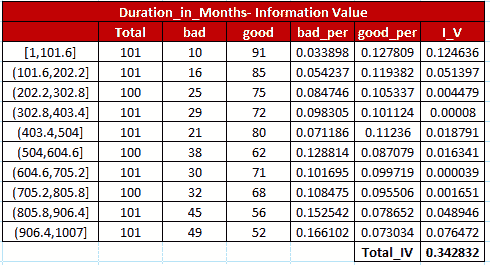

然而，在实际场景中，初始数据有时有大约 500 个变量，甚至更多。在这种情况下，很难为每个变量单独运行代码。下面的代码是为在一次操作中自动计算所有离散和连续变量的总信息值而开发的！

```py
>>> discrete_columns = ['Status_of_existing_checking_account', 'Credit_history', 'Purpose', 'Savings_Account','Present_Employment_since', 'Personal_status_and_sex', 'Other_debtors','Property','Other_installment_plans', 'Housing', 'Job', 'Telephone', 'Foreign_worker']

>>> continuous_columns = ['Duration_in_month', 'Credit_amount', 'Installment_rate_in_percentage_of_disposable_income', 'Present_residence_since', 'Age_in_years','Number_of_existing_credits_at_this_bank', 'Number_of_People_being_liable_to_provide_maintenance_for']

>>> total_columns = discrete_columns + continuous_columns
# List of IV values
>>> Iv_list = []
>>> for col in total_columns:
...    assigned_data = IV_calc(data = credit_data,var = col)
...    iv_val = round(assigned_data["I_V"].sum(),3)
...    dt_type = credit_data[col].dtypes
...    Iv_list.append((iv_val,col,dt_type))

>>> Iv_list = sorted(Iv_list,reverse = True)

>>> for i in range(len(Iv_list)):
...    print (Iv_list[i][0],",",Iv_list[i][1],",type =",Iv_list[i][2])

```

在下面的输出中，所有具有信息值的变量都以降序显示。在信息值、变量名和变量类型也被显示之后。如果类型是`object`，这意味着它是一个分类变量；同样，如果 type 是`int64`，这意味着它是一个 64 位整数值。我们将在下一阶段的分析中考虑前 15 个变量。

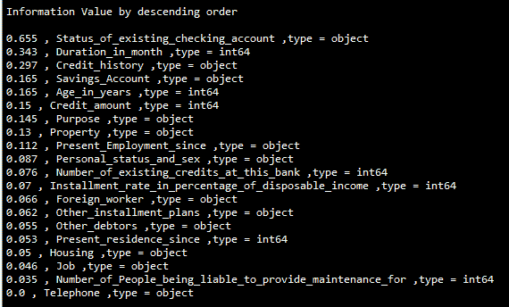

保留前 15 个变量后，我们在离散和连续类别中有以下变量。随后，我们将对离散变量进行虚拟变量编码，并使用连续变量。

```py
>>> dummy_stseca = pd.get_dummies(credit_data['Status_of_existing_checking_account'], prefix='status_exs_accnt')
>>> dummy_ch = pd.get_dummies(credit_data['Credit_history'], prefix='cred_hist')
>>> dummy_purpose = pd.get_dummies(credit_data['Purpose'], prefix='purpose')
>>> dummy_savacc = pd.get_dummies(credit_data['Savings_Account'], prefix='sav_acc')
>>> dummy_presc = pd.get_dummies(credit_data['Present_Employment_since'], prefix='pre_emp_snc')
>>> dummy_perssx = pd.get_dummies(credit_data['Personal_status_and_sex'], prefix='per_stat_sx')
>>> dummy_property = pd.get_dummies(credit_data['Property'], prefix='property')
>>> dummy_othinstpln = pd.get_dummies(credit_data['Other_installment_plans'], prefix='oth_inst_pln')
>>> dummy_forgnwrkr = pd.get_dummies(credit_data['Foreign_worker'], prefix='forgn_wrkr')
>>> dummy_othdts = pd.get_dummies(credit_data['Other_debtors'], prefix='oth_debtors')

>>> continuous_columns = ['Duration_in_month', 'Credit_amount', 'Installment_rate_in_percentage_of_disposable_income', 'Age_in_years', 'Number_of_existing_credits_at_this_bank' ]

>>> credit_continuous = credit_data[continuous_columns]
>>> credit_data_new = pd.concat([dummy_stseca,dummy_ch, dummy_purpose,dummy_savacc, dummy_presc,dummy_perssx, dummy_property, dummy_othinstpln,dummy_othdts, dummy_forgnwrkr,credit_continuous,credit_data['class']],axis=1)

```

数据已经在训练和测试之间以 70-30 的比例平均分割，`random_state`是`42`用作伪随机数生成的种子，以便在多次运行多个用户时产生可再现的结果。

```py
>>> x_train,x_test,y_train,y_test = train_test_split( credit_data_new.drop(['class'] ,axis=1),credit_data_new['class'],train_size = 0.7,random_state=42)

>>> y_train = pd.DataFrame(y_train)
>>> y_test = pd.DataFrame(y_test)

```

使用`pd.get_dummies()`函数生成虚拟变量时，生成的虚拟数量等于其中的类数量。然而，与一个变量中的类的数量相比，在一个数量中创建的虚拟变量的数量足够少(如果所有其他剩余的变量都是`0`，这将代表一个额外的类)以在该设置中表示。例如，如果样本变量的类别*决策响应*可以取三个值中的任何一个(*是*、*否*、*不能说*)，这可以用两个伪变量( *d1* 、 *d2* 来表示所有的设置。

*   如果*D1 = 1**D2 = 0*，我们可以分配类别*是*
*   如果*D1 = 0**D2 = 1*，我们可以分配类别*否*
*   如果*D1 = 0**D2 = 0*，我们可以分配类别 **不能说**

这样，使用两个虚拟变量，我们表示了所有三个类别。同样，我们可以用 *N-1* 虚拟变量来表示 *N* 类变量。

事实上，具有相同数量的伪变量会在输出中产生 NAN 值，因为它会产生冗余。因此，我们在这里从所有已创建模型的分类变量中删除一个额外的类别列:

```py
>>> remove_cols_extra_dummy = ['status_exs_accnt_A11', 'cred_hist_A30', 'purpose_A40', 'sav_acc_A61','pre_emp_snc_A71','per_stat_sx_A91', 'oth_debtors_A101','property_A121', 'oth_inst_pln_A141','forgn_wrkr_A201']

```

在这里，我们已经创建了额外的列表，用于在使用向后消除方法时一步一步迭代地消除无关紧要的变量；每次迭代结束后，我们会不断将最无关紧要且多共线的变量添加到`remove_cols_insig`列表中，这样在训练模型时那些变量就会被移除。

```py
>>> remove_cols_insig = []
>>> remove_cols = list(set(remove_cols_extra_dummy+remove_cols_insig))

```

现在进行模型最重要的一步，应用`Logit`函数、`n`变量，并创建总结:

```py
>>> import statsmodels.api as sm
>>> logistic_model = sm.Logit(y_train, sm.add_constant(x_train.drop( remove_cols, axis=1))).fit()
>>> print (logistic_model.summary())

```

汇总代码生成如下输出，其中最不重要的变量是`purpose_A46`，p 值为`0.937`:

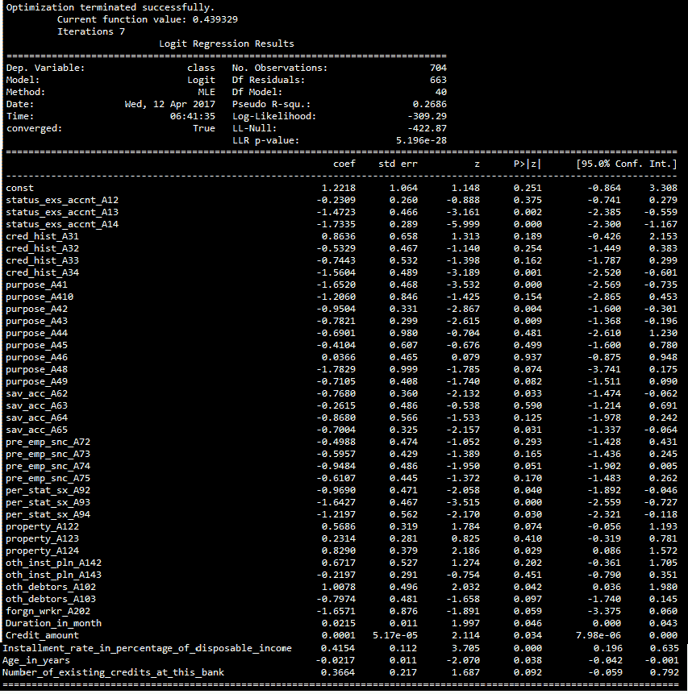

此外，计算 VIF 值以检查多重共线性，尽管在使用 *VIF > 5* 移除多重共线变量之前，需要移除无关紧要的变量。从以下结果来看，`Per_stat_sx_A93`是 VIF 为`6.177`的最多共线变量:

```py
>>> print ("\nVariance Inflation Factor")
>>> cnames = x_train.drop(remove_cols,axis=1).columns
>>> for i in np.arange(0,len(cnames)):
...   xvars = list(cnames)
...   yvar = xvars.pop(i)
...   mod = sm.OLS(x_train.drop(remove_cols,axis=1)[yvar], sm.add_constant( x_train.drop (remove_cols,axis=1)[xvars]))
...   res = mod.fit()
...   vif = 1/(1-res.rsquared)
...   print (yvar,round(vif,3))

```

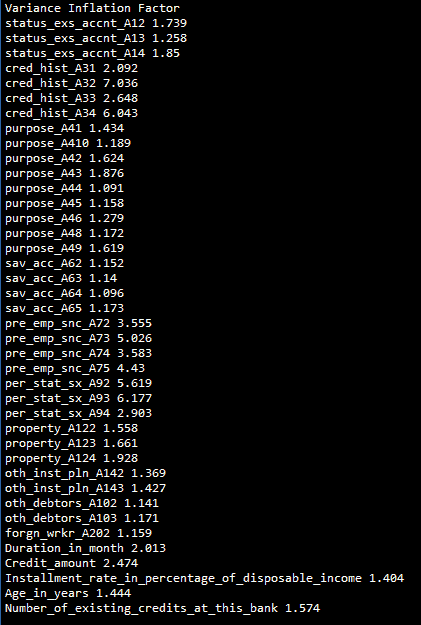

我们还检查分类器在尝试预测结果方面有多好，为此我们将运行 c 统计值，该值计算总对中一致对的比例。该值越高越好，但在生产环境中部署模型时，该值至少应为 0.7。下面的代码描述了根据第一性原理计算 c-统计量的各个步骤:

```py
>>> y_pred = pd.DataFrame (logistic_model. predict(sm.add_constant (x_train.drop (remove_cols,axis=1))))
>>> y_pred.columns = ["probs"]
>>> both = pd.concat([y_train,y_pred],axis=1)

```

Zeros 是从实际和预测表中分离出来的数据，条件作为实际类应用于 Zeros。然而，一是一个实际类的条件应用于一的分裂。

```py
>>> zeros = both[['class','probs']][both['class']==0]
>>> ones = both[['class','probs']][both['class']==1]

>>> def df_crossjoin(df1, df2, **kwargs):
...   df1['_tmpkey'] = 1
...   df2['_tmpkey'] = 1
...   res = pd.merge(df1, df2, on='_tmpkey', **kwargs).drop('_tmpkey', axis=1)
...   res.index = pd.MultiIndex.from_product((df1.index, df2.index))
...   df1.drop('_tmpkey', axis=1, inplace=True)
...   df2.drop('_tmpkey', axis=1, inplace=True)
...   return res

```

在接下来的步骤中，我们将为 1 和 0 数据生成笛卡尔乘积，以计算一致和不一致对:

```py
>>> joined_data = df_crossjoin(ones,zeros)

```

如果对`1`类的概率高于`0`类，则一对是一致的；如果对`1`类的概率低于`0`类，则一对是不一致的。如果两个概率相同，我们就把它们归入成对范畴。和谐对的数量越高，模型越好！

```py
>>> joined_data['concordant_pair'] = 0
>>> joined_data.loc[joined_data['probs_x'] > joined_data['probs_y'], 'concordant_pair'] =1
>>> joined_data['discordant_pair'] = 0
>>> joined_data.loc[joined_data['probs_x'] < joined_data['probs_y'], 'discordant_pair'] =1
>>> joined_data['tied_pair'] = 0
>>> joined_data.loc[joined_data['probs_x'] == joined_data['probs_y'],'tied_pair'] =1
>>> p_conc = (sum(joined_data['concordant_pair'])*1.0 )/ (joined_data.shape[0])
>>> p_disc = (sum(joined_data['discordant_pair'])*1.0 )/ (joined_data.shape[0])

>>> c_statistic = 0.5 + (p_conc - p_disc)/2.0
>>> print ("\nC-statistic:",round(c_statistic,4))

```

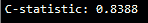

得到的`c-statistic`为`0.8388`，大于 0.7 需要认为是好模型。

我们将始终关注 c-统计和对数似然(AIC)是如何变化的(这里是-309.29)，同时逐一移除各种变量，以证明何时停止。

在移除无关紧要的变量`purpose_A46`之前，检查其 VIF 和`Per_stat_sx_A93`变量的 p 值非常重要。在某些情况下，我们可能需要同时考虑这两个指标，并进行权衡。

但是，下表是我们需要移除`pupose_A46`变量的明确结果:


移除`purpose_A46`变量后，我们需要重复该过程，直到不存在无关紧要的多共线变量。然而，我们需要关注 AIC 和 c 统计值是如何变化的。在下面的代码中，我们已经显示了一个接一个移除变量的顺序，但是我们鼓励用户亲自动手来独立验证结果:

```py
>>> remove_cols_insig = ['purpose_A46', 'purpose_A45', 'purpose_A44', 'sav_acc_A63', ... 'oth_inst_pln_A143','property_A123', 'status_exs_accnt_A12', 'pre_emp_snc_A72', ... 'pre_emp_snc_A75','pre_emp_snc_A73', 'cred_hist_A32', 'cred_hist_A33', ... 'purpose_A410','pre_emp_snc_A74','purpose_A49', 'purpose_A48', 'property_A122', ... 'per_stat_sx_A92','forgn_wrkr_A202','per_stat_sx_A94', 'purpose_A42', ... 'oth_debtors_A102','Age_in_years','sav_acc_A64','sav_acc_A62', 'sav_acc_A65', ... 'oth_debtors_A103']

```

最后，在消除了无关紧要的和多共线的变量之后，获得了以下最终结果:

*   `Log-Likelihood` : `-334.35`
*   `c-statistic` : `0.8035`

如果我们将这些与初始值进行比较，*log*-可能性从-309.29 降至-334.35，这是一个好迹象，c-statistics 也从 0.8388 略微降至 0.8035。但尽管如此，该模型仍然适用，变量数量要少得多。在不太影响模型性能的情况下移除额外的变量也会在模型的实现过程中提高效率！

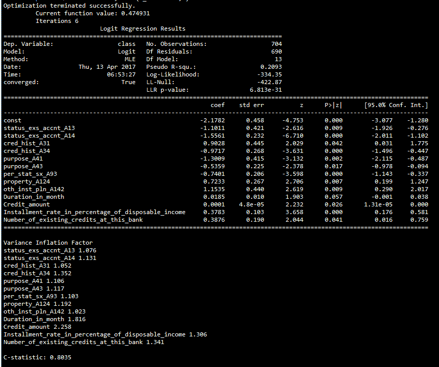

在下面的图表中绘制了 ROC 曲线与 TPR 对 FPR 的关系，并且描述了曲线下的面积，其值为 *0.80* 。

```py
>>> import matplotlib.pyplot as plt 
>>> from sklearn import metrics 
>>> from sklearn.metrics import auc 
>>> fpr, tpr, thresholds = metrics.roc_curve(both['class'],both['probs'], pos_label=1) 

>>> roc_auc = auc(fpr,tpr) 
>>> plt.figure() 
>>> lw = 2 
>>> plt.plot(fpr, tpr, color='darkorange', lw=lw, label='ROC curve (area = %0.2f)' % roc_auc) 
>>> plt.plot([0, 1], [0, 1], color='navy', lw=lw, linestyle='--') 
>>> plt.xlim([0.0, 1.0]) 
>>> plt.ylim([0.0, 1.05]) 
>>> plt.xlabel('False Positive Rate (1-Specificity)') 
>>> plt.ylabel('True Positive Rate') 
>>> plt.title('ROC Curve - German Credit Data') 
>>> plt.legend(loc="lower right") 
>>> plt.show() 

```


一旦我们从训练数据集中找到了最佳情况，下一个也是最后一个任务就是从概率到默认值预测类别。有许多方法可以设置阈值，将预测概率转换为实际类别。在下面的代码中，我们进行了简单的网格搜索，以确定最佳概率阈值截止值。尽管如此，甚至灵敏度和特异性曲线也可以用于这项任务。

```py
>>> for i in list(np.arange(0,1,0.1)):
...   both["y_pred"] = 0
...   both.loc[both["probs"] > i, 'y_pred'] = 1
...   print ("Threshold",i,"Train Accuracy:", round(accuracy_score(both['class'], both['y_pred']),4))

```


从前面的结果中，我们发现，在阈值`0.5`值处，我们可以看到`0.7713`的最大精度。因此，我们也在`0.5`设置了测试数据分类的阈值:

```py
>>> both["y_pred"] = 0
>>> both.loc[both["probs"] > 0.5, 'y_pred'] = 1
>>> print ("\nTrain Confusion Matrix\n\n", pd.crosstab(both['class'], both['y_pred'], ... rownames = ["Actuall"],colnames = ["Predicted"]))
>>> print ("\nTrain Accuracy:",round(accuracy_score(both['class'],both['y_pred']),4))

```

接下来讨论结果。在将阈值设置为`0.5`并将预测概率分类为`0`或`1`类后，混淆矩阵已经通过取行中的实际值和列中的预测值来计算，这表明`0.7713`的准确性为 77.13%:

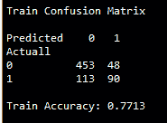

现在，将对测试数据应用`0.5`阈值，以验证模型在各种数据集之间是否一致，代码如下:

```py
>>> y_pred_test = pd.DataFrame( logistic_model.predict( sm.add_constant( ... x_test.drop(remove_cols,axis=1))))
>>> y_pred_test.columns = ["probs"]
>>> both_test = pd.concat([y_test,y_pred_test],axis=1)
>>> both_test["y_pred"] = 0
>>> both_test.loc[both_test["probs"] > 0.5, 'y_pred'] = 1
>>> print ("\nTest Confusion Matrix\n\n", pd.crosstab( both_test['class'], ... both_test['y_pred'],rownames = ["Actuall"],colnames = ["Predicted"]))
>>> print ("\nTest Accuracy:", round(accuracy_score( both_test['class'], ... both_test['y_pred']),4))

```

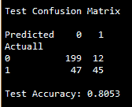

从测试数据的结果来看，获得的准确度为`0.8053`或 80.53%；我们的逻辑回归分类器对默认和非默认进行了非常有力的分类！

逻辑回归的 r 码如下:

```py
# Variable Importance 
library(mctest) 
library(dummies) 
library(Information) 
library(pROC) 
credit_data = read.csv("credit_data.csv") 
credit_data$class = credit_data$class-1
 # I.V Calculation 
IV <- create_infotables(data=credit_data, y="class", parallel=FALSE)
for (i in 1:length(colnames(credit_data))-1){ 
 seca = IV[[1]][i][1] 
 sum(seca[[1]][5]) 
 print(paste(colnames(credit_data)[i],",IV_Value:",round(sum(seca[[1]][5]),4)))
} 
 # Dummy variables creation 
dummy_stseca =data.frame(dummy(credit_data$Status_of_existing_checking_account))
dummy_ch = data.frame(dummy(credit_data$Credit_history)) 
dummy_purpose = data.frame(dummy(credit_data$Purpose))
dummy_savacc = data.frame(dummy(credit_data$Savings_Account)) dummy_presc = data.frame(dummy(credit_data$Present_Employment_since)) dummy_perssx = data.frame(dummy(credit_data$Personal_status_and_sex)) dummy_othdts = data.frame(dummy(credit_data$Other_debtors)) dummy_property = data.frame(dummy(credit_data$Property)) dummy_othinstpln = data.frame(dummy(credit_data$Other_installment_plans)) 
dummy_forgnwrkr = data.frame(dummy(credit_data$Foreign_worker))
 # Cleaning the variables name from . to _ 
colClean <- function(x){ colnames(x) <- gsub("\\.", "_", colnames(x)); x } 
dummy_stseca = colClean(dummy_stseca) ;dummy_ch = colClean(dummy_ch) dummy_purpose = colClean(dummy_purpose); dummy_savacc= colClean(dummy_savacc) 
dummy_presc= colClean(dummy_presc);dummy_perssx= colClean(dummy_perssx); 
dummy_othdts= colClean(dummy_othdts);dummy_property= colClean(dummy_property); 
dummy_othinstpln= colClean(dummy_othinstpln);dummy_forgnwrkr= colClean(dummy_forgnwrkr); 

continuous_columns = c('Duration_in_month', 'Credit_amount','Installment_rate_in_percentage_of_disposable_income', 'Age_in_years','Number_of_existing_credits_at_this_bank')
credit_continuous = credit_data[,continuous_columns]
credit_data_new = cbind(dummy_stseca,dummy_ch,dummy_purpose,dummy_savacc,dummy_presc,dummy_perssx, dummy_othdts,dummy_property,dummy_othinstpln,dummy_forgnwrkr,credit_continuous,credit_data$class) 
colnames(credit_data_new)[51] <- "class" 
 # Setting seed for repeatability of results of train & test split
set.seed(123) 
numrow = nrow(credit_data_new) 
trnind = sample(1:numrow,size = as.integer(0.7*numrow)) 
train_data = credit_data_new[trnind,] 
test_data = credit_data_new[-trnind,] 

remove_cols_extra_dummy = c("Status_of_existing_checking_account_A11","Credit_history_A30", "Purpose_A40", "Savings_Account_A61", "Present_Employment_since_A71", "Personal_status_and_sex_A91" "Other_debtors_A101", "Property_A121", "Other_installment_plans_A141", "Foreign_worker_A201") 

# Removing insignificant variables one by one 
remove_cols_insig = c("Purpose_A46","Purpose_A45","Purpose_A44","Savings_Account_A63", "Other_installment_plans_A143", "Property_A123", "Status_of_existing_checking_account_A12", "Present_Employment_since_A72", "Present_Employment_since_A75", "Present_Employment_since_A73","Credit_history_A32","Credit_history_A33", "Purpose_A40","Present_Employment_since_A74","Purpose_A49","Purpose_A48", "Property_A122","Personal_status_and_sex_A92","Foreign_worker_A202", "Personal_status_and_sex_A94","Purpose_A42","Other_debtors_A102", "Age_in_years","Savings_Account_A64","Savings_Account_A62", "Savings_Account_A65", "Other_debtors_A103") 
remove_cols = c(remove_cols_extra_dummy,remove_cols_insig) 
glm_fit = glm(class ~.,family = "binomial",data = train_data[,!(names(train_data) %in% remove_cols)])
 # Significance check - p_value summary(glm_fit) 

# Multi collinearity check - VIF 
remove_cols_vif = c(remove_cols,"class") 
vif_table = imcdiag(train_data[,!(names(train_data) %in% remove_cols_vif)],train_data$class,detr=0.001, conf=0.99) 
vif_table
 # Predicting probabilities
 train_data$glm_probs = predict(glm_fit,newdata = train_data,type = "response") 
test_data$glm_probs = predict(glm_fit,newdata = test_data,type = "response") 
 # Area under 
ROC ROC1 <- roc(as.factor(train_data$class),train_data$glm_probs) plot(ROC1, col = "blue") 
print(paste("Area under the curve",round(auc(ROC1),4))) 
 # Actual prediction based on threshold tuning 
threshold_vals = c(0.1,0.2,0.3,0.4,0.5,0.6,0.7,0.8,0.9) 
for (thld in threshold_vals){ 
 train_data$glm_pred = 0
 train_data$glm_pred[train_data$glm_probs>thld]=1 
 tble = table(train_data$glm_pred,train_data$class) 
 acc = (tble[1,1]+tble[2,2])/sum(tble)
 print(paste("Threshold",thld,"Train accuracy",round(acc,4))) 
} 
 # Best threshold from above search is 0.5 with accuracy as 0.7841
best_threshold = 0.5 
 # Train confusion matrix & accuracy 
train_data$glm_pred = 0
train_data$glm_pred[train_data$glm_probs>best_threshold]=1 
tble = table(train_data$glm_pred,train_data$class) 
acc = (tble[1,1]+tble[2,2])/sum(tble) 
print(paste("Confusion Matrix - Train Data"))
 print(tble) print(paste("Train accuracy",round(acc,4))) 

# Test confusion matrix & accuracy 
test_data$glm_pred = 0 test_data$glm_pred[test_data$glm_probs>best_threshold]=1 
tble_test = table(test_data$glm_pred,test_data$class) 
acc_test = (tble_test[1,1]+tble_test[2,2])/sum(tble_test)
print(paste("Confusion Matrix - Test Data")) print(tble_test)
print(paste("Test accuracy",round(acc_test,4))) 

```

# 随机森林

**随机森林** ( **RF** )是数据科学领域中经常使用的一种非常强大的技术，用于解决跨行业的各种问题，也是赢得像 Kaggle 这样的竞赛的银弹。我们将在下一章从基础到深入介绍各种概念；这里我们只限于最基本的必需品。随机森林是决策树的集合，我们知道，逻辑回归有很高的偏差和低方差技术；另一方面，决策树具有高方差和低偏差，使得决策树不稳定。通过平均决策树，我们将最小化模型的方差分量，这使得近似最接近理想模型。

RF 侧重于对训练数据的观测值和变量进行采样，以开发独立的决策树，并分别对分类和回归问题进行多数投票。相比之下，bagging 只随机对观察值进行采样，并为所有决策树选择所有缺少代表根显著变量的列。这种方式使得树木相互依赖，准确性将受到影响。

以下是使用随机森林从观测中选择子样本时的一些经验法则。尽管如此，任何参数都可以调整，以进一步提高结果！每棵树都是根据从训练数据中提取的采样数据开发的，并如图所示进行拟合

*每棵单独的树的训练数据中大约 2/3 的观测值*

*选择列 sqrt(p) - >对于分类问题，如果 p 是训练数据中的总列数*

如果 p 是列数，回归问题的 p/3 - >

在下图中，两个样本显示为蓝色和粉色，在打包场景中，选择了一些观察值和所有列。而在随机森林中，选择一些观察值和列来创建不相关的单个树。

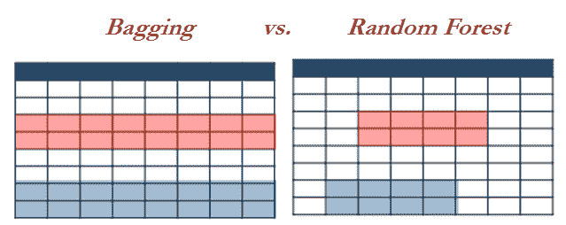

下图中，一个示例想法展示了射频分类器的工作原理。每棵树都是单独生长的，每棵树的深度因所选样本而异，但最终会进行投票来决定最终的类别。


由于决策树的集成，射频具有可解释性，无法确定每个变量的显著性；相反，只能提供可变重要性。在下图中，提供了一个可变绩效的样本，包括基尼系数的平均下降:


# 使用德国信用数据的随机森林示例

同样的德国信用数据被用来说明随机森林模型，以便提供苹果对苹果的比较。与逻辑回归相比，任何人都可以观察到的一个非常显著的差异是，应用于数据预处理的工作量急剧减少。以下差异值得一提:

*   在射频中，我们没有从基于显著性和 VIF 值的分析中逐个移除变量，因为显著性测试不适用于最大似然模型。然而，对训练数据进行了五重交叉验证，以确保模型的稳健性。
*   我们在逻辑回归程序中移除了一个额外的虚拟变量，而在射频中，我们没有从分析中移除额外的虚拟变量，因为后者会自动处理多重共线性。事实上，建立集成的基础单一模型是决策树，多重共线性对它来说根本不是问题。我们将在下一章深入讨论决策树。
*   随机森林比逻辑回归需要更少的人力和干预来训练模型。这种工作方式使得 ML 模型成为软件工程师的最爱，让他们可以轻松地部署它们。此外，ML 模型可以基于数据自动学习，没有太多麻烦。

应用于德国信用数据的随机森林:

```py
>>> import pandas as pd
>>> from sklearn.ensemble import RandomForestClassifier
 >>> credit_data = pd.read_csv("credit_data.csv")
>>> credit_data['class'] = credit_data['class']-1

```

虚拟变量的创建步骤类似于逻辑回归预处理步骤:

```py
>>> dummy_stseca = pd.get_dummies(credit_data['Status_of_existing_checking_account'], prefix='status_exs_accnt')
>>> dummy_ch = pd.get_dummies(credit_data['Credit_history'], prefix='cred_hist')
>>> dummy_purpose = pd.get_dummies(credit_data['Purpose'], prefix='purpose')
>>> dummy_savacc = pd.get_dummies(credit_data['Savings_Account'], prefix='sav_acc')
>>> dummy_presc = pd.get_dummies(credit_data['Present_Employment_since'], prefix='pre_emp_snc')
>>> dummy_perssx = pd.get_dummies(credit_data['Personal_status_and_sex'], prefix='per_stat_sx')
>>> dummy_othdts = pd.get_dummies(credit_data['Other_debtors'], prefix='oth_debtors')
>>> dummy_property = pd.get_dummies(credit_data['Property'], prefix='property')
>>> dummy_othinstpln = pd.get_dummies(credit_data['Other_installment_plans'], prefix='oth_inst_pln')
>>> dummy_housing = pd.get_dummies(credit_data['Housing'], prefix='housing')
>>> dummy_job = pd.get_dummies(credit_data['Job'], prefix='job')
>>> dummy_telephn = pd.get_dummies(credit_data['Telephone'], prefix='telephn')
>>> dummy_forgnwrkr = pd.get_dummies(credit_data['Foreign_worker'], prefix='forgn_wrkr')

>>> continuous_columns = ['Duration_in_month', 'Credit_amount', 'Installment_rate_in_percentage_of_disposable_income', 'Present_residence_since','Age_in_years','Number_of_existing_credits_at_this_bank',
'Number_of_People_being_liable_to_provide_maintenance_for']

>>> credit_continuous = credit_data[continuous_columns]

```

在接下来的变量组合步骤中，我们没有从所有分类变量中移除一个额外的虚拟变量。由于变量相对于所有其他变量的代表性，为`status_of_existing_checking_account`变量创建的所有虚拟变量都已在随机森林中使用，而不是在逻辑回归中删除的一列。

```py
>>> credit_data_new = pd.concat([dummy_stseca, dummy_ch,dummy_purpose, dummy_savacc,dummy_presc,dummy_perssx,dummy_othdts, dummy_property, dummy_othinstpln,dummy_housing,dummy_job, dummy_telephn, dummy_forgnwrkr, credit_continuous,credit_data['class']],axis=1)

```

在下面的示例中，数据被分成 70-30 份。原因是，在训练期间，我们将在网格搜索中执行五重交叉验证，这将产生类似的效果，即分别将数据分成 50-25-25 的训练、验证和测试数据集。

```py
>>> x_train,x_test,y_train,y_test = train_test_split( credit_data_new.drop( ['class'],axis=1),credit_data_new['class'],train_size = 0.7,random_state=42)

```

随机森林 ML 模型应用于假设的超参数值，如下所示:

*   树木数量为`1000`
*   纵切的标准是`gini`
*   每棵决策树可以生长的最大深度为`100`
*   每次不符合分裂条件所需的最小观测值为`3`
*   树节点中的最小观察次数应为`2`

但是，需要使用网格搜索来调整最佳参数值:

```py
>>> rf_fit = RandomForestClassifier( n_estimators=1000, criterion="gini", max_depth=100, min_samples_split=3,min_samples_leaf=2)
>>> rf_fit.fit(x_train,y_train)

>>> print ("\nRandom Forest -Train Confusion Matrix\n\n", pd.crosstab(y_train, rf_fit.predict( x_train),rownames = ["Actuall"],colnames = ["Predicted"]))
>>> print ("\n Random Forest - Train accuracy",round(accuracy_score( y_train, rf_fit.predict(x_train)),3))

>>> print ("\nRandom Forest - Test Confusion Matrix\n\n",pd.crosstab(y_test, rf_fit.predict(x_test),rownames = ["Actuall"],colnames = ["Predicted"]))
>>> print ("\nRandom Forest - Test accuracy",round(accuracy_score(y_test, rf_fit.predict(x_test)),3))

```

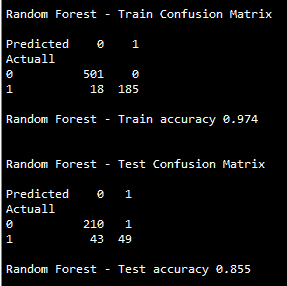

从观察上述结果来看，随机森林产生的测试精度为`0.855`，远高于逻辑回归结果的测试精度 0.8053，即使在仔细调整和去除无关紧要的多共线变量后也是如此。这整个现象归结为偏见与差异权衡的核心主题。线性模型非常稳健，并且没有足够的方差来拟合数据中的非线性，然而，使用集成技术，我们可以最小化来自传统决策树的方差误差，这产生了具有来自偏差和方差分量的最小误差的结果。

通过使用网格搜索方法来获得最优超参数，可以进一步优化随机森林的精度，对于最优超参数，精度可以比随机选择的超参数高得多。在下一节中，我们将详细介绍网格搜索方法。

# 随机森林上的网格搜索

通过使用以下设置更改各种超参数来执行网格搜索。但是，我们鼓励读者尝试其他参数，以便在此领域进一步探索。

*   树木数量为`(1000,2000,3000)`
*   最大深度为`(100,200,300)`
*   每次分裂的最小样本数为`(2,3)`
*   叶节点中的最小样本为`(1,2)`

导入`Pipeline`如下:

```py
>>> from sklearn.pipeline import Pipeline >>> from sklearn.model_selection import train_test_split,GridSearchCV

```

`Pipeline`功能创建组合，这些组合将依次应用，以确定最佳组合:

```py
>>> pipeline = Pipeline([ ('clf',RandomForestClassifier(criterion='gini'))]) >>> parameters = {
 ...    'clf__n_estimators':(1000,2000,3000), ...    'clf__max_depth':(100,200,300), ...    'clf__min_samples_split':(2,3), ...    'clf__min_samples_leaf':(1,2) }

```

在下文中，网格搜索利用 5 的交叉验证来确保模型的健壮性，这是创建模型两点验证的 ML 方式:

```py
>>> grid_search = GridSearchCV(pipeline,parameters,n_jobs=-1, cv=5, verbose=1, ... scoring='accuracy')
>>> grid_search.fit(x_train,y_train)

>>> print ('Best Training score: %0.3f' % grid_search.best_score_)
>>> print ('Best parameters set:')
>>> best_parameters = grid_search.best_estimator_.get_params()
>>> for param_name in sorted(parameters.keys()):
 ...    print ('\t%s: %r' % (param_name, best_parameters[param_name]))

>>> predictions = grid_search.predict(x_test)

>>> print ("Testing accuracy:",round(accuracy_score(y_test, predictions),4))
>>> print ("\nComplete report of Testing data\n",classification_report(y_test, ... predictions))

>>> print ("\n\nRandom Forest Grid Search- Test Confusion Matrix\n\n", pd.crosstab(y_test, predictions,rownames = ["Actuall"],colnames = ["Predicted"]))

```

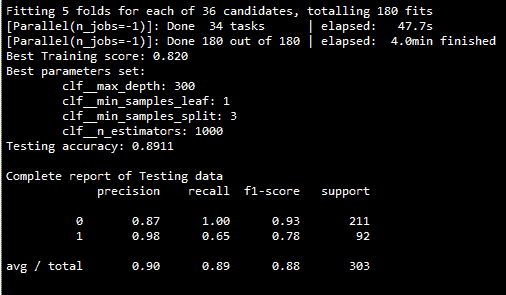


从网格搜索的结果来看，很明显最佳测试精度为`0.8911`或 89.11%，这比逻辑回归模型提高了约 10%。通过提高 10%的预测准确性，因批准不良客户贷款而导致的损失将大大减少。

In a simple random forest model, train accuracy is 97.4 percent, but test accuracy is comparatively lower at 85.5 percent; whereas, in grid search methodology, train accuracy is 82 percent, but test accuracy is 89.11 percent. This highlights the issue of overfitting by building a model on single data compared with a five-fold cross validation methodology used in grid search. Hence, it is advisable to perform cross-validation to avoid over-fitting problems and ensure robustness in machine learning models.

最后，如果我们将逻辑回归的混淆矩阵与随机森林进行比较，误报将大大减少。

*   逻辑回归——43 个实际违约客户被预测为非违约类别
*   带有网格搜索的随机森林—32 个实际默认客户已被预测为非默认类别

这 11 个额外客户所产生的损失将通过信用行业的机器学习模型来消除，这是通过给不值得的客户提供信用来避免巨大损失的救命稻草！

对德国信用数据进行网格搜索的随机森林的 R 代码如下:

```py
# Random Forest 
library(randomForest) 
library(e1071) 
credit_data = read.csv("credit_data.csv") 
credit_data$class = credit_data$class-1 
credit_data$class = as.factor(credit_data$class) 

set.seed(123) 
numrow = nrow(credit_data) 
trnind = sample(1:numrow,size = as.integer(0.7*numrow)) 
train_data = credit_data[trnind,] 
test_data = credit_data[-trnind,] 

rf_fit = randomForest(class~.,data = train_data, mtry=4, maxnodes= 2000,ntree=1000,nodesize = 2) 
rf_pred = predict(rf_fit,data = train_data,type = "response") 
rf_predt = predict(rf_fit,newdata = test_data,type ="response") 

tble = table(train_data$class,rf_pred) 
tblet = table(test_data$class,rf_predt) 

acc = (tble[1,1]+tble[2,2])/sum(tble) 
acct = (tblet[1,1]+tblet[2,2])/sum(tblet) 
print(paste("Train acc",round(acc,4),"Test acc",round(acct,4))) 

# Grid Search 
rf_grid = tune(randomForest,class~.,data = train_data,ranges = list( mtry = c(4,5), 
 maxnodes = c(700,1000),
 ntree = c(1000,2000,3000), 
 nodesize = c(1,2)
), 
tunecontrol = tune.control(cross = 5) 
) 
summary(rf_grid) 
best_model = rf_grid$best.model 
summary(best_model)

 y_pred_train = predict(best_model,data = train_data) 
train_conf_mat = table(train_data$class,y_pred_train)
print(paste("Train Confusion Matrix - Grid Search:")) print(train_conf_mat)
train_acc = (train_conf_mat[1,1]+ train_conf_mat[2,2])/sum(train_conf_mat)
print(paste("Train_accuracy-Grid Search:",round(train_acc,4)))

y_pred_test = predict(best_model,newdata = test_data) 
test_conf_mat = table(test_data$class,y_pred_test)
print(paste("Test Confusion Matrix - Grid Search:")) print(test_conf_mat) 

test_acc = (test_conf_mat[1,1]+ test_conf_mat[2,2]) /sum(test_conf_mat)
print(paste("Test_accuracy-Grid Search:",round(test_acc,4)))

```

# 可变重要性图

变量重要性图按照基尼系数的平均下降值，按降序列出了最重要的变量。顶部变量比底部变量对模型的贡献更大，并且在对违约和非违约客户进行分类时具有很高的预测能力。

令人惊讶的是，在 Python scikit-learn 中，网格搜索没有可变重要性功能，因此我们使用网格搜索的最佳参数，并用简单的随机森林`scikit-learn`功能绘制可变重要性图。然而，在 R 编程中，我们有这样的规定，因此 R 代码在这里是紧凑的:

```py
>>> import matplotlib.pyplot as plt 
>>> rf_fit = RandomForestClassifier(n_estimators=1000, criterion="gini", max_depth=300, min_samples_split=3,min_samples_leaf=1) 
>>> rf_fit.fit(x_train,y_train)    
>>> importances = rf_fit.feature_importances_ 
>>> std = np.std([tree.feature_importances_ for tree in rf_fit.estimators_], axis=0) 
>>> indices = np.argsort(importances)[::-1] 

>>> colnames = list(x_train.columns) 
# Print the feature ranking 
>>> print("\nFeature ranking:\n") 
>>> for f in range(x_train.shape[1]): 
...    print ("Feature", indices[f], ",", colnames[indices[f]], round(importances [indices[f]],4)) 

>>> plt.figure() 
>>> plt.bar(range(x_train.shape[1]), importances[indices], color="r", yerr= std[indices],  align="center") 
>>> plt.xticks(range(x_train.shape[1]), indices) 
>>> plt.xlim([-1, x_train.shape[1]]) 
>>> plt.show()

```

可变重要性随机森林的 r 代码如下:

```py
# Variable Importance
vari = varImpPlot(best_model)
print(paste("Variable Importance - Table")) 
print(vari)

```

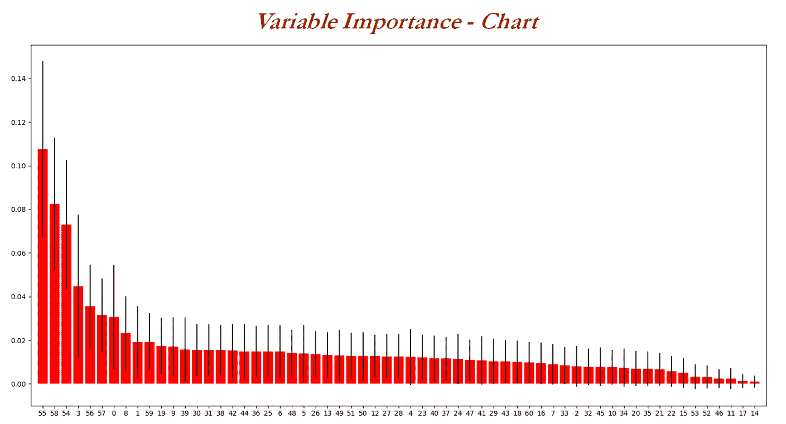

由于存在许多变量，因此很难在图上表示变量和名称，因此相同的内容如下所示。`Credit_amount`首先代表预测基尼系数平均下降的变量`0.1075`，随后是其他变量:


# logistic 回归与随机森林的比较

监管机构给信贷风险行业带来的一个主要问题是机器学习模型的黑箱特性。本节着重于绘制逻辑回归和随机森林模型之间的相似之处，以创建随机森林的透明度，这样在批准机器学习模型的实施时，监管者就不会那么害怕了。最后但同样重要的是，读者还将接受统计模型与机器学习模型的比较教育。

在下表中，两个模型的解释变量根据它们对模型贡献的重要性按降序排列。在逻辑回归模型中，它是 p 值(最小值是更好的预测值)，对于随机森林，它是基尼系数的平均下降(最大值是更好的预测值)。许多变量在重要性上非常匹配，例如，`status_exs_accnt_A14`、`credit_hist_A34`、`Installment_rate_in_percentage_of_disposable_income`、`property_A_24`、`Credit_amount`、`Duration_in_month`等等。

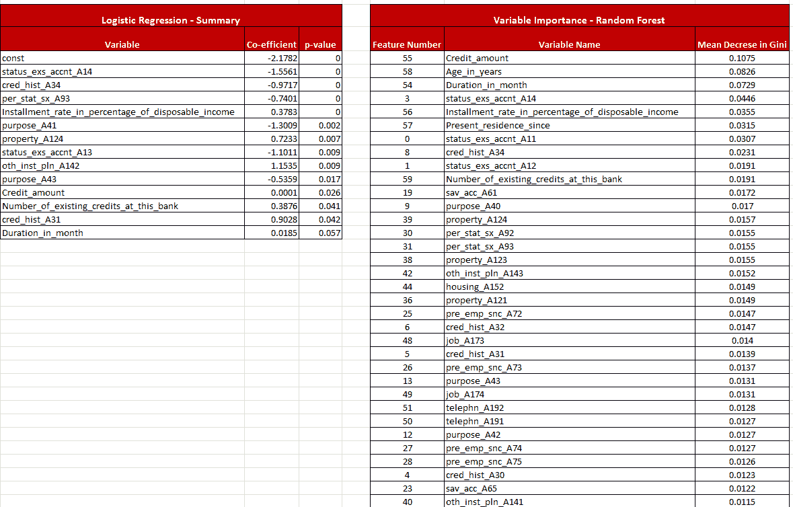

读者不应该忽视的一个主要的潜在事实是，重要的变量在任何模型中都是重要的，无论是统计模型还是机器学习模型。但是，通过仔细比较这种方式，信贷和风险部门可以向监管机构提供解释，并说服他们实施机器学习模型。

# 摘要

在本章中，您已经学习了逻辑回归的工作原理及其逐步求解方法，通过不断检查 AIC 值和一致性值以统计方式确定最佳模型，迭代移除无关紧要的和多共线的变量来找到最佳拟合。随后，我们研究了机器学习模型和随机森林在计算测试精度中的应用。我们发现，通过使用网格搜索仔细调整随机森林的超参数，我们能够将结果的测试精度提高 10%，从逻辑回归的 80%提高到随机森林的 90%。

在下一章中，我们将覆盖完整的基于树的模型，如决策树、随机森林、增强树、模型集成等，以进一步提高准确性！